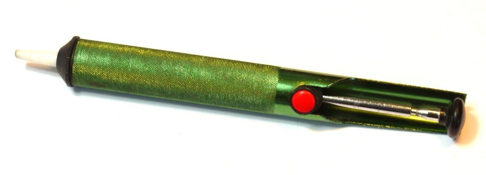
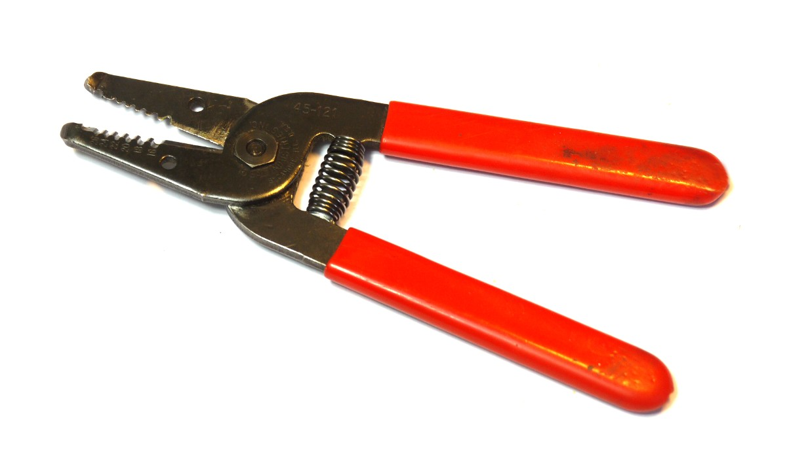
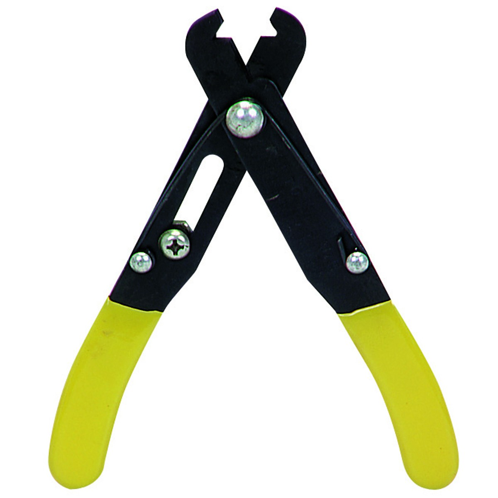
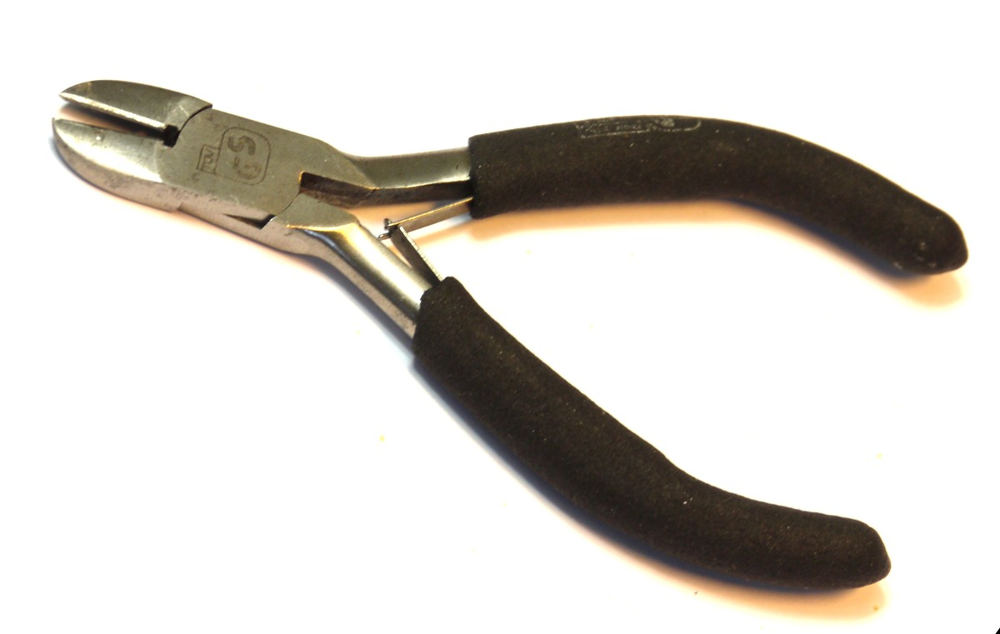

<!--- Copyright (c) 2013 Gordon Williams, Pur3 Ltd. See the file LICENSE for copying permission. -->
Tools and Supplies
================

:warning: **Please view the correctly rendered version of this page at https://www.espruino.com/Tools. Links, lists, videos, search, and other features will not work correctly when viewed on GitHub** :warning:

* KEYWORDS: Tools,Supplies

**NOTE:** *We'll be fleshing this section out with more details as time goes on...*

If you're going to be making things with Espruino, some things are really handy:

## Tools

### Soldering Iron

A thin tip is useful. Generally speaking:

* Soldering irons with a separate power supply are going to be the best ones, but then they're also more expensive
* Soldering irons with a pistol-grip won't be good enough - you need one that you hold a bit like a massive pen

### Soldering Iron stand

Get one of these with a sponge in it. When wet, it can be used to get any oxidised solder off of the tip of the soldering iron, which makes soldering much easier.

### De-Solder Pump

Otherwise known as the Solder Sucker, it's a simple tool that simple sucks the molten solder off of joints. It's good to have one of these, because if you add too much solder you can easily remove it.

### Wire Strippers and Cutters

Don't be fooled by the huge semi-automatic wire strippers. Simple is better - either of the above styles is suitable. 

### Diagonal Cutters

Wire cutters with a simple cutting point - these are extremely useful for cutting wires close to the PCB

### Tweezers or foreceps 

Tweezers or forceps can be very helpful for holding parts in place while soldering, particularly for surface mount parts.

### Multimeter

Just a cheap volt and ohm meter with a continuity tester will be extremely useful. A more full-featured one that can measure current and capacitance is better still, but these functions are less frequently used. 

### Oscilloscope

This is just a luxury unless you're routinely dealing with signals, but you may find that some simple hand-held oscilloscopes are very useful. On the cheaper end of things there's:

* Velleman [HPS140](http://www.hps140.com/)
* [DSO Nano](http://www.seeedstudio.com/depot/dso-nano-v3-p-1358.html?cPath=63_65)
* [DSO Quad](http://www.seeedstudio.com/depot/dso-quad-4-channel-digital-storage-oscilloscope-p-736.html?cPath=63_65)

While old-style analog Oscilloscopes are useful, Storage Oscilloscopes are massively more helpful for microcontrollers as you can record a non-repetitive signal and can then keep it displayed on the screen.

## Supplies

### Solder (ideally thinner than 1mm diameter)

Simple 'lead-free' solder. You definitely don't need Silver Solder.

### Multi-core (Stranded) wire

For wiring external parts to Espruino. Solid core wire is much more likely to break if it gets moved around a lot.

### Solid Core Wire

Just for wiring up parts that are soldered to your Espruino board. You can always use old Ethernet cable, but it's much better to have proper wire with insulation that is less likely to shrink when it gets hot.

### Flux

Nice to have - if you add a small amount of flux, the solder tends to pull itself together much more and you get a very clean joint. It's not a big deal for 0.1" soldering (most of what you'll do with Espruino) but if you're soldering surface mount components it's invaluable. Some types of flux need to be carefully cleaned off after use - the "no clean" flux does not, and is probably more convenient for that reason. 

### De-soldering Braid

Again, nice to have for surface mount soldering, it 'wicks' the solder away from a joint and really cleans it up. If you have a solder sucker you'll probably never use this for 0.1" soldering though.

## Common Components

Having a selection of common, cheap components on hand will speed development - and save money, since brick-and-mortar stores charge as much for a package of 1-5 parts as an online vendor will charge for 100 of the same part. eBay is an excellent source for low cost passive components, and there are numerous eBay sellers who specialize in selling cheap components to hobbyists. 

### Resistors

Assortment packs of resistors are readily available online, and are highly recommended. Particularly useful values of resistor are 10k ohm (for I2C pull-ups, and general use as pull-up/pull-down resistors), and some values in the 100-500 ohm range (to put in series with indicator LEDs). If you're working with high power LEDs (1W and up), you'll need resistors with a higher power rating (1W+) and lower resistance (1-10 ohms). These are often not included in assortments, as they're not used as frequently. 

### Capacitors

The most important value of capacitor to have is 0.1uf, in a ceramic capacitor. Many parts require a 0.1uf ceramic capacitor between power and ground right next to the part to ensure stable power to the part, so you should have some of these on hand. 

If you're using voltage regulators in your project, each of these will need a higher value capacitor across the output to provide a stable voltage - typically a 10-100uf tantalum or electrolytic. For such filtering applications, the exact value is not critical, as long as it's big enough that the voltage regulator is able to supply a stable enough voltage for your purpose.

As with other passive components, assortment packs of capacitors are available online at very low prices - however, an assortment of capacitors is nowhere near as important as an assortment of resistors. 

### Diodes

Everyone who plays with electronics should have some basic diodes in stock - particularly since they're so cheap. The 1N4001 is a cheap and ubiquitious 1 amp diode. The rest of the 1N400x series is also perfectly suitable. Normal diodes have a forward voltage drop of around 0.7v. Schottky diodes have a lower forward voltage drop (0.3-0.5v), but are more expensive.

### LEDs

Generic through-hole LEDs can come in very handy as indicators when debugging.  Be sure you have appropriate resistors to put in series with them. Assortments of around 100 basic, through-hole LEDs are available on eBay for a few bucks, and they can also often be scavenged from discarded electronics (whether this is worth doing is another matter). 
