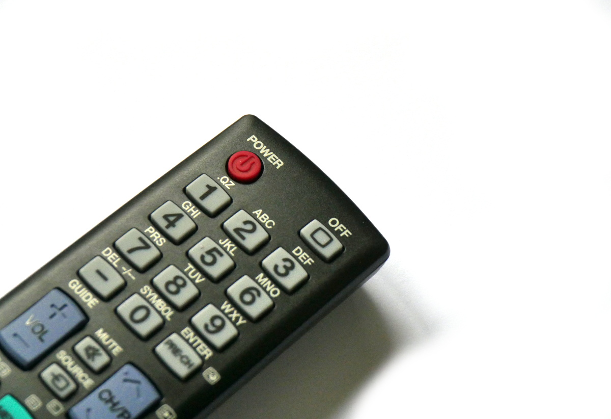

<!--- Copyright (c) 2017 Gordon Williams, Pur3 Ltd. See the file LICENSE for copying permission. -->
Infrared 'Pronto Hex' decoder
=========================

<span style="color:red">:warning: **Please view the correctly rendered version of this page at https://www.espruino.com/pronto. Links, lists, videos, search, and other features will not work correctly when viewed on GitHub** :warning:</span>

* KEYWORDS: Module,Modules,IR,Infrared,Pronto,IRDB,IRDB.tk
* USES: Puck.js,Infrared,IR



While you can [plug in an IR receiver and decode IR signals](/Puck.js Infrared),
it requires you to have an IR receiver and is a bit fiddly.

Luckily, [http://irdb.tk](http://irdb.tk/) contains a list of common remote control
codes for different devices.

To use it:

* Click `Find IR codes for your device`
* Choose your device
* When you see a list of buttons, click the `Pronto Hex` tab, and for
most devices you will see a code - for example this is the code for the
Power button on a Samsung TV:

```
0000 006C 0000 0022 00AD 00AD 0016 0041 0016 0041 0016 0041 0016 0016 0016 0016 0016 0016 0016 0016 0016 0016 0016 0041 0016 0041 0016 0041 0016 0016 0016 0016 0016 0016 0016 0016 0016 0016 0016 0016 0016 0041 0016 0016 0016 0016 0016 0016 0016 0016 0016 0016 0016 0016 0016 0041 0016 0016 0016 0041 0016 0041 0016 0041 0016 0041 0016 0041 0016 0041 0016 06FB
```

Now just enclose that in quotes, and use it with the pronto decoder:

```
var prontoHex = "0000 006C 0000 0022 00AD 00AD 0016 0041 0016 0041 0016 0041 0016 0016 0016 0016 0016 0016 0016 0016 0016 0016 0016 0041 0016 0041 0016 0041 0016 0016 0016 0016 0016 0016 0016 0016 0016 0016 0016 0016 0016 0041 0016 0016 0016 0016 0016 0016 0016 0016 0016 0016 0016 0016 0016 0041 0016 0016 0016 0041 0016 0041 0016 0041 0016 0041 0016 0041 0016 0041 0016 06FB";
var pulseTimes = require("pronto").decode(prontoHex);
```

`pulseTimes` now contains an array of pulses in milliseconds that you can use with [`digitalPulse`](/Pico+Infrared)
on normal Espruino boards, or [`Puck.IR`](/Puck.js Infrared) on Puck.js devices:

### Puck.js

```
Puck.IR(pulseTimes);
```

### Other boards

```
analogWrite(IR_ANODE,0.9,{freq:38000});
digitalPulse(IR_CATHODE, 1, pulseTimes);
digitalPulse(IR_CATHODE, 1, 0);
digitalRead(IR_ANODE);
```
