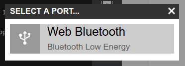

<!--- Copyright (c) 2016 Gordon Williams, Pur3 Ltd. See the file LICENSE for copying permission. -->
Getting Started with Puck.js
============================

* KEYWORDS: Tutorials,Puck.js,Quick Start,Getting Started,Web Bluetooth,BLE
* USES: Puck.js,Web Bluetooth


Your Puck.js shipped with a battery installed, but with a small plastic tab inserted to keep it turned off.


Turning On
----------

To turn on your Puck.js, simply:

* Remove Puck.js from its packaging
* Peel the silicone case away from the hard base using your fingers
* Tip the Puck.js circuit board out of the case
* Remove the battery by poking it out from the rear with a blunt object
* Remove the clear plastic tab that was under the battery
* Re-insert the battery - the red LED should flash once, very briefly.
* If the green LED lights or red stays lit, it is because you have accidentally
pressed the button down while inserting the battery. Remove the battery and try
again, making sure the button next to the battery connector isn't pressed.
* Re-assemble Puck.js. **To make sure the button works correctly you need to put
the battery side facing down, with the silver shield facing towards the 'shelf' in the
case.**

Now to get started!

Once you've your Puck.js is powered up it'll start doing two things:

* Advertising itself on Bluetooth Low Energy
* Acting as an NFC tag that will redirect you to the Puck.js website

If you have an NFC phone, make sure NFC is on, and then move Puck.js near the NFC receiver on it. A Web page should open that will direct you to some examples. Otherwise, you can go straight to the Puck.js website - [https://www.puck-js.com/go](https://www.puck-js.com/go)


Using Puck.js
--------------

By default, Puck.js appears as a Bluetooth Low Energy device with a serial port. When you connect to this serial port you get full command-line access to the Espruno Javascript interpreter built into it.

To get started you have two options:

* Use the Espruino IDE or command-line tools to write code to Puck.js
* Send individual JavaScript commands to Puck.js without programming it


Using the Espruino IDE
----------------------

### With Web Bluetooth

<script><!--
  document.write("<p><b>Note:</b> Web Bluetooth is  <b>" +
    (navigator.bluetooth?'already enabled':'currently disabled')+
    "</b> on this computer.</p>");
--></script>

If your computer supports it, Web Bluetooth is the easiest way to get started with Puck.js.

You'll need an up to date version of [Google Chrome](https://www.google.com/chrome/browser/desktop/) or Opera Web Browsers on one of:

#### Mac OS

OS X Yosemite or later required, and check that your Mac supports Bluetooth Low Energy:

* Click the Apple logo then `About this Mac` in the top left
* Click `System Report`
* Click `Bluetooth` under `Hardware`
* See if it says `Bluetooth Low Energy Supported`

If it doesn't:

* Get a Bluetooth 4.0 (or later) adaptor (they cost $5 - $10)
* Open a terminal and type `sudo nvram bluetoothHostControllerSwitchBehavior=al­ways`
(to go back to the old behaviour type `sudo nvram -d bluetoothHostControllerSwitchBehavior`)
* Reboot your Mac
* **Make sure that you turn off (or un-pair) any Bluetooth devices that were using your internal Bluetooth** - they get stop your Mac from using the new adaptor

When your Mac supports BLE, you need to enable Web Bluetooth support:

* Type `chrome://flags` in the address bar
* You need to enable `Web Bluetooth` (`chrome://flags/#enable-web-bluetooth`) in Chrome 55 or earlier. For Chrome 56 and later on Mac OS and Chromebook, there is no option available and Web Bluetooth is enabled by default.
* Restart your browser

#### Windows

Windows support in Chrome is not yet available - Windows 10 should be supported in 2017.

For now you'll need to [install the Web IDE application](#with-an-application) instead.

#### Linux

BlueZ 5.41+ required - you can check by typing `bluetoothd --version`. If it isn't there are some [Bluez installation instructions here](/Web Bluetooth On Linux)

* Type `chrome://flags` in the address bar
* You need to enable `Experimental Web Platform Features` (`chrome://flags/#enable-experimental-web-platform-features`) in Chrome 56 or later, or `Web Bluetooth` (`chrome://flags/#enable-web-bluetooth`) in Chrome 55 or earlier.
* Restart your browser

#### Chromebook

All Chromebooks with Bluetooth should support Web Bluetooth

* Type `chrome://flags` in the address bar
* You need to enable `Web Bluetooth` (`chrome://flags/#enable-web-bluetooth`) in Chrome 55 or earlier. For Chrome 56 and later on Chromebook, there is no option available and Web Bluetooth is enabled by default.
* Restart your browser

#### Android

Android 6 (Marshmallow) or later required, but Android 5 [works with the latest Chromium builds](http://stackoverflow.com/questions/34810194/can-i-try-web-bluetooth-on-chrome-for-android-lollipop))

* Type `chrome://flags` in the address bar
* You need to enable `Web Bluetooth` (`chrome://flags/#enable-web-bluetooth`) in Chrome 55 or earlier. For Chrome 56 and later, there is no option available and Web Bluetooth is enabled by default.
* Restart your browser

#### iOS (iPhone, iPad)

Apple's built-in web browser does not support Web Bluetooth. Instead you'll
need to [install the WebBLE app](https://itunes.apple.com/us/app/webble/id1193531073)

However once that is done you'll be able to access Web Bluetooth through any
webpage viewed with [WebBLE](https://itunes.apple.com/us/app/webble/id1193531073)

### Once Web Bluetooth is set up:

* Go to the [Puck.js site](https://puck-js.com/go). It should tell you that you have Web Bluetooth.
* Click the [Web IDE option](/ide).
* Click the orange icon in the Top Left: 
* You may see a list of connection options - choose `Web Bluetooth`:



* You should be shown a list of devices - click on `Puck.js ABCD` (where `ABCD` is the last 4 digits of your Puck.js's MAC address)


* Wait a few seconds - you should now be connected!
* Click on the left-hand side of the IDE, type `LED1.set()` and enter. The red LED should light.
* You can type `LED1.reset()` to turn it off.
* You can now try [writing some code](#next) on your Puck.js!


### With an application

On some platforms (Windows, or Linux with older versions of `Bluez`) Web
Bluetooth isn't supported yet.

On these you'll need to install a native application. We've created a
[Web IDE installer for Windows](/Web+IDE#as-a-native-application) - don't
use the Chrome Web Store version at the top of that page, as it won't
give you access to Bluetooth devices.

**Note:**

* If using Windows 8.1 or later you'll need to pair your Puck.js using the Windows
Bluetooth menu before it'll appear in the Web IDE.
* If using Windows 7 you'll need to have [set up your Bluetooth adaptor with Zadig first](/Web+IDE#zadig)

On Linux, Mac OS and other platforms you'll need to follow the NPM install
[instructions on the Web IDE GitHub Page](https://github.com/espruino/EspruinoWebIDE#installing-from-npm)

Once set up, you can try [writing some code](#next) on your Puck.js!


### Via a Raspberry Pi

There are two ways of using the Raspberry Pi to control Puck.js devices.

* You can use the Espruino Hub software (which provides an MQTT bridge) and the
Node-RED UI - see the [Node RED Tutorial](/Puck.js Node-RED)

* Or you can [use the Raspberry Pi to host a web-based version of the Web IDE](/Raspberry Pi Web IDE).

Once set up, you can try [writing some code](#next) on your Puck.js!


### By wired connection

In the worst case, you don't have any computers that allow you to communicate using Bluetooth Low Energy.

But all is not lost! You can buy a USB-TTL converter, and can [connect directly to your Puck.js](/Puck.js#serial-console).

You can then use the normal [Espruino Web IDE](/Web+IDE).


Command-Line
------------

You can use the Espruno command-line app. It works under [Node.js](https://nodejs.org/en/), so you'll need to:

* Install [Node](https://nodejs.org/en/)
* In a command prompt, type `npm install -g espruino` (on Linux you'll want to use `sudo` before the command)
* On Linux, you need to run ```sudo setcap cap_net_raw+eip $(eval readlink -f `which node`)``` to give node permissions for BLE (or you'll have to run it as `sudo`)
* When that completes, you can type `espruino --help` for help
* To connect, try `espruino --list` to list devices, then copy your device's MAC address and type `espruino -p aa:bb:cc:dd:ee` to connect.
* Press `Ctrl-C` twice to exit.
* You can also type `espruino -p aa:bb:cc:dd:ee -w filename.js` to upload a file, enter terminal mode,
and then re-upload it if it changes (so you can use your favourite editor)
* You can now start [writing some code](#next) on your Puck.js!


Sending Individual Commands
---------------------------

### Using Adafruit 'Bluefruit LE' app

**This is the easiest solution on iOS**

* Start the app
* Choose the Puck.js device you want to communicate with and click `Connect`
* Click `UART`
* When connected you're ready to enter some commands - see `Commands` below

### `nRF UART` app

* Start the app
* Tap `Connect` and choose your Puck.js device
* Type commands into the console - see `Commands` below.

**Note:** In this app, you need to manually press the `Enter` key *before* sending a line. If you're on iOS you need to do this by copy/pasting out of code in notepad - which is much trickier (the Adafruit app above is easier).

### A Website

You can use Web Bluetooth on your own website to control Puck.js devices, as long as you have a compatible browser.

While you can use Web Bluetooth directly, we've provided a helpful library. Just include
`<script src="https://puck-js.com/puck.js"></script>` in your website (served off `HTTPS`)
and you can easily execute commands just by running JS code like:

```
Puck.write('LED1.set();\n');
```

We've got [a proper tutorial on it here](/Puck.js Web Bluetooth)

### Your own app

You can make your own application to control Espruino for whatever platform you need.

For the simplest control, add you need to do is connect to the Puck.js bluetooth
device and connect to the characteristic with ID `6e400002b5a3f393e0a9e50e24dcca9e`.
You can then write repeatedly to it to send commands to Espruino.

### Commands...

Type in `LED1.set()` and click send.

* The red LED should light up.
* You can now type `LED1.reset()` to turn it off. `LED2` and `LED3` work too
* Note that responses are also being sent back. You can type in `BTN.read()` and `false` will be returned - it'll be `true` if the button is pressed


New Firmware
------------

While Puck.js ships with firmware that's fine for simple tasks, we're constantly
improving the software and adding new features.

To get the best out of it, we'd recommend that you [update Puck.js's firmware](/Puck.js#firmware-updates)


<a id="next"></a>Having Trouble?
-----------------------------

Check out the [Troubleshooting](/Puck.js#troubleshooting) page, or ask on
[our forums](http://forum.espruino.com)


What now?
----------

If you're using any version of the Web IDE, you can click on the Book icon in
the top right, then:

* **Tour** for a quick tour of the various parts of the Web IDE
* **Tutorial** for a step by step guide to writing your first code on Espruino


Or you can follow the [Quick Start guide](/Quick+Start#start-writing-code-)
for normal Espruino Boards.

You can check out some of the Puck.js tutorials:

* APPEND_USES: Puck.js

However there's also much more detailed information:

* [Puck.js Reference](/Puck.js) and [Troubleshooting](/Puck.js#troubleshooting)
* [How to use Puck.js on board Peripherals](/Puck.js#on-board-peripherals)
* [Language Reference](/Reference), specifically:
  * [Puck Object](/Reference#Puck) - for Puck.js specific functionality
  * [NRF Object](/Reference#NRF) - for nRF52 Bluetooth functionality
  * [Global Functions](/Reference#_global) and [E Object](/Reference#E) - for built-in Espruino functionality
* [List of available modules](/Modules)
* [Other tutorials](/Tutorials)
* Or check out [our forums](http://forum.espruino.com)

**Note:** Espruino runs on many other devices, and [espruino.com](http://espruino.com)
caters for all of them. Unless a tutorial explicitly says it is for Puck.js it's
possible that you will have to change some pin names and wiring to match
[the pins on the Puck.js](/Puck.js#pinout).


Power Usage
------------

When idle (as it comes after the battery is plugged in) Puck.js draws around 20uA,
allowing it to run for around a year on a battery. When it's running a small amount
of JavaScript code once a minute or when a button is pressed that figure won't be
a great deal higher.

However, it's very easy to draw more power:

* Staying connected to Puck.js will draw 10x more power than idle
* Lighting a single LED will draw around 100x more power than Puck.js does at idle
* Running JavaScript code all the time will draw 200x more power than at idle

As a result, if you've been using Puck.js but don't intend to use the code
you've uploaded it's recommended that you either unplug the battery, or connect
to the Puck.js and type `reset()`, to ensure that no code is running in the
background that might flatten the battery.


For more details on power usage, [see here](/Puck.js#power-consumption)
