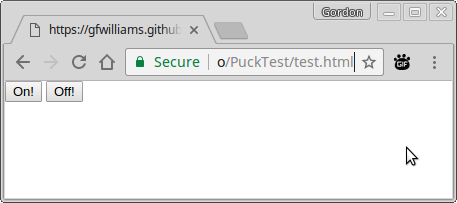
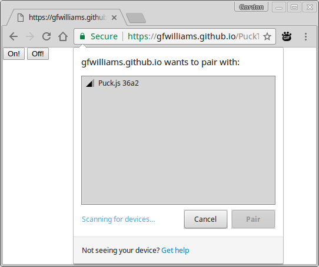
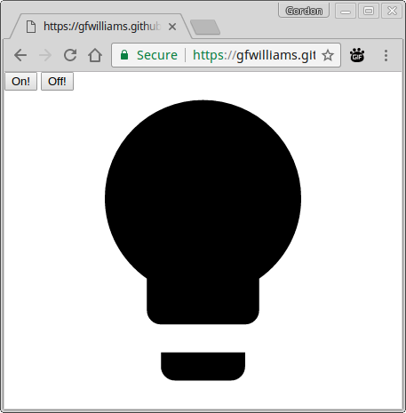

<!--- Copyright (c) 2016 Gordon Williams, Pur3 Ltd. See the file LICENSE for copying permission. -->
Using Puck.js from a Web Bluetooth Website
==========================================

<span style="color:red">:warning: **Please view the correctly rendered version of this page at https://www.espruino.com/Puck.js+Web+Bluetooth. Links, lists, videos, search, and other features will not work correctly when viewed on GitHub** :warning:</span>

* KEYWORDS: Tutorials,Puck.js,GitHub,Web Bluetooth,BLE
* USES: Puck.js,Web Bluetooth,BLE,Only BLE

**Note:** Web Bluetooth currently works on Mac OS, Android, Chromebook, Linux and
iOS (with [this app](https://itunes.apple.com/us/app/webble/id1193531073)). Google
were supposed to add Web Bluetooth support for Windows in early 2017, but this has
not yet happened - however [there are workarounds](https://github.com/urish/web-bluetooth-polyfill).

To work, Web Bluetooth needs to be run from a website that's served over HTTPS
(not HTTP). While you can set one up yourself with [Let's Encrypt](https://letsencrypt.org/),
we're not going to cover that here. Instead, we'll use [GitHub Pages](https://pages.github.com/).

* Log in or create an account on [GitHub.com](https://github.com)
* Click on the `Repositories` tab, and click `New`
* Enter `PuckTest` as the name, make sure you check `Initialize this repository with a README`,
and click `Create` (if you don't, you'll have to use command-line tools to create a new file)
* Click on `Settings` in the top right
* Scroll down to `GitHub Pages`, under `Source` choose `master branch` and click `Save`
* Now go back to the `Code` tab, and click `Create new file` in the top right
* Enter `test.html` as the name
* Now Copy and paste the following code and click `Commit new file` at the bottom:

```HTML_demo_link
<html>
 <head>
 </head>
 <body>
  <script src="https://www.puck-js.com/puck.js"></script>
  <button onclick="Puck.write('LED1.set();\n');">On!</button>
  <button onclick="Puck.write('LED1.reset();\n');">Off!</button>
 </body>
</html>
```

You'll now have your own webpage at: https://your_username.github.io/PuckTest/test.html



Click on the button marked `On!` and you should be presented with a window
like the following:



If you choose your Puck.js device and click `Pair`, you should see the Red
LED light up on it after a few seconds. You can now click the `Off!` button
to turn it off, and it should turn off.

So what happened? The HTML above creates two buttons, and when they are
executed they call the `Puck.write` function, which is in the `puck.js`
script file that we loaded up right before.

`Puck.write` sends the string you pass to it directly to [Puck.js](/Puck.js)
as a command. You need the `\n` (newline character) to tell Espruino that
it's the end of the command and it should execute it.

**Can I send commands to Puck.js as soon as the page loads?** Unfortunately
not - as a security precaution, Web Bluetooth implementations can only
connect to a Bluetooth LE device in response to user input. After that you
can do what you want though.

The example above is pretty basic - let's try and make something
that looks better.

First, we'll find a lightbulb icon. SVG is a nice choice as it looks good
when it's scaled up, and we can include the whole image in our HTML file.

* Go to [materialdesignicons.com/](https://materialdesignicons.com/)
* In the search box, type in `lightbulb`
* Click the filled in icon, then in the window that pops up click `</>`
and `View SVG`.
* Copy the code that appears onto the clipboard
* Now, go back to your repository on GitHub, click on the file, and click
the edit icon (shaped like a Pencil).
* Paste the `SVG` in right after the `<body>` tag.
* If you view now, you should see a small lightbulb icon - but we want it
to stretch, so we need to add some CSS to tell it to fill the available
area. Add this inside the `<head>` tag:

```CSS
  <style>
    body { margin:0;  }
    svg {
      display:block; position:absolute;
      top:0%; left:0%; width:100%; height:100%;
    }
  </style>    
```

* And delete the `style=` section from the SVG. Your code should now look like this:

```HTML
<html>
 <head>
   <style>
     body { margin:0;  }
     svg {
       display:block; position:absolute;
       top:0%; left:0%; width:100%; height:100%;
     }
   </style>    
 </head>
 <body>
  <svg viewBox="0 0 24 24">
    <path fill="#000000" d="M12,2A7,7 0 0,0 5,9C5,11.38 6.19,13.47 8,14.74V17A1,1 0 0,0 9,18H15A1,1 0 0,0 16,17V14.74C17.81,13.47 19,11.38 19,9A7,7 0 0,0 12,2M9,21A1,1 0 0,0 10,22H14A1,1 0 0,0 15,21V20H9V21Z" />
  </svg>
  <script src="https://www.puck-js.com/puck.js"></script>
  <button onclick="Puck.write('LED1.set();\n');">On!</button>
  <button onclick="Puck.write('LED1.reset();\n');">Off!</button>
 </body>
</html>
```

* If you now reload your page it should look like this:



**Note:** if it doesn't change, it might be because the webpage has been cached.
If you can add `?1` to the end of the URL (you may have to keep incrementing the
number) it'll force a reload.

Now, we can start to make it interactive. We'll replace the two buttons
with just a click on the SVG image.

* Edit the code and replace the HTML for the buttons with a script that'll
work when the image is clicked:

```HTML_demo_link
<html>
 <head>
   <style>
     body { margin:0;  }
     svg {
       display:block; position:absolute;
       top:0%; left:0%; width:100%; height:100%;
     }
   </style>    
 </head>
 <body>
  <svg viewBox="0 0 24 24">
    <path fill="#000000" d="M12,2A7,7 0 0,0 5,9C5,11.38 6.19,13.47 8,14.74V17A1,1 0 0,0 9,18H15A1,1 0 0,0 16,17V14.74C17.81,13.47 19,11.38 19,9A7,7 0 0,0 12,2M9,21A1,1 0 0,0 10,22H14A1,1 0 0,0 15,21V20H9V21Z" />
  </svg>
  <script src="https://www.puck-js.com/puck.js"></script>
  <script type="text/javascript">
    // Get the actual curve inside the SVG. You could make differemt
    // parts of a more complex SVG do different things...
    var path = document.getElementsByTagName('path')[0];
    // Make sure your mouse cursor turns into a hand when over it, and gray it out
    path.style="cursor:pointer;fill:#BBB";
    // Now send commands to turn the LED on or off
    var on = false;
    path.addEventListener("click", function() {
      on = !on;
      if (on) {
        path.style.fill="red";
        Puck.write('LED1.set();\n');
      } else {
        path.style.fill="#444";
        Puck.write('LED1.reset();\n');
      }
    });
  </script>
  </body>
 </html>  
```

* Save and reload the page and you should now be able to control the Puck's
LED from it

Or course you might want to cycle through colours - in which case you
could use the following:

```HTML_demo_link
<html>
 <head>
   <style>
     body { margin:0;  }
     svg {
       display:block; position:absolute;
       top:0%; left:0%; width:100%; height:100%;
     }
   </style>    
 </head>
 <body>
  <svg viewBox="0 0 24 24">
    <path fill="#000000" d="M12,2A7,7 0 0,0 5,9C5,11.38 6.19,13.47 8,14.74V17A1,1 0 0,0 9,18H15A1,1 0 0,0 16,17V14.74C17.81,13.47 19,11.38 19,9A7,7 0 0,0 12,2M9,21A1,1 0 0,0 10,22H14A1,1 0 0,0 15,21V20H9V21Z" />
  </svg>
  <script src="https://www.puck-js.com/puck.js"></script>
  <script type="text/javascript">
    // Get the actual curve inside the SVG. You could make differemt
    // parts of a more complex SVG do different things...
    var path = document.getElementsByTagName('path')[0];
    // Make sure your mouse cursor turns into a hand when over it, and gray it out
    path.style="cursor:pointer;fill:#BBB";
    // the possible states we could be in
    var state = 0;
    var states = [
      { color : "#444", command : "digitalWrite([LED3,LED2,LED1],0);\n" },
      { color : "red", command : "digitalWrite([LED3,LED2,LED1],1);\n" },
      { color : "green", command : "digitalWrite([LED3,LED2,LED1],2);\n" },
      { color : "blue", command : "digitalWrite([LED3,LED2,LED1],4);\n" },
    ];
    // Now send commands to turn the LED on or off
    path.addEventListener("click", function() {
      state++;
      if (state>=states.length)
        state=0;
      path.style.fill=states[state].color;
      Puck.write(states[state].command);
    });
  </script>
</body>
</html>
```

Extra Features
--------------

The Puck.js library also has a `Puck.setTime(optional_callback)` function
which will set Puck.js's time to your computer's time. This can be great
if you're making some time-based device and you want to be sure that
the clock is always set correctly.

Reading from Puck.js
--------------------

At the moment, all we're doing is sending data to Puck.js - not getting
anything back.

However, getting values back is quite easy. While you're connected to
Puck.js with the webpage you made, open up the Developer tools in Chrome
with `Ctrl + Shift + I`, `F12`, or from the menu (`More tools -> Developer tools`).

Now, enter the following in the `Console` window:

```
Puck.eval("BTN.read()",function(x) { console.log(x); })
```

This will print `false` to the console. However, if you press Puck.js down
and do it again, it'll print `true`.

This is evaluating a command on Puck.js (note there's no newline needed),
and then calling the callback with the result.

**So why isn't this a normal function call that returns a value?** Well,
it takes time to send the data to Puck.js and get a response back. If your
code waited for a response then the whole webpage would grind to a halt.

This way, you provide a function which is called back when data arrives, and
everything else keeps working.

So how would you use this? You could modify the light example above to
change the colour of the webpage icon depending on the amount of light
the Puck can sense.

Just create a new HTML file in GitHub as you did above and paste the
following code in:

```HTML_demo_link
<html>
 <head>
   <style>
     body { margin:0;  }
     svg {
       display:block; position:absolute;
       top:0%; left:0%; width:100%; height:100%;
     }
   </style>    
 </head>
 <body>
  <svg viewBox="0 0 24 24">
    <path fill="#000000" d="M12,2A7,7 0 0,0 5,9C5,11.38 6.19,13.47 8,14.74V17A1,1 0 0,0 9,18H15A1,1 0 0,0 16,17V14.74C17.81,13.47 19,11.38 19,9A7,7 0 0,0 12,2M9,21A1,1 0 0,0 10,22H14A1,1 0 0,0 15,21V20H9V21Z" />
  </svg>
  <script src="https://www.puck-js.com/puck.js"></script>
  <script type="text/javascript">
    // Get the actual curve inside the SVG. You could make differemt
    // parts of a more complex SVG do different things...
    var path = document.getElementsByTagName('path')[0];
    // Make sure your mouse cursor turns into a hand when over it, and gray it out
    path.style="cursor:pointer;fill:#BBB";

    function getLightValue() {
      Puck.eval("Puck.light()", function(v) {
        path.style.fill="rgb("+Math.round(v*255)+",0,0)";
        setTimeout(function() {
          getLightValue();
        }, 250);
      });
    }

    // When clicked, start trying to get the light value
    path.addEventListener("click", function() {
      getLightValue();
    });
  </script>
 </body>
</html>
```

Now, when you click the light bulb it'll connect to Puck.js, and you can
change the colour by shining light on or covering up your Puck.

**Note:** we're only requesting new data after we have got the last set of
data. This is better than using something like `setInterval`, as if there
are transmission errors, multiple requests for data could end up piling up.

This works, and it's easy - but it's not very fast.


Two way communications
----------------------

What would be better is if we had lower-level control. We could then just
tell Espruino to automatically send data over Bluetooth (without being prompted)
and we could just handle it directly.

That's what you can do with `Puck.connect(callback)`. Once connected it calls the `callback`
function with the connection, which you can then use to send and receive data.

**Note:** You can't use `Puck.connect` and `Puck.write/eval` on the same
connection at the same time. If you want to write to a Puck after having
used `Puck.connect`, you need to use `connection.write` and handle
any response in the `connection.on("data",` handler.

Try the example below:

```HTML_demo_link
<html>
 <head>
   <style>
     body { margin:0;  }
     svg {
       display:block; position:absolute;
       top:0%; left:0%; width:100%; height:100%;
     }
   </style>    
 </head>
 <body>
  <svg viewBox="0 0 24 24">
    <path fill="#000000" d="M12,2A7,7 0 0,0 5,9C5,11.38 6.19,13.47 8,14.74V17A1,1 0 0,0 9,18H15A1,1 0 0,0 16,17V14.74C17.81,13.47 19,11.38 19,9A7,7 0 0,0 12,2M9,21A1,1 0 0,0 10,22H14A1,1 0 0,0 15,21V20H9V21Z" />
  </svg>
  <script src="https://www.puck-js.com/puck.js"></script>
  <script type="text/javascript">
    // Get the actual curve inside the SVG. You could make differemt
    // parts of a more complex SVG do different things...
    var path = document.getElementsByTagName('path')[0];
    // Make sure your mouse cursor turns into a hand when over it, and gray it out
    path.style="cursor:pointer;fill:#BBB";

    // Called when we get a line of data - updates the light color
    function onLine(v) {
      console.log("Received: "+JSON.stringify(v));
      path.style.fill="rgb("+Math.round(v*255)+",0,0)";
    }

    // When clicked, connect or disconnect
    var connection;
    path.addEventListener("click", function() {
      if (connection) {
        connection.close();
        connection = undefined;
      }
      Puck.connect(function(c) {
        if (!c) {
          alert("Couldn't connect!");
          return;
        }
        connection = c;
        // Handle the data we get back, and call 'onLine'
        // whenever we get a line
        var buf = "";
        connection.on("data", function(d) {
          buf += d;
          var i = buf.indexOf("\n");
          while (i>=0) {
            onLine(buf.substr(0,i));
            buf = buf.substr(i+1);
            i = buf.indexOf("\n");
          }
        });
        // First, reset Puck.js
        connection.write("reset();\n", function() {
          // Wait for it to reset itself
          setTimeout(function() {
            // Now tell it to write data on the current light level to Bluetooth
            // 10 times a second. Also ensure that when disconnected, Puck.js
            // resets so the setInterval doesn't keep draining battery.
            connection.write("setInterval(function(){Bluetooth.println(Puck.light());},100);NRF.on('disconnect', function() {reset()});\n",
              function() { console.log("Ready..."); });
          }, 1500);
        });
      });
    });
  </script>
 </body>
</html>
```

This:

* Connects when the light is clicked
* Registers a data handler with `connection.on("data",  ...)`, which then
calls `onLine` each time a line is received.
* Sends `reset()` to Puck.js - while not required this performs a software
reset, which would clear out any previously send code.
* Waits for the reset to complete. The reset is fast, but sending the text
created bythe reset itself is slow!
* Sends `setInterval(function(){Bluetooth.println(Puck.light());},100);` - this
causes Espruino to write the current light value down the Bluetooth link every
`100ms`.
* When each line is received, `onLine` gets called and it updates the color
of the light icon.
* `NRF.on('disconnect', function() {reset()});` is also sent. This ensures that
when disconnected, Puck.js resets itself - which makes sure that there isn't
a `setInterval` left running that will flatten your battery. If you're making
something with this you'll almost certainly want to be a bit more subtle -
using `clearInterval` to remove *just* the interval you started.

**Note:** We use `Bluetooth.println` not `console.log` because writing to the
console would cause the `>` prompt character to be removed, the text to be
written, and then `>` to be written again. By writing direct to `Bluetooth` the
console device is unaware of what's going on and doesn't output any extra
characters.

Dashboards
----------

You might also be interested in the [Web Bluetooth Dashboard tutorial](/Web+Bluetooth+Dashboard).
