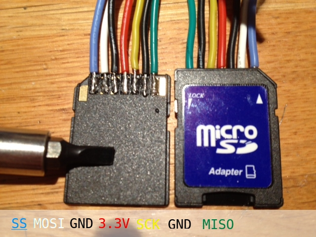
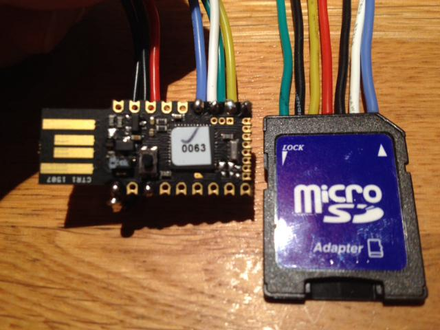

<!--- Copyright (c) 2015 Gordon Williams, Pur3 Ltd. See the file LICENSE for copying permission. -->
File IO
=======

* KEYWORDS: File,Filesystem,File IO,SD card,microSD card

To access files from Espruino (if you're not getting them from the [[Internet]]) you'll need an SD card.

On the original [Espruino board](/EspruinoBoard) there's a Micro SD card slot built-in,
or on the [Espruino Pico](/Pico) you'll have to wire a card up externally and then
tell Espruino about it with [E.connectSDCard](http://www.espruino.com/Reference#l_E_connectSDCard):

```
// Wire up up MOSI, MISO, SCK and CS pins (along with 3.3v and GND)
SPI1.setup({mosi:B5, miso:B4, sck:B3});
E.connectSDCard(SPI1, B6 /*CS*/);
// see what's on the device
console.log(require("fs").readdirSync());
```

Espruino has two main forms of File IO available:

FS Library - Simple Node.js-compatible File IO
-----------------------------------------

The [fs](http://www.espruino.com/Reference#fs) library allows you to read directories, 
read, write, stat and delete files. See [here](http://www.espruino.com/Reference#fs) 
for more details about the specific functions.

We've tried to keep it a lot like the [Node FS Library](https://nodejs.org/api/fs.html) however
note that while Asynchronous functions exist (like `fs.readFile`) they are not currently asynchronous
and behave the same way as their `...Sync` equivalents.

### Read directory contents

```
var files = require("fs").readdirSync();
for (var i in files)
  console.log("Found file "+files[i]);
```

### Read and write files

```
require("fs").writeFileSync("hello.txt", "Hello World");
console.log(require("fs").readFileSync("hello.txt")); // prints "Hello World"
require("fs").appendFileSync("hello.txt", "!!!");
console.log(require("fs").readFileSync("hello.txt")); // prints "Hello World!!!"
```

However, with the exception of `appendFileSync`, these functions only allow you to act on whole files. This means that you will quickly exhaust Espruino's RAM when loading larger files.

E.openFile - Stream File IO
------------------------

While we'd have liked to keep a node.js-compatible Filesystem stream API, Node's
implementation just didn't make sense on a Microcontroller.

Instead we have developed our own simple API. Just use 
[`E.openFile`](http://www.espruino.com/Reference#l_E_openFile) to open a file. This 
returns a [File](http://www.espruino.com/Reference#File) Object, which has functions
such as `read`, `write` and `seek` on it.

For example the following would open a file, get one byte out of it, and then
write to an analog ([[PWM]]) output 10 times a second.

```
var f = E.openFile("data.raw","r");

setInterval(function() {
  var val = f.read(1).charCodeAt(0);
  analogWrite(A0, val/256);
}, 100);
``` 

Or the following would take a series of readings and write them as a comma-separated file:

```
var f = E.openFile("data.csv","w");

setInterval(function() {
  var readings = [
    analogRead(A0),
    analogRead(A1),
    analogRead(A2),
    analogRead(A3)
  ];
  f.write(readings.join(", ")+"\n");
}, 100);
``` 

Finally you'll need to close the file with `f.close()` or you may get corruption.

Note that you could do also this with `appendFileSync`. However `appendFileSync` will close
the file after each write, which is safer (but also slower!).

Piping
-----

You can also 'pipe' to and from files, which will perform the data transfer in the background.

For example the following will create an HTTP server that serves up the file `rick.webm` from the SD card.

This is hugely useful, as sometimes you will want to serve up a file that is too big to fit into Espruino's RAM.

```
function onPageRequest(req, res) {
  res.writeHead(200, {'Content-Type': 'video/webm'});
  new File("rick.webm").pipe(res);
}
require('http').createServer(onPageRequest).listen(80);
```


Ejecting
-------

Just like on a PC or camera, if you unplug an SD card while a device is writing to it, you can corrupt (and in some cases physically damage) it.

To avoid this, Espruino has the [`E.unmountSD()`](http://www.espruino.com/Reference#l_E_unmountSD) function. Just close your open files, and call it. The SD card can then be removed without problems.

Just be sure not to perform any File IO after calling it, as they will 're-mount' the SD card.

For example you might want to create a logger that writed to a log file when the Red LED is lit, but that allows you to press a button to toggle between recording and not recording:

```
var logFile;
var logInterval;
function doLog() {
  digitalPulse(LED2,1,50); // pulse green led as indicator
  logFile.write(getTime()+","+E.getTemperature()+"\r\n"); // write the time and temperature for example
}
setWatch(function() {
  if (logFile===undefined) {
   logFile = E.openFile("log.txt", "a");
   digitalWrite(LED1,1); // red indicator on
   logInterval = setInterval(doLog, 1000);
  } else {
    clearInterval(logInterval);
    logInterval = undefined;
    logFile.close();
    logFile = undefined;
    E.unmountSD(); // card can now be pulled out
    digitalWrite(LED1,0); // red indicator off
  }
}, BTN,  { repeat:true, edge:'rising', debounce:50 });
setDeepSleep(1);
```


Wiring up an SD card adapter
--------------------------

If you don't have an SD breakout board at your disposal, you can make your own by soldering directly to a microSD/SDHC to SD card adapter (often provided with microSDs).



Example of wiring it up to the Espruino Pico:



Example code for the above wiring:

```javascript
/* 
  R: the following function is auto-called when the Espruino is booting up
     to flash the Espruino & save the following to its flash, just call 'save()' in the IDE
*/
function onInit() {
  // initial SPI1 for SDCard module
  SPI1.setup({sck:A5, miso:A6, mosi:A7 });
  E.connectSDCard(SPI1,B1/*CS*/);
  console.log(require("fs").readdirSync());
  // ...
}
```

