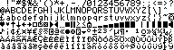

<!--- Copyright (c) 2013 Gordon Williams, Pur3 Ltd. See the file LICENSE for copying permission. -->
Fonts
====

* KEYWORDS: Graphics,Font,Fonts,Text,Typeface,Module

Espruino has two main fonts built-in. A vector font, and a bitmap font.

Vector Font
----------

The Vector font is made out of polygons, and it can be resized to any size. This makes it great for displaying big text like numbers.

To use it, just use `Graphics.setFontVector(size)`:

assuming you've set up [[Graphics]] as a variable called `g`
```
g.clear();
g.setFontVector(40);
g.drawString("Hello",0,0); // 40px high
g.setFontVector(60);
g.drawString("World",40,40); // 60px high 
```

While the vector font is meant to look great at larger sizes, it doesn't scale down in size very well, so there's the Bitmap Font.


Bitmap Font
----------

The bitmap font is designed to be extremely small while still legible. This is the default font, but if you've already switched away from a Vector font, you can switch back to it with:

```
g.setFontBitmap();
g.drawString("Hello",0,0);
```

Font Modules
-----------

Often you may want a font that is bigger than the built-in font, but smaller than the vector font. For this, you can use one of the font modules.

Current modules are:

* [[Font4x4.js]] - tiny 4x4 block font (only digits 0-9)
* [[Font6x8.js]]
* [[Font6x12.js]]
* [[Font8x12.js]]
* [[Font8x16.js]]
* [[FontDennis8.js]] - An 8 pixel high font by [Dennis Bemmann](https://github.com/pastaclub/espruino-font-dennis8) with most characters for German, Spanish, French, Turkish, etc:



Use these like this:

```
// On initialisation...
require("Font8x12").add(Graphics);

// When drawing...
g.setFont8x12();
g.drawString("Hello World!",0,0);
```

Custom Fonts
-----------

You can also create your own fonts. To do this, see [`g.setFontCustom(...)`](/Reference#l_Graphics_setFontCustom)

You'll need a string containing a column-first, most significant bit first, 1 bit per pixel bitmap containing the font bitmap. Optionally you can also have another string containing the widths of each character.

Matt Brailsford has made an excellent [online font converter](http://ebfc.mattbrailsford.com/) specifically for creating fonts for Espruino. 
... or for an example of how to create the data programmatically, take a look at
[the JS file used to make Espruino's font modules](https://github.com/espruino/Espruino/blob/master/scripts/create_custom_font.js).


Font Widths
----------

Often it's extremely useful to know the size of a piece of text - either so that you can position it centrally, or so that you can position other text at the end. For this, you can use `g.stringWidth()`.

For example you may want to draw some small text right after some big text:

```
function bigThenSmall(big, small, x, y) {
  g.setFontVector(20);
  g.drawString(big, x, y);
  x += g.stringWidth(big);
  g.setFontBitmap();
  g.drawString(small, x, y);
}
bigThenSmall("Hello", " World", 0,0);
```

or you may just want to draw text centrally:

```
function central(text, y) {
  g.drawString(text, (g.getWidth() - g.stringWidth(text))/2, y);
}
central("Hello", 0);
```
