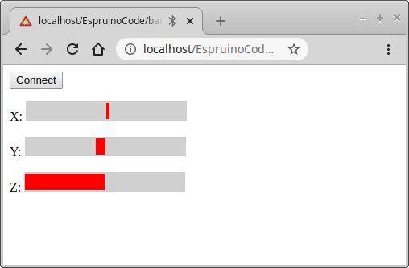
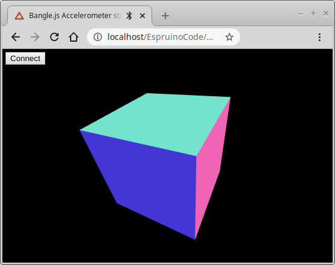

<!--- Copyright (c) 2020 Gordon Williams, Pur3 Ltd. See the file LICENSE for copying permission. -->
Bangle.js Data Streaming
========================

<span style="color:red">:warning: **Please view the correctly rendered version of this page at https://www.espruino.com/Bangle.js+Data+Streaming. Links, lists, videos, search, and other features will not work correctly when viewed on GitHub** :warning:</span>

* KEYWORDS: Tutorials,Bangle.js,data,web bluetooth
* USES: Bangle.js,Storage



This tutorial will show you how to stream data from Bangle.js to the PC. We're
going to use the accelerometer, along with Web Bluetooth on
the PC (using the `puck.js` library).

For more detailed info, check out [this page on Web Bluetooth with Espruino](/Web+Bluetooth).

First off you need to be able to either host a webpage on your own PC (HTTP via `localhost`)
or online via HTTPS. There's some info on doing this on [the Web Bluetooth page](/Web+Bluetooth).

Then copy this code and try it in a web browser.

**Note:** You can try it right now just by clicking `Try Me` in the bottom
right of the code snippet.

```HTML_demo_link
<html>
 <head>
  <title>Bangle.js Accelerometer streaming</title>
 </head>
 <body>
<script src="https://www.puck-js.com/puck.js"></script>
<button id="btnConnect">Connect</button>
<p>X: <span class="bar"><span id="barX"></span></span></p>
<p>Y: <span class="bar"><span id="barY"></span></span></p>
<p>Z: <span class="bar"><span id="barZ"></span></span></p>
<script>
// Code to upload to Bangle.js
var BANGLE_CODE = `
Bangle.on('accel',function(a) {
  var d = [
    "A",
    Math.round(a.x*100),
    Math.round(a.y*100),
    Math.round(a.z*100)
    ];
  Bluetooth.println(d.join(","));
})
`;

// When we click the connect button...
var connection;
document.getElementById("btnConnect").addEventListener("click", function() {
  // disconnect if connected already
  if (connection) {
    connection.close();
    connection = undefined;
  }
  // Connect
  Puck.connect(function(c) {
    if (!c) {
      alert("Couldn't connect!");
      return;
    }
    connection = c;
    // Handle the data we get back, and call 'onLine'
    // whenever we get a line
    var buf = "";
    connection.on("data", function(d) {
      buf += d;
      var l = buf.split("\n");
      buf = l.pop();
      l.forEach(onLine);
    });
    // First, reset the Bangle
    connection.write("reset();\n", function() {
      // Wait for it to reset itself
      setTimeout(function() {
        // Now upload our code to it
        connection.write("\x03\x10if(1){"+BANGLE_CODE+"}\n",
          function() { console.log("Ready..."); });
      }, 1500);
    });
  });
});

// When we get a line of data, check it and if it's
// from the accelerometer, update it
function onLine(line) {
  console.log("RECEIVED:"+line);
  var d = line.split(",");
  if (d.length==4 && d[0]=="A") {
    // we have an accelerometer reading
    var accel = {
      x : parseInt(d[1]),
      y : parseInt(d[2]),
      z : parseInt(d[3]),
    };    
    // Update bar positions
    setBarPos("barX", accel.x);
    setBarPos("barY", accel.y);
    setBarPos("barZ", accel.z);
  }
}
// Set the position of each bar
function setBarPos(id,d) {
  var s = document.getElementById(id).style;
  if (d>150) d=150;
  if (d<-150) d=-150;
  if (d>=0) {
    s.left="150px";
    s.width=d+"px";
  } else { // less than 0
    s.left=(150+d)+"px";
    s.width=(-d)+"px";
  }
}
</script>
<style>
/* Styles just to make the bars for X Y and Z look neat */
.bar {
  width : 500px;
  height: 24px;
  background-color : #D0D0D0;
  position:relative;
  display: inline-block;
}
.bar span {
  width : 1px;
  height: 20px;
  background-color : red;
  position:absolute;
  display: inline-block;
  left: 150px;
  top: 2px;
}
</style>
 </body>
</html>
```

Click `Connect`, choose your Bangle.js, and you should
instantly see the accelerometer readings in the browser.

So how does it work?
--------------------

* When you click `Connect`, `Puck.connect` creates a connection to the Bangle using Web Bluetooth
* The Bangle is reset and the contents of `BANGLE_CODE` is uploaded - this takes accelerometer data and writes it to the web browser in the form `A,x,y,z`
* `onLine` is called for each new line, and it detects lines of the form `A,x,y,z` and updates the bars accordingly

You can easily add other `Bluetooth.println` to your code on Bangle.js
and then detect them in `onLine`.

Gotchas
-------

The Web Bluetooth connection can only transfer around 2500 bytes per second. As a result you need to be careful you don't try and
send more than that. Accelerometer data is 12.5Hz by default, and we round it to whole numbers to avoid sending too many characters.


Bonus: 3D Rendering
-------------------

3D looks much more exciting. This is identical code, just with the bottom part
with the bars replaced with [three.js](https://threejs.org/) WebGL rendering
a cube.



```HTML_demo_link
<html>
 <head>
   <title>Bangle.js Accelerometer streaming in 3D</title>
 </head>
 <body style="margin:0px">
<script src="https://www.puck-js.com/puck.js"></script>
<button id="btnConnect" style="position:absolute;left:5px;top:5px;z-index:1000">Connect</button>
<script src="https://cdnjs.cloudflare.com/ajax/libs/three.js/r99/three.min.js"></script>
<script>
// Code to upload to Bangle.js
var BANGLE_CODE = `
Bangle.on('accel',function(a) {
  var d = [
    "A",
    Math.round(a.x*100),
    Math.round(a.y*100),
    Math.round(a.z*100)
    ];
  Bluetooth.println(d.join(","));
})
`;
var accel = new THREE.Vector3( 0, 0, 1 );

// When we click the connect button...
var connection;
document.getElementById("btnConnect").addEventListener("click", function() {
  // disconnect if connected already
  if (connection) {
    connection.close();
    connection = undefined;
  }
  // Connect
  Puck.connect(function(c) {
    if (!c) {
      alert("Couldn't connect!");
      return;
    }
    connection = c;
    // Handle the data we get back, and call 'onLine'
    // whenever we get a line
    var buf = "";
    connection.on("data", function(d) {
      buf += d;
      var l = buf.split("\n");
      buf = l.pop();
      l.forEach(onLine);
    });
    // First, reset the Bangle
    connection.write("reset();\n", function() {
      // Wait for it to reset itself
      setTimeout(function() {
        // Now upload our code to it
        connection.write("\x03\x10if(1){"+BANGLE_CODE+"}\n",
          function() { console.log("Ready..."); });
      }, 1500);
    });
  });
});

// When we get a line of data, check it and if it's
// from the accelerometer, update it
function onLine(line) {
  console.log("RECEIVED:"+line);
  var d = line.split(",");
  if (d.length==4 && d[0]=="A") {
    // we have an accelerometer reading
    accel.x = parseInt(d[1])/100;
    accel.y = parseInt(d[2])/100;
    accel.z = parseInt(d[3])/100;
    render();
  }
}
// WebGL boilerplate
var scene, camera, renderer, cube;
var WIDTH  = window.innerWidth;
var HEIGHT = window.innerHeight;
function init() {
    scene = new THREE.Scene();

    camera = new THREE.PerspectiveCamera(70, WIDTH / HEIGHT, 1, 10);
    camera.position.set(0, 3.5, 5);
    camera.lookAt(scene.position);

    cube = new THREE.Mesh(new THREE.CubeGeometry(2, 2, 2), new THREE.MeshNormalMaterial());
    scene.add(cube);

    renderer = new THREE.WebGLRenderer({ antialias: true });
    renderer.setSize(WIDTH, HEIGHT);

    document.body.appendChild(renderer.domElement);
}
function render() {
    cube.lookAt(accel);
    renderer.render(scene, camera);
}

init();
render();
</script>
 </body>
</html>
```
