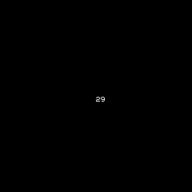
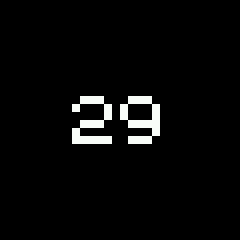
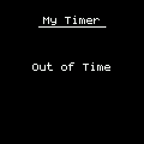

<!--- Copyright (c) 2020 Gordon Williams, Pur3 Ltd. See the file LICENSE for copying permission. -->
Bangle.js First Application (Timer)
====================================

<span style="color:red">:warning: **Please view the correctly rendered version of this page at https://www.espruino.com/Bangle.js+First+App. Links, lists, videos, search, and other features will not work correctly when viewed on GitHub** :warning:</span>

* KEYWORDS: Tutorials,Bangle.js,Development,Timer,App,Apps,Application
* USES: Bangle.js

We'll assume you've already been through the [Bangle.js Development page](/Bangle.js+Development)
and have an idea how to get started.

If so you're now connected and can write some simple code - let's have a go at making a timer app.

To do this, it's best to use the right-hand side of the IDE - once uploaded you can tweak values and call functions using the REPL on the left if you want to.

Counting down
-------------

Copy the following code to the right of the IDE and click Upload ():

```
var counter = 30;

function countDown() {
  counter--;

  g.clear();
  // draw the current counter value
  g.drawString(counter, g.getWidth()/2, g.getHeight()/2);
  // optional - this keeps the watch LCD lit up
  g.flip();
}

var interval = setInterval(countDown, 1000);
```

You'll now have some tiny text in the middle of the screen, which counts down
from 29.



Changing font
-------------

First, we'll want to make the text bigger, and properly centered. You have
two options here - a bitmap font, or a vector one.

Because we're not resetting the state of the Graphics library with
`reset()` every frame, you can now just copy/paste the following
code onto the left-hand side of the IDE.

```
g.setFontAlign(0,0); // center font
g.setFont("6x8",8); // bitmap font, 8x magnified
```



You'll now have a bigger, but pixellated, number in the center of the screen.

You can try different numbers (`-1/1/0` for `setFontAlign` or changing `8` in
`setFont`) or can experiment with `g.setColor("#00ff7f")` to
change the colour.

When you have it as you want, add the code right after `g.clear()` on
the right hand side and re-upload to make it permanent.

If you'd prefer something smooth, you can use the Vector font, 80px high,
by replacing `g.setFont("6x8",8)` with `g.setFont("Vector",80)`.


Messages, beep, and buzz
-------------------------

Finally, maybe we want to detect when the counter hits zero,
display a message, and beep:

```
var counter = 30;
var counterInterval;

function outOfTime() {
  E.showMessage("Out of Time","My Timer");
  Bangle.buzz();
  Bangle.beep(200, 4000)
    .then(() => new Promise(resolve => setTimeout(resolve,200)))
    .then(() => Bangle.beep(200, 3000));
  // again, 10 secs later
  setTimeout(outOfTime, 10000);
}

function countDown() {
  counter--;
  // Out of time
  if (counter<=0) {
    clearInterval(counterInterval);
    counterInterval = undefined;
    outOfTime();
    return;
  }

  g.clear();
  g.setFontAlign(0,0); // center font
  g.setFont("Vector",80); // vector font, 80px  
  // draw the current counter value
  g.drawString(counter,120,120);
  // optional - this keeps the watch LCD lit up
  g.flip();
}

counterInterval = setInterval(countDown, 1000);
```



This will just keep on beeping and buzzing until you reset the
watch with a long-press of **BTN3**. Let's just make the press of
**BTN2** clear the timer:

* Add `if (counterInterval) return;` as the first line in `function outOfTime() {`
* Replace `counterInterval = setInterval(countDown, 1000);` with:

```
function startTimer() {
  counter = 30;
  countDown();
  if (!counterInterval)
    counterInterval = setInterval(countDown, 1000);
}

startTimer();
```   

* And finally we'll make a button press reset it. Add `setWatch(startTimer, BTN2);`
just before the call to `outOfTime();` in `countDown`.

Your code should now look like:

```
var counter = 30;
var counterInterval;

function outOfTime() {
  if (counterInterval) return;
  E.showMessage("Out of Time", "My Timer");
  Bangle.buzz();
  Bangle.beep(200, 4000)
    .then(() => new Promise(resolve => setTimeout(resolve,200)))
    .then(() => Bangle.beep(200, 3000));
  // again, 10 secs later
  setTimeout(outOfTime, 10000);
}

function countDown() {
  counter--;
  // Out of time
  if (counter<=0) {
    clearInterval(counterInterval);
    counterInterval = undefined;
    setWatch(startTimer, BTN2);
    outOfTime();
    return;
  }

  g.clear();
  g.setFontAlign(0,0); // center font
  g.setFont("Vector",80); // vector font, 80px  
  // draw the current counter value
  g.drawString(counter,120,120);
  // optional - this keeps the watch LCD lit up
  g.flip();
}

function startTimer() {
  counter = 30;
  countDown();
  if (!counterInterval)
    counterInterval = setInterval(countDown, 1000);
}

startTimer();
```

Making an App
-------------

Now we have this, we need to turn it into an app for the watch. To do that
we need two basic files on the watch:

* The app's code in a JS file
* A JSON `info` file describing the app (name/etc) for the launcher.

First, come up with a unique ID for your app. Don't use spaces, use
lowercase letters, and try and make it reasonably short (under 10 characters is a good idea).

It shouldn't already be listed in https://github.com/espruino/BangleApps/tree/master/apps
so that it doesn't interfere with other apps you might install.

### App Code: timer.app.js

We'll use `timer`. Now, click the down-arrow below the Upload button,
then choose `Storage`, then `New File`, and then type `timer.app.js`
and click `Ok`.

Now, click the `Upload` button. The app will be uploaded to the watch
and then executed from the file. With this set, you can easily
continue to develop your app as it is on the watch.

### App Info: timer.app.info

Now we have the app, but it won't appear in the launcher because
there is no app info file. To fix this, just copy and paste the
following into the **left-hand side** of the IDE.

It'll write the relevant info to the file `timer.info`

```
require("Storage").write("timer.info",{
  "name":"My Timer",
  "src":"timer.app.js"
});
```

If you now long-press **BTN3** to get to the clock, the press
**BTN2** to get to the menu, you can scroll down and see `My Timer`.
If you select it, it'll execute your app!

**Note:** The [Bangle App Loader](https://banglejs.com/apps/)
automatically generated this file - we're just doing it here
so you can create an app without requiring the loader.

### Icon: timer.img

In the menu, you'd have noticed that there was no icon shown.

To fix this, let's find a 48px icon. Unless you want to create one,
we'd suggest using [icons8.com](https://icons8.com/) as they're free
for Open Source projects (we're also paid up just in case).

* Go to [icons8.com](https://icons8.com/)
* Type `Timer` into the search box
* On the left, click `Color` - this is the style we often use in Bangle.js
* Choose `Sand Timer` or whatever you feel like
* Click `Download` and download the 48px image

Now it's time to convert the image for use in Espruino and upload it.
You can use http://www.espruino.com/Image+Converter for this, but
the tools are now built into the IDE.

* Click the `Storage` icon above Upload: ![](data:image/png;base64,iVBORw0KGgoAAAANSUhEUgAAACUAAAAoCAIAAAD2YqSKAAAACXBIWXMAAAsTAAALEwEAmpwYAAAAB3RJTUUH5AMNCSQcHvPXXwAABlJJREFUWMPtl11sI9UVx+/M3BmPHTv2jJNxiB3nw3aKBKtNthK7aLv52FaAhNSXVkho4aHRLupjq1ZsVR7ap0IFWlGKVBGUohVClLYviPZlVYKdALtbIAskkTb+iNd24q+Mv8b2jGfm3pk+GLLGu+tdwgqpVY9G82Bfnf/ce87vnHMJU1fBt2gk+Hbtf10P3n6JaWCEdF03sIENjDEGAJimCQAgCAIAQFEURVIQUhSEFISAIA+ipzQauUKhUMhvReOJRCK9s5Mv5EWxLNUlXdOVVgsAYGVZmqH7Hf0DA/yQZ8jvHwkFJkKhSY8g3OPxWO32O9KrlMTIyupyOHLx0uWr0Wiz2dzfUG9rb9fe13fvvZPHHjh6cn5+9sRxzj3w1dPS1c4nFds6s7DAc9w3DxXP80+dXkjFtjr9d+udX1qEEN617IDw/NJip//u2DYaMkLobukhhBoNuRcPPp+X5/m7ped2u30+b6/4Ncvi0it/mp46zDAMRVEHk6EoimXZI9NTf158pVkpdfonuuon0lTDMEsl8YMPL1741/InV64U94qq0mqpqqppGH/BX5d3iqIsDMNaLBYrKwwK352efugHJ48fP+7meQIAmmWv53CX3oULF7LZ3GM//pHNbgcGVmQllUlvJ6+ldzLiXqlcLtekmq7jVqsFAGBZlqYpl9PFc9zg4KDP550YHxsd8Vv7bIAg5Ubjrb/9fXh46OGHH7nleb784jme4548der80uLG2idqvda14LaPWq+tr3302quLT5x6nHO5Xn7xXOe/8AZmyXKl8vobb7z9zjv+kZHh4aFQMBQIBPw+ryAIAzzvdDppGrIsCwBotVq6jmq1mlguF4vFdCaT2E7G4rFsNp/OZCRJaju8o3omSdLG5ubG5ua7y2GGYSwWC0VREEJIUYBoVxJgmgCYJsIYIYQxVlVV07QbA9xLTxgccDgc9Xp9/xeMsaIoiqIcIFEdDocgCL14KOd3n3/u2WAwcGAY9pN2Mhh84blnK4VsLx5MhFRNTSavhVdW3w2/d2Xt03K1qmkaQsgwjFuVHgghSZIQQoZheJdr+sjU9+fm5+dmJsbGaJohOgpkt95KJFyp1n746KMEhFqrVZekxHYyth1PpTOFfKFUKtWkuqarrZYKAGBZC0NbXM5+nuc9Q55R/0hoIhiYGHf09zMsayL09j/+yXPOmdm5W8ZvfWPzd79/fnX1/fn52fvvu8/vG3ELwgPHjt7YhAEAN22tJkLpnczGxuZyOPLmX9965uzZXnoEQWZzuXMv/fH1N//yncng2Oh4MBgY84/4vMNu9yDHOfsdDoZmGAsDANBUTdM1SapXqjVR3NvN7l5L78TjiWQyGY3F9kTRNM074sE0zWKxWCwWV9//kKZpe1+f1WplLIyFsdA0TZAERVIAAGxg0zB1XVc1VVM1WVGazaau61+DB87ltLJse1xom67rlWq1Uq0eIEutLMu5nL14yGeu/erpX3qHh795M/J6vb8++3Qhk+rFAwBArtfXPv1sORJZWV1dX9+o1mqGYZim2X7fanIhSbL9djmdhw7dP3PixMnZ2SNTh20Ox1dWdun9+9LllqrMzM4BA1cqlVK5HI8lovF4Kp0uFAp7JbFalXRd6+gPDMe5Bnh+yOMZHR0NBQLBUMDN8xzHAZJaiYRZi7Uzvbvj9/Ha2rk/vHRm4SezMzOhYCAYCARDk498meiGaZimaRpfbJMAgCAJgiBIgrwOtYFLYunS5Y+WI+Glpdd+8fOf9dIDACS2t5/5zW99Pt/U4UOhYCgwMT7i9Xo8As+5nf2OPnsfhJBmLO3mjBBqNppVqVapVPK5wk4um9hORqPRzz5f39ndvbF235wHjHEqlUqlUgAAm83mcjodDofNZrVarTTNQEi1ZziEEEJY1zVFUWRZkeq1Wq0uy/LX4MFut0EIO+ukLMuyLINc7mDzoN1u6znvxreeOr1wV0Y0nud/euZ0Kr51Gx4qJTGy+sF74fDFy5euXo02DjTPP3j02Mn5udkT33Px7l487FtLbmZz+UKxGIvFEtvJdDqdLxRFUZQkSdX1fR4sNO109bv5gSGP4Pf7AxPjoVDIIwjD9wyxtr6bfNOd3KexrmGEEMLYwNgwgWlcv48RJEUS1+9jNHObM/j//f2/Wu8/508JxJqZ87AAAAAASUVORK5CYII=)
* Choose `Upload a File`
* Select the image file you downloaded
* The IDE will detect it is an image and offer you some options for conversion
* Name the icon `timer.img`
* Ensure `Convert for Espruino` and `Transparency` are checker
* Choose `4 bit Mac Palette` and check the Preview. If the colours aren't good enough, try `8 bit Web Palette` instead.
* Now click `Ok` to upload

Now all you have to do is change the App Info file to reference the icon. Copy
and paste this into the left-hand side of the IDE:

```
require("Storage").write("timer.info",{
  "name":"My Timer",
  "src":"timer.app.js",
  "icon":"timer.img"
});
```

If you open the Launcher now, you'll see the icon!

**Note:** You can use these images in your app as well. If you want to
draw the timer image, just use `g.drawImage(require("Storage").read("timer.img"),x,y)`

Next Steps
-----------

Ok, so now we've got an app, and we can run it from the launcher.

How about adding it to the [Bangle.js App Loader](http://banglejs.com/apps)?
Check out [Adding an app to the Bangle.js App Loader](/Bangle.js+App+Loader)
