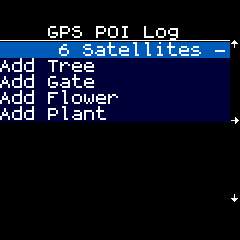

<!--- Copyright (c) 2020 Gordon Williams, Pur3 Ltd. See the file LICENSE for copying permission. -->
Bangle.js Data Storage
========================

<span style="color:red">:warning: **Please view the correctly rendered version of this page at https://www.espruino.com/Bangle.js+Storage. Links, lists, videos, search, and other features will not work correctly when viewed on GitHub** :warning:</span>

* KEYWORDS: Tutorials,Bangle.js,Development,interface,storage,data,log,logging,save,App,Apps,Application
* USES: Bangle.js,Storage

In Bangle.js you may often want to store data over time, and then recall it
later on your PC. In this tutorial we'll talk about how to do that.

There's a [more general tutorial about storing data on Espruino](/Data+Collection) as well.

We'll assume you've been through [creating an app](https://www.espruino.com/Bangle.js+First+App)
already so you know what's involved in creating one.

For this example, we're just going to have a menu that lets you write your current
GPS location and time to a file along with a name (for example you could mark the
location of every tree you find by standing by it and choosing `Add Tree`).

**Note:** We've already added a `gpspoilog` to the [App Loader](https://banglejs.com/apps/)
for you, so while you can upload this code yourself you'll find it is already all available
for you.


Watch App
---------

This is the code for the app - the majority of it is just creating the menu:

```JS
var menuItems = {
  "":{title:"GPS POI Log"},
  " ":{value:"No Fix"},
  "Add Tree" : ()=>addItem("Tree"),
  "Add Gate" : ()=>addItem("Gate"),
  "Add Flower" : ()=>addItem("Flower"),
  "Add Plant" : ()=>addItem("Plant")
};

var menu = E.showMenu(menuItems);
var gps = { fix : 0};
var gpsCount = 0;
// Create the file in append mode
var file = require("Storage").open("gpspoilog.csv","a");

function setStatus(msg) {
  menuItems[" "].value = msg;
  menu.draw();
}

Bangle.on('GPS',function(g) {
  gps = g;
  gpsCount++;
  var msg;
  if (g.fix) {
    msg = g.satellites + " Satellites";
  } else {
    msg = "No Fix";
  }
  setStatus(" "+"-\\|/"[gpsCount&3]);
});


function addItem(name) {
  if (!gps.fix) {
    setStatus("Ignored - no fix");
    return; // don't do anything as no fix
  }
  // The fields we want to put in out CSV file
  var csv = [
    0|getTime(), // Time to the nearest second
    gps.lat,
    gps.lon,
    gps.alt,
    name
  ];
  // Write data here
  file.write(csv.join(",")+"\n");
  setStatus("Written");
}


Bangle.loadWidgets();
Bangle.drawWidgets();
Bangle.setGPSPower(1);
```  

First we need to open a file, which is done with this line:

```
var file = require("Storage").open("gpspoilog.csv","a");
```

This opens a file in `append` (`a`) mode. If it doesn't exist, it is created
empty, but if it does then subsequent writes will go on the end.

And now, we just need to write data into the file in `addItem` using
`file.write`:

```
file.write(csv.join(",")+"\n");
```

A few things are going on here:

* `csv` is an array, so we convert it to a string using `join`, which
adds all elements together with a comma between them.
* `write` doesn't add a newline, so we need to add one with `\n` so
we can read the data line by line later.
* `write` also can't currently write the character code 255 (`"\xff"`)
in files, so you need to stick to writing text, not binary data.
* `write` writes data as soon as it is called - there's no need to `close`
a file when you're finished.
* A file created with `require("Storage").open` is different to one
created with `require("Storage").write` since it is designed to be
appended to. As such you can only access the files with `require("Storage").open`
and not with `require("Storage").write/read/erase/etc`

Ok, now this is sorted, you can upload the app, run it, and get some data:

* Open the [Web IDE](https://www.espruino.com/ide/) and connect to your Bangle
* Click the down-arrow by the Upload button, choose `Storage`, `New File`, and enter `gpspoilog.app.js` as the name.
* Click the Upload button to uplaod the app
* Now copy/paste the following into the IDE on the left-hand side. This will
create a listing for your app in the Launcher without you having to upload
it via the app store:

```JS
require("Storage").write("gpspoilog.info",{
  "id":"gpspoilog",
  "name":"GPS POI Log",
  "src":"gpspoilog.app.js"
});
```

Now, you can go for a walk - when you have a GPS signal you can start logging
some data by choosing `Add Plant`, etc from the menu.




Reading the data
-----------------

### With the IDE

The easiest way to read the data is to open the file in the Web IDE. This may
be enough for many of you:

* Click the Storage icon in the middle of the screen (4 discs)
* Click the 'eye' icon next to `gpspoilog.csv (StorageFile)` in the window
* You should now see the file contents, and you can save this to a file if you wish.

### In the app

You can access the data programmatically - either reading in chunks or line by line.

For example this code will write one line at a time:

```JS
var f = require("Storage").open("gpspoilog.csv","r");
var l = f.readLine();
while (l!==undefined) {
  console.log(l);
  l = f.readLine();
}
```


Reading with the App Loader
---------------------------

However, you can also add the loading functionality to the App Loader itself.

First, we'll need to add the app. This is basically as documented in
[Adding an app to the Bangle.js App Loader](/Bangle.js+App+Loader) with one extra
addition - a `"interface"` element in the JSON.

* Set up [your own App loader as described here](https://www.espruino.com/Bangle.js+App+Loader#enable-github-pages)
* Copy the directory `apps/_example_app` to `apps/gpspoilog`
* Write the JS file above over the top of `apps/gpspoilog/app.js`
* Delete `apps/gpspoilog/add_to_apps.json`
* Add the following to the end of `apps.json` in the root folder (without the `original line` comments), ensuring you add a comma to the end of the previous item in the JSON as shown:

```
  }, //<--- original line - add comma here
  { "id": "gpspoilog",
    "name": "GPS POI Logger",
    "shortName":"GPS POI Log",
    "icon": "app.png",
    "version":"0.01",
    "description": "A way to log points of interest with their GPS coordinates",
    "tags": "outdoors",
    "interface": "interface.html",
    "storage": [
      {"name":"gpspoilog.app.js","url":"app.js"},
      {"name":"gpspoilog.img","url":"app-icon.js","evaluate":true}
    ]
  }
] //<--- original line
```

Now you need to add the 'interface' file - copy the following to `apps/gpspoilog/interface.html`.

```HTML
<html>
  <head>
    <link rel="stylesheet" href="../../css/spectre.min.css">
  </head>
  <body>
    <div id="data"></div>
    <button class="btn btn-default" id="btnSave">Save</button>
    <button class="btn btn-default" id="btnDelete">Delete</button>

    <script src="../../core/lib/interface.js"></script>
    <script>
var dataElement = document.getElementById("data");
var csvData = "";

function getData() {
  // show loading window
  Util.showModal("Loading...");
  // get the data
  dataElement.innerHTML = "";
  Util.readStorageFile(`gpspoilog.csv`,data=>{
    csvData = data.trim();
    // remove window
    Util.hideModal();
    // If no data, report it and exit
    if (data.length==0) {
      dataElement.innerHTML = "<b>No data found</b>";
      return;
    }
    // Otherwise parse the data and output it as a table
    dataElement.innerHTML = `<table>
    <tr>
      <th>Time</th>
      <th>Lat</th>
      <th>Lon</th>
      <th>Alt</th>
      <th>Type</th>
    </tr>`+data.trim().split("\n").map(l=>{
      l = l.split(",");
      return `<tr>
      <td>${(new Date(l[0]*1000)).toLocaleString()}</td>
      <td>${l[1]}</td>
      <td>${l[2]}</td>
      <td>${l[3]}</td>
      <td>${l[4]}</td>
      </tr>`
    }).join("\n")+"</table>";
  });
}

// You can call a utility function to save the data
document.getElementById("btnSave").addEventListener("click", function() {
  Util.saveCSV("gpsdata", csvData);
});
// Or you can also delete the file
document.getElementById("btnDelete").addEventListener("click", function() {
  Util.showModal("Deleting...");
  Util.eraseStorageFile("gpspoilog.csv", function() {
    Util.hideModal();
    getData();
  });
});
// Called when app starts
function onInit() {
  getData();
}

    </script>
  </body>
</html>
```

This does a few basic things:

* `onInit` is called when the page loads
* `getData` grabs the data from the watch
* `Util.showModal` displays a status screen when things are happening
* `Util.readStorageFile` reads the Storage file from the Bangle and returns a string containing its contents
* `Util.saveCSV` can pop up a save dialog
* `Util.eraseStorageFile` erases the file

For more information about the available functions you can check out
[the interface.js file](https://github.com/espruino/BangleApps/blob/master/lib/interface.js).

To use your new interface HTML file:

* [view your personal App Loader site](https://www.espruino.com/Bangle.js+App+Loader#using-your-new-app)
* Click `Connect` up the top right
* Click `My Apps`
* Next to `GPS POI Logger` there's a down arrow icon. Click it
* It'll pop up a `GPS POI Logger` showing you the data you recorded
* You can now save the data or delete it from the Bangle

And that's it! When you have it working as you want you can even
[submit it to the official App Loader site](https://www.espruino.com/Bangle.js+App+Loader#submitting-your-app-to-the-main-app-loader-website)
