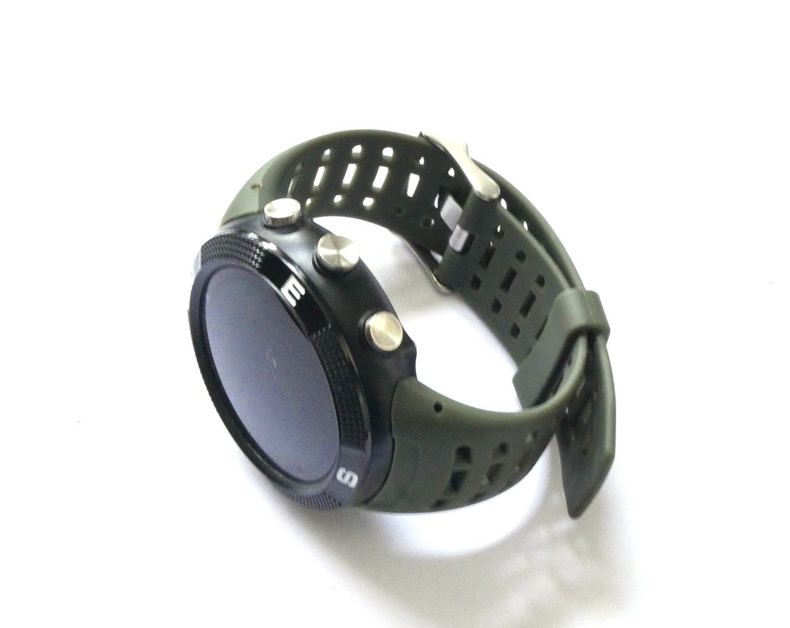
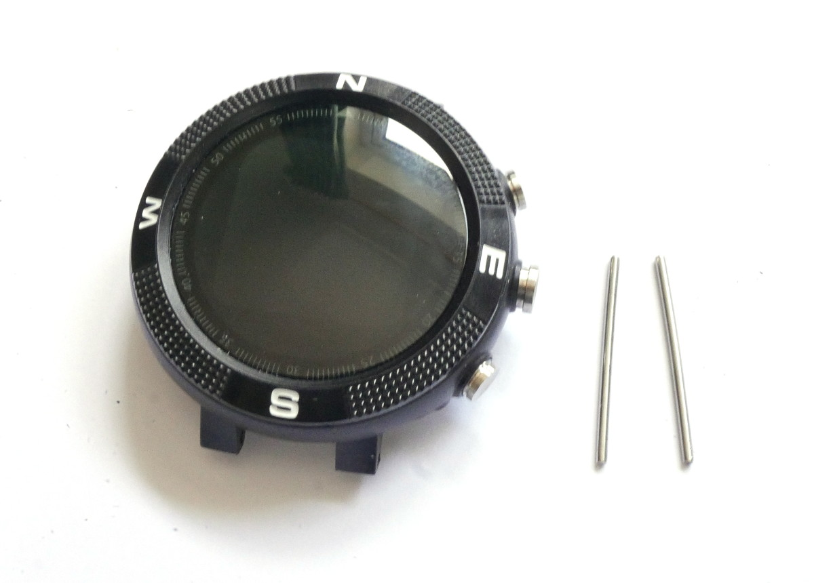
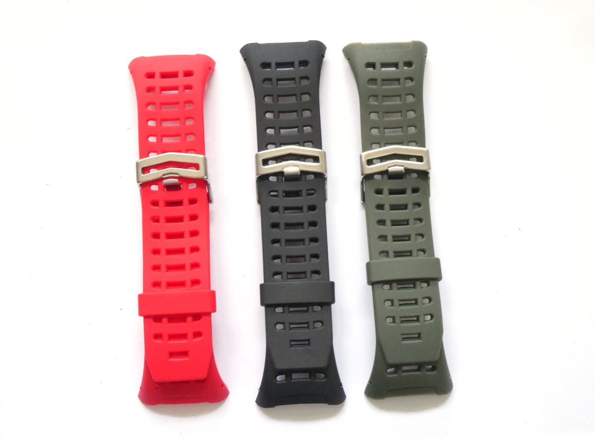
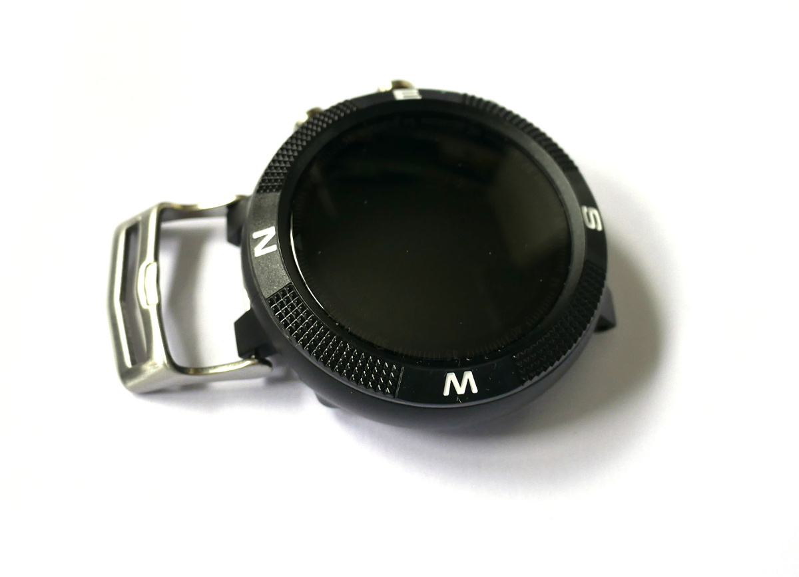
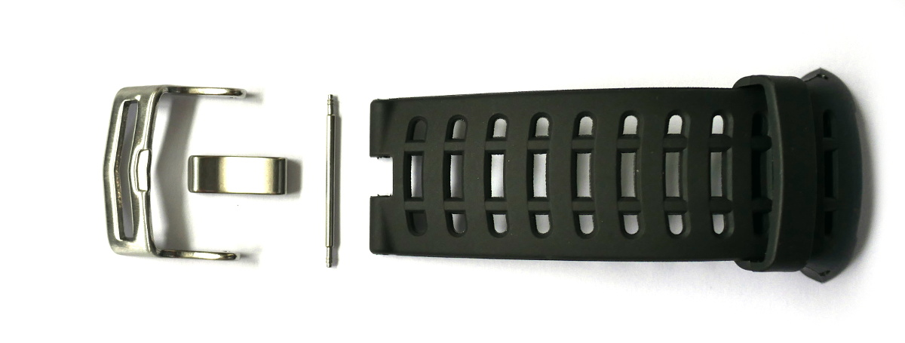
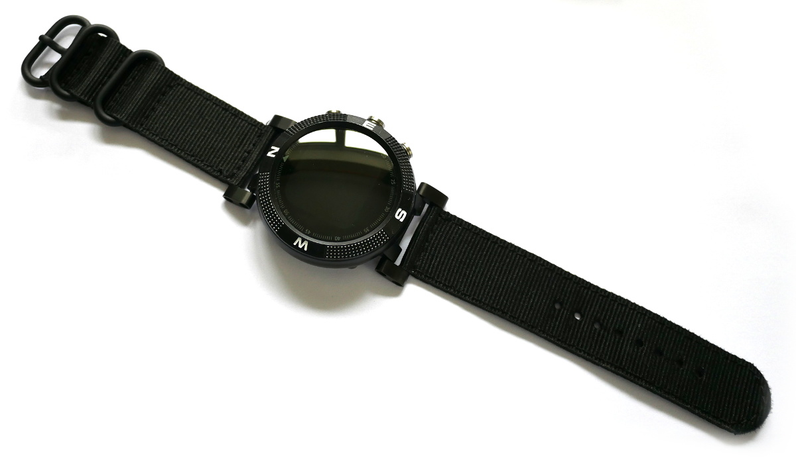
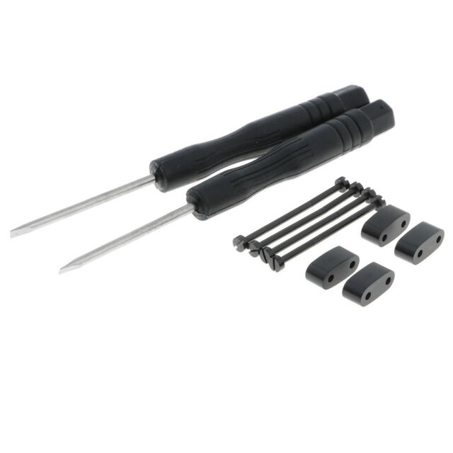
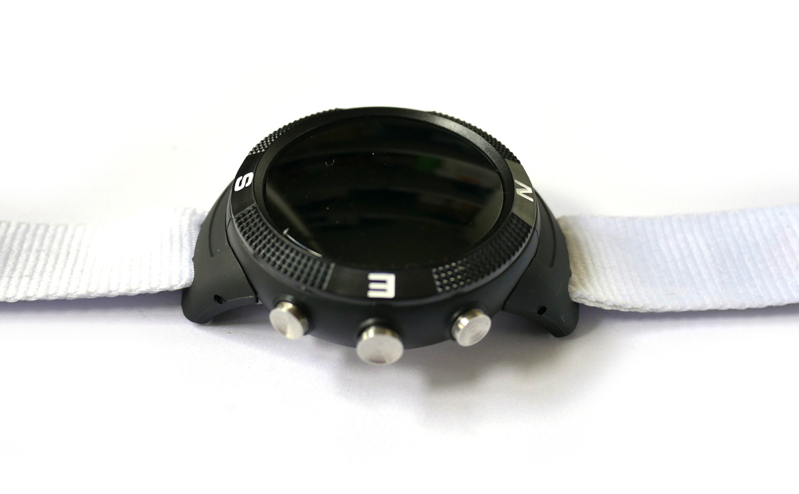

<!--- Copyright (c) 2020 Gordon Williams, Pur3 Ltd. See the file LICENSE for copying permission. -->
Bangle.js Strap Modifications
=============================

:warning: **Please view the correctly rendered version of this page at https://www.espruino.com/Bangle.js+Strap. Links, lists, videos, search, and other features will not work correctly when viewed on GitHub** :warning:

* KEYWORDS: Tutorials,Bangle.js,strap,wrist,modification
* USES: Bangle.js

Bangle.js comes with a proprietary rubber strap that some may find
uncomfortable. Luckily there are a few easy ways to modify it!

The first step is to remove the old strap, which
can be done by pushing out the strap pins from the side. Carefully push
with a thin screwdriver until part of the pin is showing on the opposite side,
then pull with a pair of pliers.

For full instructions check out the [Bangle.js Disassembly](/Bangle.js+Disassembly) video.

Different Strap Colors
-----------------------

We sold three different Strap Colors in the Espruino Shop, 
however unfortunately these are no longer manufactured and
we are out of stock.

Pocket Watch
------------

To make your Bangle.js into a pocket watch, all you need to do
is disassemble the buckle on the watch strap. It is sprung in from
the ends, so all you need to do is get a knife blade between the strap and the
edge of the buckle and level it in to free it.

You can then re-assemble the outer buckle and spring pin on the watch
to turn it into a pocket watch!

Standard Straps - Suunto Core adaptor
------------------------------------

The most obvious improvement is to be able to use 'standard'
watch straps. To do this on Bangle.js you can buy a watch
adaptor designed for another similar style of watch called the
[Suunto Core](https://www.suunto.com/).

If you search for [Suunto Core adaptor on eBay](http://www.ebay.com/sch/i.html?_nkw=suunto+core+adaptor)
you'll find a selection of options which should fit Bangle.js:

Fabric Straps - Existing Strap
-------------------------------

It is also possible to cut down the existing strap. The first set of
'breathing holes' can be opened up, and then an 18mm wide fabric strap can
be inserted through as shown above.

This will block the heart rate sensor, but it is a fast, simple solution.
