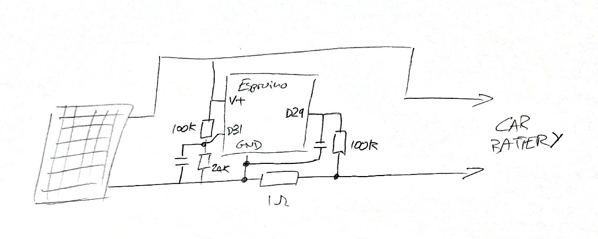

<!--- Copyright (c) 2020 Gordon Williams, Pur3 Ltd. See the file LICENSE for copying permission. -->
Battery Monitor
================

<span style="color:red">:warning: **Please view the correctly rendered version of this page at https://www.espruino.com/Battery+Monitor. Links, lists, videos, search, and other features will not work correctly when viewed on GitHub** :warning:</span>

* KEYWORDS: Tutorials,Pixl.js,Power,Current,Voltage,Amps,Power Usage,Battery Monitor
* USES: MDBT42Q,BLE,Only BLE,Web Bluetooth

[[http://youtu.be/VNjZB92O88U]]

Sometimes it might be useful to monitor a battery's voltage or current usage over time. Here we're
using an Espruino board and a few passive components to monitor voltage and current, log them,
and display them as a graph on the PC.

You'll need
-----------

* An [MDBT42Q](/MDBT42Q) breakout, but any bluetooth Espruino board will do (although [Puck.js](/Puck.js) would need to be self-powered as it has no voltage regulator)
* 1x 1 Ohm high current (1W or more) resistor
* 2x 100 kOhm Resistors
* 1x 24 kOhm Resistor
* 2x Capacitors (0.1uF used here, almost anything will do)

Wiring
------



Connect as in the circuit above. We're using:

* D31 for voltage input
* D29 for current input

But any analog-capable inputs will do.

Software
--------

We're using the [Averager Library](/Averager) here to store data in
a format that is easy to graph.

```JS
var Averager = require("Averager").Averager;
var volts, amps;
var voltAvr = new Averager({scale:1000});
var ampAvr = new Averager({scale:1000});

function onSecond() {
  amps = analogRead(D29)*3.3;
  volts = analogRead(D31)*3.3*(100+24)/24 - amps;

  voltAvr.add(volts);
  ampAvr.add(amps);

  var data = {
    v:Math.round(volts*100)/100,
    a:Math.round(amps*100)/100
  };
  NRF.setAdvertising({},{
    name:"\xF0\x9F\x9A\x98", // car emoji, https://apps.timwhitlock.info/emoji/tables/unicode
    manufacturer:0x0590,
    manufacturerData:JSON.stringify(data)
  });
}
setInterval(onSecond, 1000);
NRF.setTxPower(4);
```

Webpage
-------

You'll need to serve this off a HTTPS link - see the [Web Bluetooth](/Web+Bluetooth) page
for more information.

**Note:** you can try this out as-is just by clicking the `Try Me!` link.

```HTML_demo_link
<html>
  <head>
  </head>
  <body>
    <div id="data"></div>

    <script src="https://www.puck-js.com/puck.js"></script>
    <script src="https://cdn.jsdelivr.net/npm/chart.js@2.9.4/dist/Chart.min.js"></script>
    <script>
var dataElement = document.getElementById("data");
var voltData, ampData;
var csvData = "";

function addChart(id, voltData, ampData, title) {
  var labels = voltData.current.map((y,x)=>x);
  if (id == "hrChart") labels = voltData.current.map((y,x)=>`${x>>2}:${((x&3)*15).toString().padStart(2,0)}`);
  if (id == "moChart") labels = "Jan,Feb,Mar,Apr,May,Jun,Jul,Aug,Sept,Oct,Nov,Dec".split(",");
  new Chart(document.getElementById(id), {
      type: 'line',
      data: {
        labels : labels,
        datasets : [
          {  data: voltData.current, label: 'Volts', borderColor: "red",
              backgroundColor: 'rgba(0, 0, 0, 0)', fill: false, },
          {  data: voltData.last, label: 'Last Volts', borderColor: "darkred",
              backgroundColor: 'rgba(0, 0, 0, 0)', fill: false, },
          {  data: voltData.avr, label: 'Average Volts', borderColor: "grey",
              backgroundColor: 'rgba(0, 0, 0, 0)', fill: false, },

          {  data: ampData.current.map(x=>x*10), label: 'Amps x10', borderColor: "green",
              backgroundColor: 'rgba(0, 0, 0, 0)', fill: false, },
          {  data: ampData.last.map(x=>x*10), label: 'Last Amps x10', borderColor: "darkgreen",
              backgroundColor: 'rgba(0, 0, 0, 0)', fill: false, },
          {  data: ampData.avr.map(x=>x*10), label: 'Average Amps x10', borderColor: "grey",
              backgroundColor: 'rgba(0, 0, 0, 0)', fill: false, },
        ]
      },
      options: {
				responsive: true,
				title: {
					display: true,
					text: title
				},
				tooltips: {
					mode: 'index'
				}
      }
    });
}

function getData() {
  // get the data
  dataElement.innerHTML = '<span style="font-size:300%;position:absolute;top:50%;left:50%;transform:translate(-50%,-50%)">Loading...</span>';
  Puck.write(`\x10voltAvr.print()\n`,data=>{
    // if we have a JS prompt at the end of what's printed, remove it
    if (data.endsWith(">"))
      data = data.slice(0,-1);
    voltData = JSON.parse(data);
    Puck.write(`\x10ampAvr.print()\n`,data=>{
      // if we have a JS prompt at the end of what's printed, remove it
      if (data.endsWith(">"))
        data = data.slice(0,-1);
      ampData = JSON.parse(data);

      // Draw graphs
      dataElement.innerHTML = `
        <div><canvas id="hrChart"></div>
        <div><canvas id="dayChart"></div>
        <div><canvas id="moChart"></div>`;
      addChart('hrChart', voltData.hours, ampData.hours, "Hourly");
      addChart('dayChart', voltData.days, ampData.days, "Daily");
      addChart('moChart', voltData.months, ampData.months, "Monthly");
    });
  });
}

Puck.modal(function() {
  getData();
});
    </script>
  </body>
</html>
```
