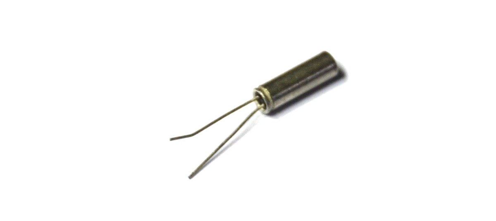
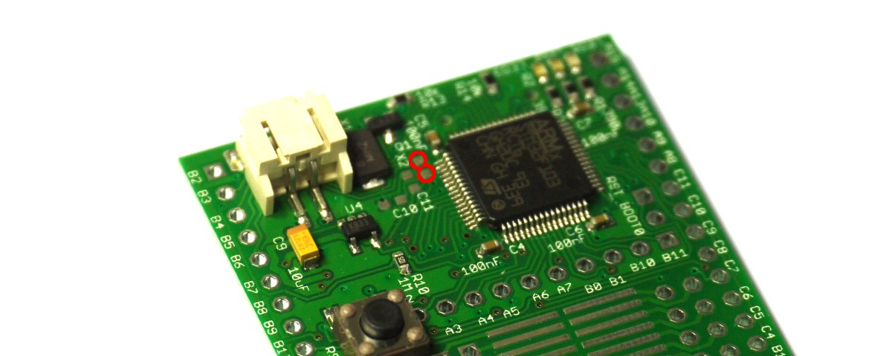
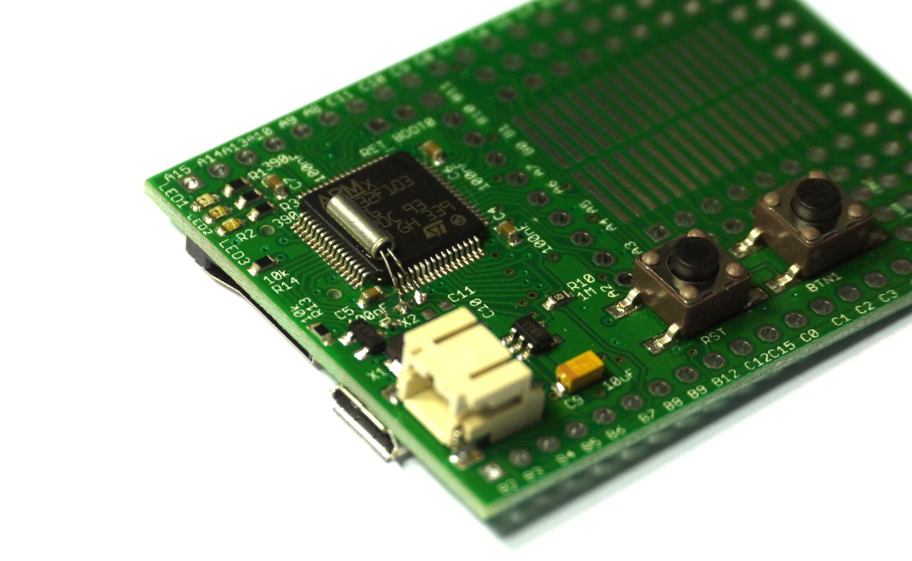

<!--- Copyright (c) 2013 Gordon Williams, Pur3 Ltd. See the file LICENSE for copying permission. -->
Espruino's Real Time Clock
=======================

* KEYWORDS: Clock,Time,Accuracy,RTC,Real Time Clock

Introduction
-----------

Often you might want to keep the current time - either for a clock, or maybe for Data Logging.

Espruino contains its own Real-Time Clock which allows it to keep time even when it is saving power by being in Deep Sleep. **Revision 1v4 and later contain their own accurate 32kHz Oscillator** but revision 1v3 (the KickStarter board) uses an internal 40kHz oscillator. Unfortunately the 40kHz oscillator isn't very accurate (+/- 1%) so over the course of a day the time may drift off.

If you're serious about keeping accurate time **and you have a revision 1v3 board**, you'll want to solder on a 32kHz watch crystal which will be significantly more accurate. If you have a revision 1v4 everything works already, and you can skip right to the **Software** section below.

When you use the 32kHz internal oscillator, please note that pin C15 on the pin header will not be usable for normal IO.

**Note:** You could also use an external module like the [[DS3231]].

You'll Need
----------

* One [Espruino Board](/EspruinoBoard)
* A 32Khz Watch Crystal

Buying a Crystal
----------------



You can get these from pretty much any electronic component supplier, for instance:

* (Farnell)[http://uk.farnell.com/multicomp/mcrj332768f1220how/crystal-32-768khz-12-5pf-thru-hole/dp/1701100]
* (eBay)[http://www.ebay.com/sch/i.html?_nkw=Crystal+32.768]

You need something that looks like the above - roughly 8mm long and 2mm wide, with 2 very thin wires. They're not very expensive - less than £1 each usually, however you may also be able to scavenge them from old Quartz watches.

Wiring Up
--------



* Apply two small blobs of solder to the two pads indicated above
* Cut your crystal's wires to length, and tin them.
* Solder the crystal on to the board (it doesn't matter which way around it is)
* Fold it down on to the ARM chip, and apply some Super Glue to hold it in place



**Note:** The other four empty pads nearby are for two capacitors for the crystal. These crystals require around 12pF for each capacitor - however in reality there is enough capacitance in the PCB, and the crystal will work perfectly well without them.

Software
-------

Nothing is needed! Just plug your Espruino in, and the Crystal will automatically be detected and used!

You can either use `getTime()` to get the time since the system started, or you can use setInterval to accurately schedule a callback. If the system is under load the callback may not be called at exactly the correct time, however over an hour a 1000ms callback will be called exactly 3600 times.

This allows you to keep track of time as follows:

```
var time = { 
  hours : 1,
  mins : 0,
  secs : 0
};


function onSecond() {
  time.secs++;
  if (time.secs>=60) {
    time.secs = 0;
    time.mins++;
    if (time.mins>=60) {
      time.mins = 0;
      time.hours++;
      if (time.hours>=24) {
        time.hours = 0;
      }
    }
  }
}

setInterval(onSecond,1000);
```

However you can also use the [[clock]] and [[date]] modules, which will properly keep track of the time and date for you.
