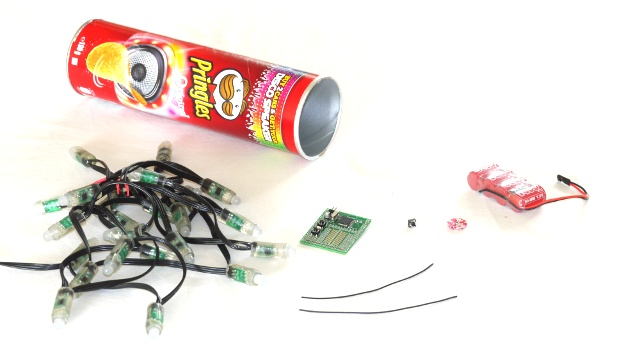
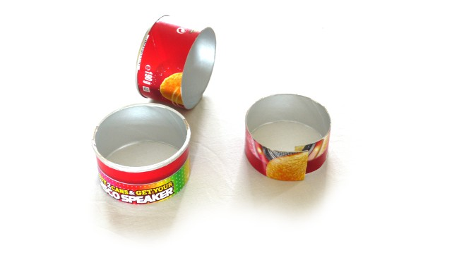
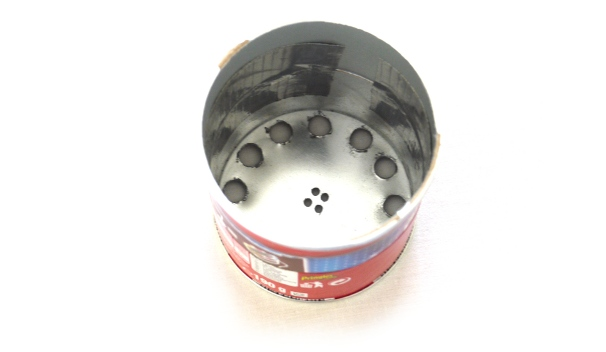
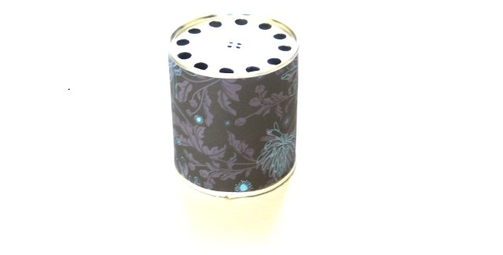
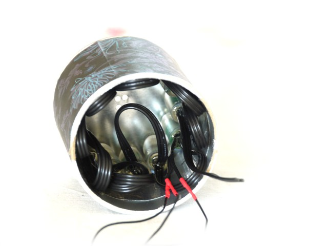
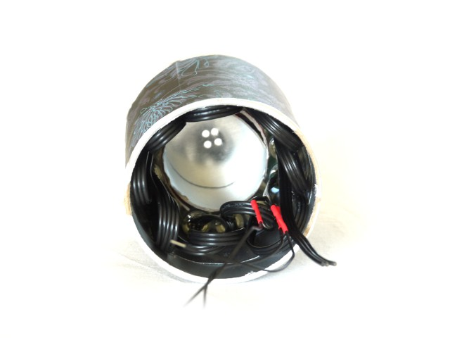
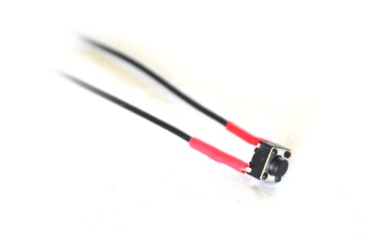
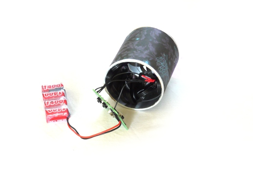
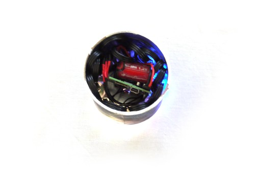

<!--- Copyright (c) 2014 Gordon Williams, Pur3 Ltd. See the file LICENSE for copying permission. -->
Digital Dice
===========

<span style="color:red">:warning: **Please view the correctly rendered version of this page at https://www.espruino.com/Digital+Dice. Links, lists, videos, search, and other features will not work correctly when viewed on GitHub** :warning:</span>

* KEYWORDS: Dice,Die,Game,Random
* USES: WS2811,Espruino Board


[[http://youtu.be/1agbdmdVqrQ]]

Here's how to make what you see above - a multifunction, digital dice:

What you need
------------



* A clean and empty Pringles Can
* An Espruino Board
* A battery
* A switch, and two wires for it
* A string of [[WS2811]] Lights
* (Not shown) Wrapping paper, tape, and double-sided tape


What to do
---------

Measure 4cm from each end of the pringles can, and use a craft knife to cut it as straight as possible.

Also cut another ring from the middle of the can, around 3cm wide. Cut across it as well - this will help to hold the LED lights in place.



Then, cut 12 equally spaced (8mm) holes in the tin end of the can, about 2mm from the edge. You'll also need a hole in the middle for your switch. We marked ours by hand with a marker pen until they looked about right, and then drilled them out.


Put the two ends of the can back together, and tape them together on the inside.



Apply double-sided sticky tape around the outside of the can, and then use some patterned paper (like wrapping paper) to cover up the pringles text.



Look carefully at the two ends of your strip of lights. Through the clear plastic you should be able to see markings on the PCB where the wires connect. One set should clearly say '5V, DI, GND', the other might say 'DO' in the middle (or you might not be able to make anything out). Make sure you mark the end of the lights marked with  '5V, DI, GND' - you don't care about the other end at all, so just make sure it stays out of the way.

Then push each one of the 12 LEDs into their holes (in order). You can use blu-tack or double-sided tape to hold them in place.



Put the third ring of the Pringles can inside the LEDs to hold them in place - add some tape to it to help hold it in position.



Now, connect the two wires to your switch. We've used some head-shrink sleeving to stop the contacts shorting out, but you could use tape again. Having the contacts short won't damage anything, but it'll make Espruino think the button has been pressed when it hasn't!



Now solder the wires to Espruino...

* Connect the other end to 'A1' on Espruino
* Connect one end of the switch to a pad marked 3.3V (it should be right next to A1)

On the lights, take the end that was marked  '5V, DI, GND', and separate out the 3 sets of wires that correspond to each marking.

* Connect '5V' to 'VBAT' on Espruino
* Connect 'GND' to 'GND' on Espruino
* Connect 'DI' to 'B5' on Espruino (for this one, you need a pin that is marked SPI#_MOSI)
* You're done - you can now connect the battery!



And now, you can tuck everything inside. The Espruino board and battery should fit snugly inbetween the LEDs. Make sure the USB connector faces outwards so that you can connect to it with your PC



Software
-------

Now, for the software! Connect your computer as described in [[Quick Start]]. You can follow the examples in [[WS2811]] to play with the lights - remember to use 'B5' as the SPI pin though.


Now, just copy and paste the following code in, which turns your new digital dice into the purple spinner seen in the video:

```
SPI1.setup({baud:3200000, mosi:B5});
var FRONT_BUTTON = A1;

var slowdown;
var speed;
var running;
var timePressed;
var pos=0;

// button press
setWatch(function(e) {
  if (e.time < timePressed+0.01) return; // skip button bounces
  timePressed = e.time;
  // remove any animation that may have been happening
  clearInterval();
  // set up initial values
  speed = 20; 
  slowdown = 1.1 + Math.random()*0.1;
  running = true;
  // start animation...
  setInterval(function() { 
    if (!running) { // if the button was released...
      speed = speed * slowdown; // slow down
      changeInterval(1,speed); // use this to slow the timer
      if (speed > 500) clearInterval(); // if it's really slow then stop
    }
    pos++; // spin around
    if (pos>11) pos = 0; // wrap around when we get to the least LED
    // Now work out what pattern to show - just light up one light (with red and blue LEDs)
    var leds = new Uint8Array(12*3);
    leds[0+(11-pos)*3] = 255; // red
    leds[2+(11-pos)*3] = 255; // blue
    SPI1.send4bit(leds, 0b0001, 0b0011); // send to the lights
  }, speed); // speed for setInterval
}, FRONT_BUTTON, { repeat: true, edge: "rising" });

// button release
setWatch(function(e) {
  timePressed = e.time;
  // signal the animation to slow down and stop
  running = false;
}, FRONT_BUTTON, { repeat: true, edge: "falling" });

function onInit() {
  // pull the front button down, so we don't need an external resistor
  pinMode(FRONT_BUTTON, "input_pulldown");
}
onInit();
```

Or, you can paste this code in, which performs all the different functions shown in the video:

```
clearWatch();
SPI1.setup({baud:3200000, mosi:B5});
var FRONT_BUTTON = A1;

var hours = 3,mins = 20,secs = 0;
var slowdown;
var speed;
var running;
var mode = 0;
var timePressed;
var pos=0;

// button press
setWatch(function(e) {
  if (e.time < timePressed+0.01) return; // skip button bounces

  timePressed = e.time;
  clearInterval();
  if (mode == 0) { // clock
    setInterval(function() {
      secs++;
      if (secs>59) {
       secs = 0;
       mins++;
       if (mins>59) {
         mins = 0;
         hours++;
         if (hours>11) {
          hours = 0;
         }
       }
      }
      var leds = new Uint8Array(12*3);
      var secled = parseInt(secs/5);
      leds[1+(11-secled)*3] = 255; // green
      var minled = parseInt(mins/5);
      leds[2+(11-minled)*3] = 255; // blue
      leds[0+(11-hours)*3] = 255; // red
      SPI1.send4bit(leds, 0b0001, 0b0011);
    }, 1000);
  } else if (mode == 1) { // spin
    speed = 20;
    slowdown = 1.1 + Math.random()*0.1;
    running = true;
    setInterval(function() {
      if (!running) {
        speed = speed * slowdown;
        changeInterval(1,speed);
        if (speed > 500) clearInterval();
      }
      pos++;
      if (pos>11) {
       pos = 0;
      }
      var leds = new Uint8Array(12*3);
      leds[0+(11-pos)*3] = 255; // red
      leds[2+(11-pos)*3] = 255; // blue
      SPI1.send4bit(leds, 0b0001, 0b0011);
    }, speed);
  } else if (mode == 2) { // random flick between 6
    speed = 20;
    slowdown = 1.1 + Math.random()*0.1;
    running = true;
    setInterval(function () {
      if (!running) {
        speed = speed * slowdown;
        changeInterval(1,speed);
        if (speed > 500) clearInterval();
      }
      pos = parseInt(Math.random()*6)*2;
      var leds = new Uint8Array(12*3);
      var r = 1+parseInt(Math.random()*6);
      leds[0+(11-pos)*3] = (r&1)?0:255; // red
      leds[1+(11-pos)*3] = (r&2)?0:255; // green
      leds[2+(11-pos)*3] = (r&4)?0:255; // blue
      SPI1.send4bit(leds, 0b0001, 0b0011);
    }, speed);
  } else if (mode == 3) {
    speed = 20;
    slowdown = 1.2 + Math.random()*0.1;
    running = true;
    setInterval(function () {
      if (!running) {
        speed = speed * slowdown;
        changeInterval(1,speed);
        if (speed > 500) clearInterval();
      }
      var patterns = [
        [0],
        [0,5],
        [0,4,8],
        [0,3,6,9],
        [0,2,4,6,9],
        [0,2,4,6,8,10],
      ];
      var r = parseInt(Math.random()*patterns.length);
      var leds = new Uint8Array(12*3);
      for (i in patterns[r]) {   
        leds[1+patterns[r][i]*3] = 255; // green
        leds[2+patterns[r][i]*3] = 255; // blue
      }
      SPI1.send4bit(leds, 0b0001, 0b0011);  
    }, speed);
  }
}, FRONT_BUTTON, { repeat: true, edge: "rising" });

// button release
setWatch(function(e) {
  if (e.time < timePressed+0.01) return; // skip button bounces
  if (e.time > timePressed+1) { // long press
    clearInterval();
    // go to next mode
    mode++;
    if (mode>3) mode=0;
    print(mode);
    // all LEDs off
    SPI1.send4bit(new Uint8Array(12*3), 0b0001, 0b0011); 
  } else {
    // short press - signal for animation to slow down and stop
    running = false;
  }
  timePressed = e.time;
}, FRONT_BUTTON, { repeat: true, edge: "falling" });

function onInit() {
  // pull the front button down, so we don't need an external resistor
  pinMode(FRONT_BUTTON, "input_pulldown");
}
onInit();
```


You've now got a working Digital Dice! Type `save()` and everything will be saved to flash, so the next time you power on your Digital Dice it'll auto-load the Digital Dice software!
