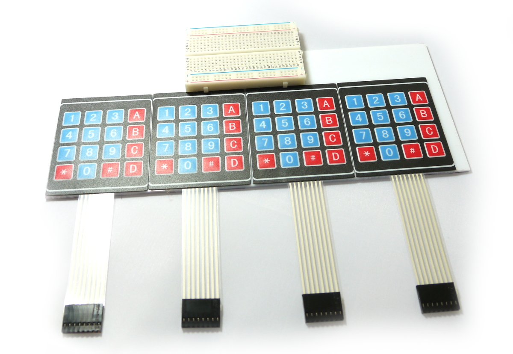
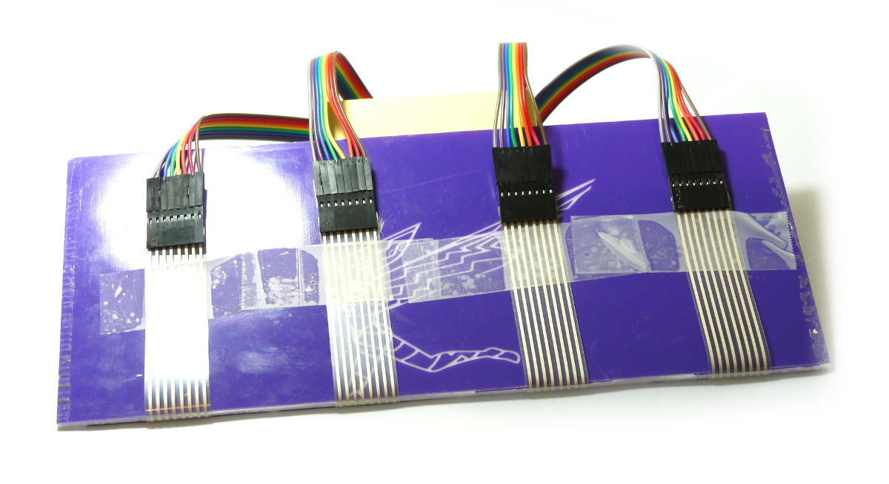
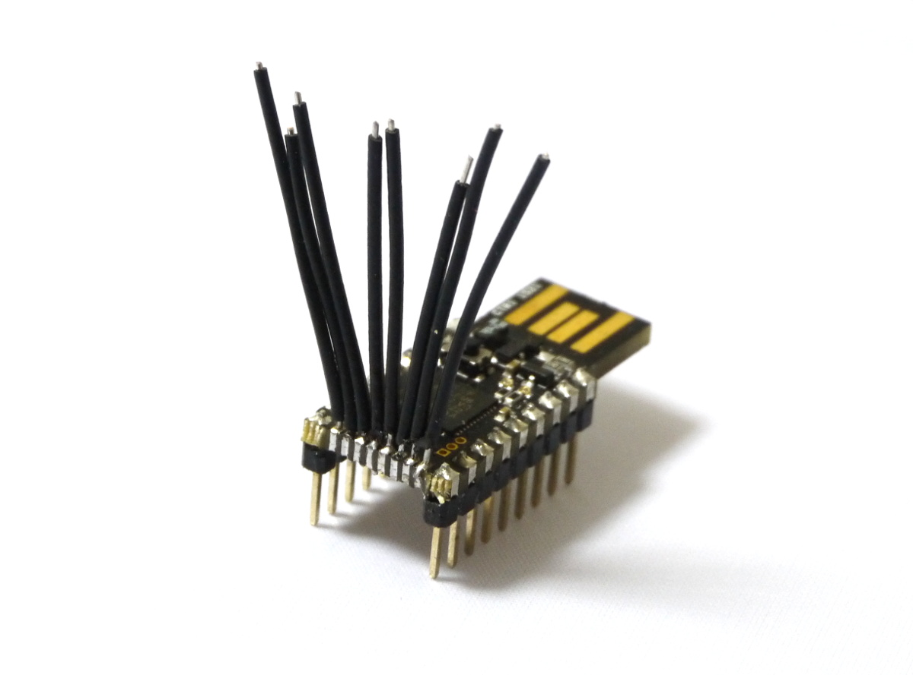
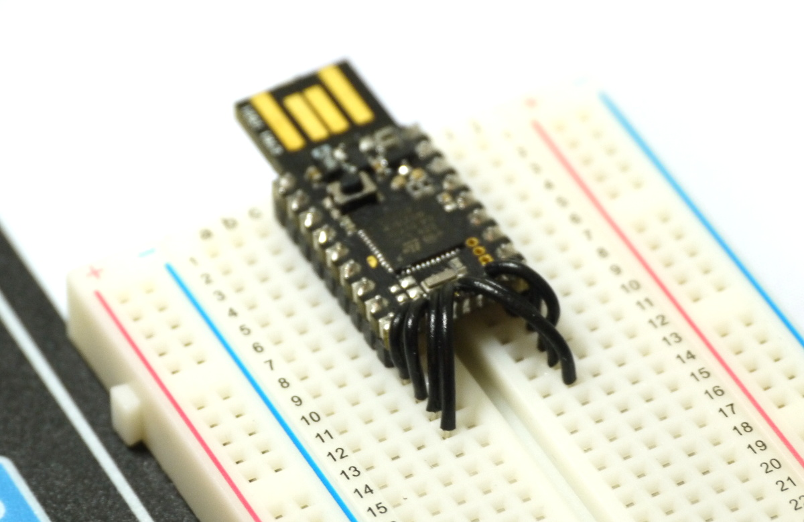
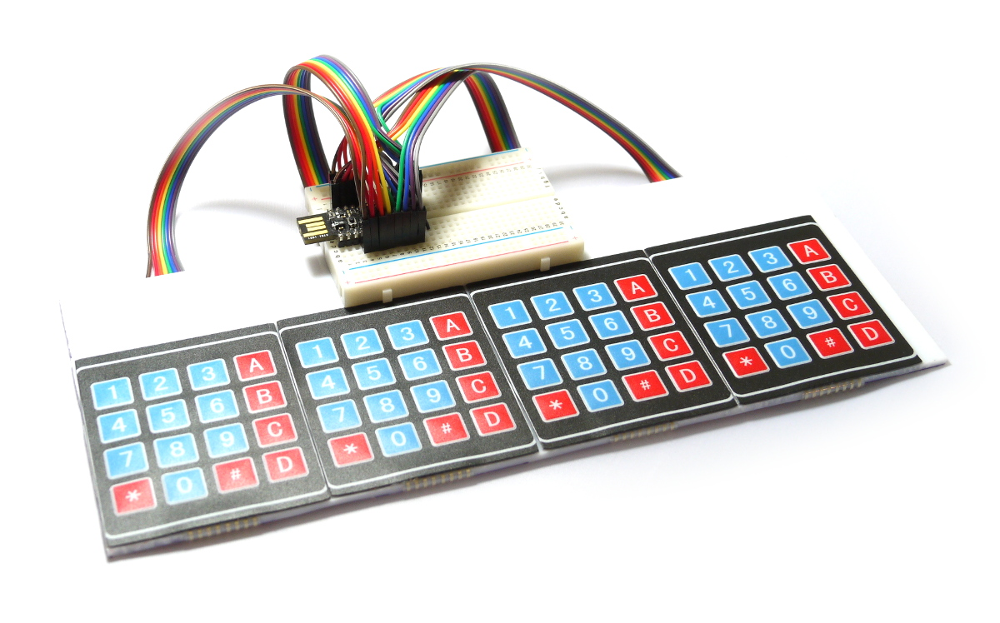
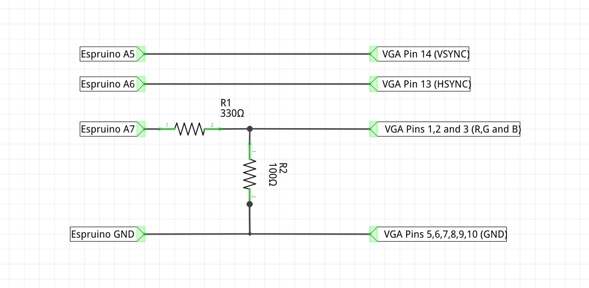
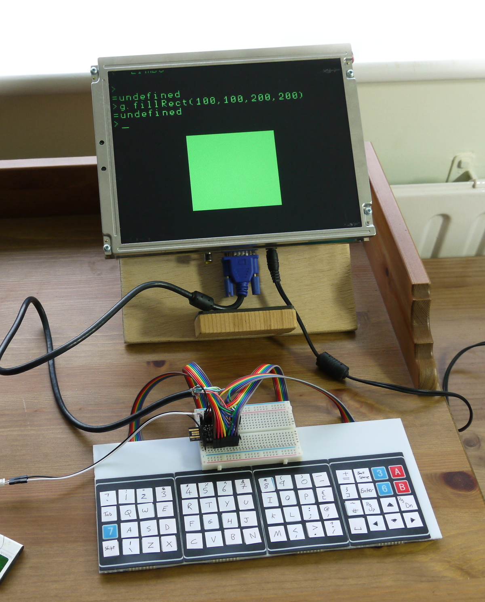

 <!--- Copyright (c) 2015 Gordon Williams, Pur3 Ltd. See the file LICENSE for copying permission. -->
Espruino Home Computer
======================

* KEYWORDS: PC,Computer,Spectrum,Commodore,Micro,Home PC
* USES: Television,KeyPad,Pico,Breadboard

[[http://youtu.be/0d3uGQUm7tM]]

Many of us learnt to program on Sinclair Spectrums, Commodore 64s, BBC Micros or similar. Computers that booted straight up to a prompt and that encouraged you to play with them.

In this tutorial you'll learn how to make your own JavaScript computer in a few hours using Espruino!


You'll Need
----------

* An Espruino [[Pico]]
* A piece of plastic of wood to act as a base
* A [[Breadboard]]
* 4x 4x4 [[KeyPad]]s
* Lots of Stickers
* 40x Male->Male Dupont-style Jumper wires - a multicoloured strip of them makes life a lot easier
* An old VGA cable

Wiring Up
--------

* Stick your 4 [[KeyPad]]s next to each other on your base (they're sticky-back). You may want to trim their edges down, but be careful not to trim too far or you might cut some contacts off.

* Stick your breadboard down in the middle - it's sticky-back too!



* Split the jumper wire into 4 lengths of 8 - try and keep the colours the same on each.

* Stick the wires into the KeyPads, making sure the colours all match.

* Fold the wires back and tape them to the rear of your base. You might want to add some sticky feet to save the wires from getting bent at too much of an angle.



* Now you need the extra pins on your Espruino [[Pico]]. Get some solid core wire and solder it to the 0.05" pins. Check nothing is shorted!



* Put the [[Pico]] into the left-hand side of the breadboard, strip and place the wires as in the picture below:



* Now you need to wire the keyboard. Do it as shown (check the colours of wires in the images), with left to right:

  * KeyPad 1 First 4 wires -> `B6,B5,B4,B3`
  * KeyPad 1 Second 4 wires -> `B9,B8,A8,B7`
  * KeyPad 2 First 4 wires -> `B6,B5,B4,B3`
  * KeyPad 2 Second 4 wires -> `A4,A3,A2,A1`
  * KeyPad 3 First 4 wires -> `B10,B13,B14,B15`
  * KeyPad 3 Second 4 wires -> `B9,B8,A8,B7`
  * KeyPad 4 First 4 wires -> `B10,B13,B14,B15`
  * KeyPad 4 Second 4 wires -> `A4,A3,A2,A1`



* Now wire up VGA - connect the plug or cut open the old VGA cable, and connect as below. For more information, see http://www.espruino.com/Television



**Note:** There's no need to connect Blue and Red if you just want a green display!

* Add labels for the keys on your keyboard as below. If you're not in the UK you'll probably want to make your own key labels,
but you will need to change the `KEYMAP` variables in the code below.



Software
--------

Make sure your Espruino Pico has up to date firmware!

Put the following in the right-hand side of the Web IDE, click `Send to Espruino`, and when that is done type `save()` in the left-hand side.

To fully use the computer you'll need to power it from a non-computer-based power source like a USB phone charger or battery.


```
// Keyboard wiring
var KEYROW = [B10,B13,B14,B15, B6,B5,B4,B3];
var KEYCOL = [A4,A3,A2,A1, B9,B8,A8,B7];

// Key Maps for Keyboard
var KEYMAPLOWER = [
  "`1234567890-=\x08",
  "\tqwertyuiop[]\n",
  "\0asdfghjkl;'#\x84\x82\x85",
  "\x01\\zxcvbnm,./ \x80\x83\x81",
  ];
var KEYMAPUPPER = [
  "¬!\"£$%^&*()_+\x08",
  "\tQWERTYUIOP{}\n",
  "\0ASDFGHJKL:@~\x84\x82\x85",
  "\x01|ZXCVBNM<>? \x80\x83\x81",
  ];

/* If a char in the keymap is >=128, 
subtract 128 and look in this array for
multi-character key codes*/
var KEYEXTRA = [
  String.fromCharCode(27,91,68), // 0x80 left
  String.fromCharCode(27,91,67), // 0x81 right
  String.fromCharCode(27,91,65), // 0x82 up
  String.fromCharCode(27,91,66), // 0x83 down
  String.fromCharCode(27,91,53,126), // 0x84 page up
  String.fromCharCode(27,91,54,126), // 0x85 page down
];
// Shift status
var hasShift = false;
function setShift(s) {
  hasShift = s;
  digitalWrite(LED1, s);
}
  
// Convert an actual key into a sequence of characters
// And send to Loopback (where the console is)
function handleKeyPress(e) {
  var kx = e>>3;
  var ky = e&7;
  if (ky>3) { // turn into long row
    kx+=8;
    ky-=4;
  }
  var key = hasShift ? KEYMAPUPPER[ky][kx] : KEYMAPLOWER[ky][kx];
  if (key=="\x01") {
    setShift(!hasShift);
  } else { 
    setShift(false);
    if (key && key.length) {
      if (key.charCodeAt(0)>127)
        key = KEYEXTRA[key.charCodeAt(0)-128];
      //USB.write(JSON.stringify(key)+"\r\n"); // debug
      LoopbackB.write(key);
    }
  }
}
  
var term; // the terminal
var g; // graphics
  
function onInit() {
  // set up the keypad
  require("KeyPad").connect(KEYROW, KEYCOL, handleKeyPress);
  // Start TV out
  g = require('tv').setup({ type : "vga",
    video : A7,
    hsync : A6,
    vsync : A5,
    width : 320,
    height : 240,
    repeat : 2, // amount of times to repeat each line
  });
  // use a larger font instead of the default
  require("Font8x12").add(Graphics);
  g.setFont8x12();
  
  // Set up the terminal
  term = require("VT100").connect(g, {
    charWidth : 8,
    charHeight : 12,
    marginTop : 10, // might want to tweak these depending on your monitor
    marginLeft : 20,
    marginBottom : 16
  });

  // take characters from Espruino, and push them into the VT100 terminal
  LoopbackB.on('data',function(e){
    for (var i in e) term.char(e[i]);
  });
  // copy characters coming down USB into the 'loopback' device
  USB.on('data',function(e){ LoopbackB.write(e); });
  // Now move the console to Loopback
  LoopbackA.setConsole();
}
```
