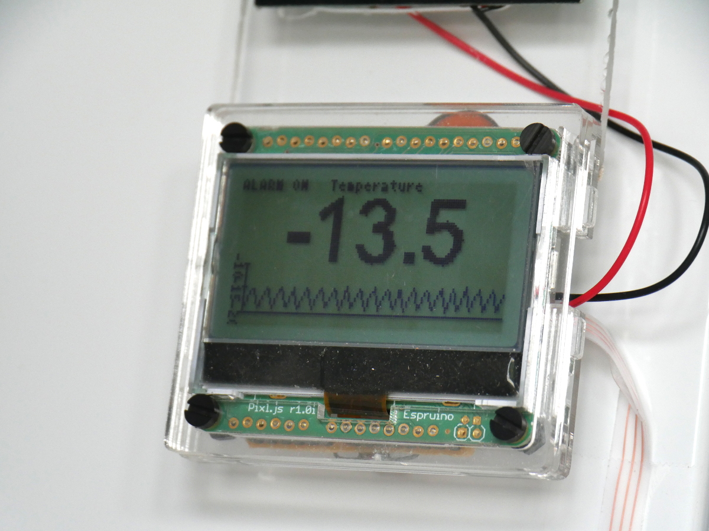
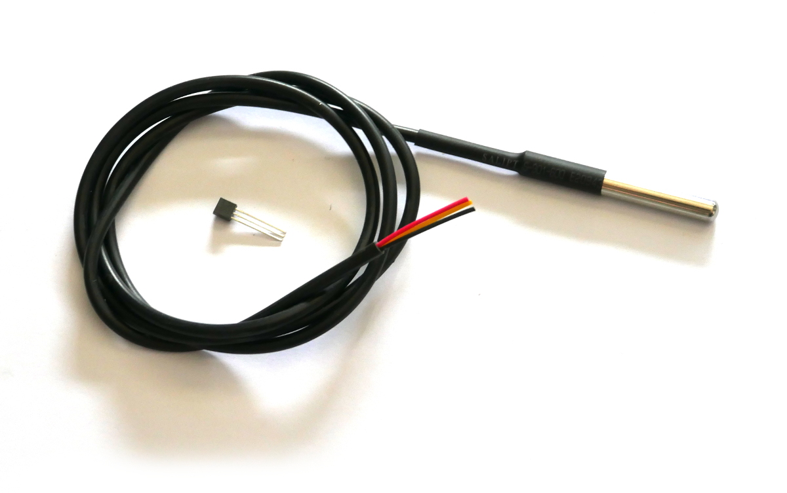
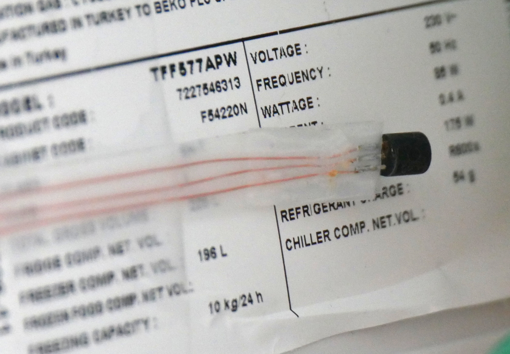
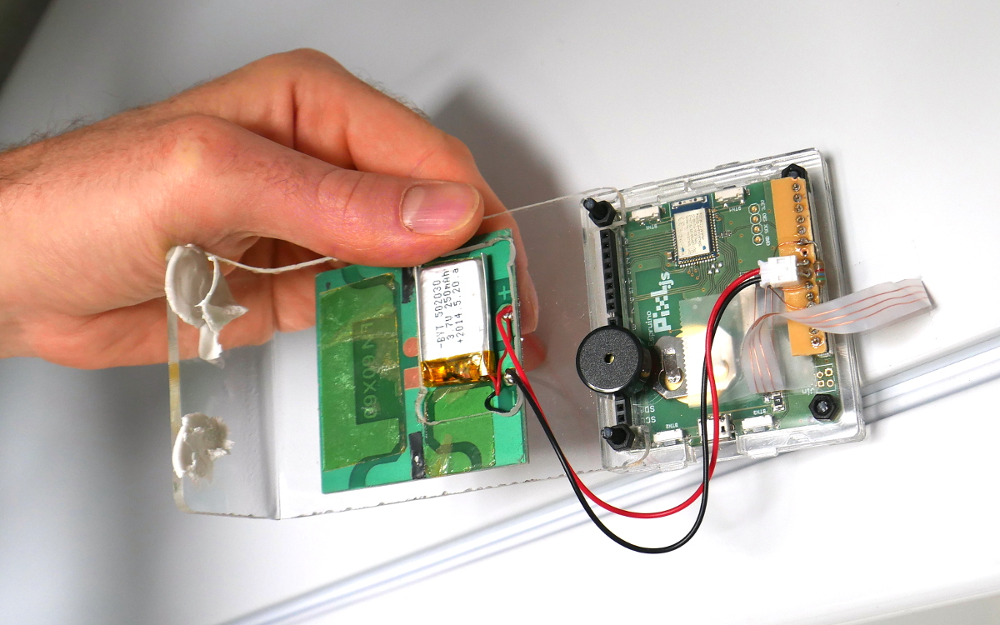
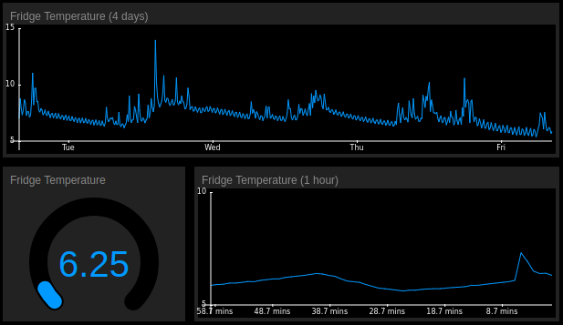

<!-- Copyright (c) 2018 Gordon Williams. See the file LICENSE for copying permission. -->
Freezer Alarm
==============

<span style="color:red">:warning: **Please view the correctly rendered version of this page at https://www.espruino.com/Freezer+Alarm. Links, lists, videos, search, and other features will not work correctly when viewed on GitHub** :warning:</span>

* KEYWORDS: Alarm,Thermometer,Temperature,Fridge,Freezer
* USES: Pixl.js,Graphics,graph,BLE,Speaker



We've got a problem where every so often the freezer door doesn't close
properly, and everything inside gets thawed out. While some freezers have
an alarm built in, ours doesn't - so this tutorial shows you how to
make one using [Pixl.js](/Pixl.js). It beeps when the freezer gets too
warm, but also shows the current and historical temperature **and**
sends the data over Bluetooth LE so it can be logged.


You'll Need
-----------

* An Espruino [Pixl.js](/Pixl.js)
* A [DS18B20 Temperature sensor](/DS18B20) - either a cable, or a small TO-92
sensor and some thin cable.
* A 4.7k resistor
* A LiPo [Battery](/Battery) (or anything over 3.5v but below 15v)
* A [Piezo Buzzer](/Speaker) - I used [this one from Rapid](https://www.rapidonline.com/Audio-Visual/Miniature-PCB-Piezo-Transducer-35-0044)


Temperature Sensor
------------------



I'm using the [DS18B20](/DS18B20) because it's accurate, and digital - so there
are no inaccuracies caused by having a long wire.

The sensors come in a few forms - you can get them with a cable attached (as above)
or in a TO-92 package (in the middle of the above picture). While the cable is
easy, you may find it difficult to fit into your freezer so the door shuts
unless you're willing to drill a hole in it.

To work around this, I used the small transistor-style TO-92 type of DS18B20
with a thin cable that I added. It's wired as follows:


While you could buy a thin ribbon cable, I made one by placing 3 thin wires
between two lengths of sellotape. It can then be fitted to your freezer along
the side of the door and it won't interfere with the door closing:




Wiring Up
----------

Wiring up is pretty simple:

* Connect the [DS18B20 Temperature sensor](/DS18B20)
up to `3.3v` and `GND` as described in the link, with the data wire connected to
`A0`.
* Connect a 4.7k resistor between `A0` and `3.3v`
* Connect the [Piezo Buzzer](/Speaker) between pins `D10` and `GND`. You could
use any data pin, but with [this piezo](https://www.rapidonline.com/Audio-Visual/Miniature-PCB-Piezo-Transducer-35-0044)
has a pin spacing of 10mm which allows you to just push it into Pixl.js's headers.
* Connect a battery between `Vin` and `GND`. You can use the JST pinout or the Arduino
header for this (or could just power from Micro USB). I also attached a small solar
panel direct to the battery to keep it charged.

To simplify wiring, I used a small strip of PCB and with some pins in it to plug
into the back of the Pixl, then taped the ribbon cable down to stop the wires from
twisting and breaking. However it's fine to just poke wires into the pin headers
to make connections if that's easier:



Software
---------

Connect to Pixl.js with the Web IDE, copy the following code to the right-hand
side and click upload.

```
var ALARM_TEMP = -5; // temperature at which to alarm
var PIN_BUZZER = D10; // Pin Buzzer is connected to
var PIN_SENSOR = A0;  // Pin temperature sensor is connected to

var ow,sensor,history;
var avrSum=0,avrNum=0;
var lastTemp = 0;

var alarmEnabled = true;
var alarmPos = 0;
var alarmInterval;

// Set whether the alarm is on or off
function setAlarm(on) {
  if (on) {
    if (!alarmInterval)
      alarmInterval = setInterval(function() {
        alarmPos = !alarmPos;
        analogWrite(PIN_BUZZER,0.5,{freq:alarmPos?800:900});
      }, 200);
  } else {
    if (alarmInterval)
      clearInterval(alarmInterval);
    alarmInterval = 0;
    digitalWrite(PIN_BUZZER,0);
  }
}

// Draw the temperature and graph to the screem
function draw() {
  // draw
  g.clear();
  g.setFontVector(30);
  g.setFontAlign(0,-1);
  g.drawString(lastTemp.toFixed(1), 64,5);
  g.setFontBitmap();
  g.drawString("Temperature", 64, 0);
  require("graph").drawLine(g, history, {
    axes : true,
    gridy : 5,
    x:0, y:37,
    width:128,
    height:27
  });
  g.setFontAlign(-1,-1);
  g.drawString(alarmEnabled?"ALARM ON":"NO ALARM",0,0);
  g.flip();  
  // Check temperature
  setAlarm(alarmEnabled && (lastTemp>ALARM_TEMP));
}

// Called when we get a temperature reading
function onTemp(temp) {
  if (temp===null) return; // bad reading
  avrSum+=temp;
  avrNum++;
  lastTemp = temp;
  // advertising
  var th = Math.round(lastTemp*100);
  NRF.setAdvertising({
    0x1809 : [th&255,th>>8]
  });

  draw();
}

// BTN1 enables/disables the alarm
setWatch(function() {
  alarmEnabled = !alarmEnabled;
  draw();
}, BTN1, {edge:1,repeat:1});

// take temp reading and update graph/alarm
var readingInterval = setInterval(function() {
  if (sensor) sensor.getTemp(onTemp);
}, 10000);

// save average to history
var histInterval = setInterval(function() {
  history.set(new Float32Array(history.buffer,4));
  history[history.length-1] = avrSum / avrNum;
  avrSum = 0;
  avrNum = 0;
}, 60000); // 1 minute

// At startup, set up OneWire
function onInit() {
  ow = new OneWire(PIN_SENSOR);
  sensor = require("DS18B20").connect(ow);
  history = new Float32Array(128);
  avrSum=0;
  avrNum=0;
}
```

Once uploaded, type `save()` - this will save everything to Flash memory
and will start the code running.

### Notes

* `BTN1` will turn the audible alarm on and off (the state is shown on the
  screen).
* The DS18B20 sensor itself draws around 1mA of power - around 4 times the amount
Pixl.js does! While I haven't done so, you could wire the sensor to be powered
from an IO pin so it can be turned off when not needed.

Logging
-------

Since this code broadcasts the temperature via Bluetooth LE on the standard
characteristic `1809`, you can install [the EspruinoHub Software](https://github.com/espruino/EspruinoHub)
on a Raspberry Pi with Bluetooth LE. When a `log` directory is created, it
will keep a log of the temperature in that directory.

You can then use [the TinyDash](https://github.com/espruino/TinyDash) library
to plot those temperatures, for example:



Details of this will follow in another tutorial.
