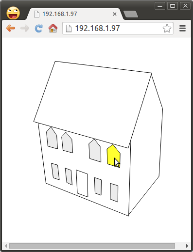
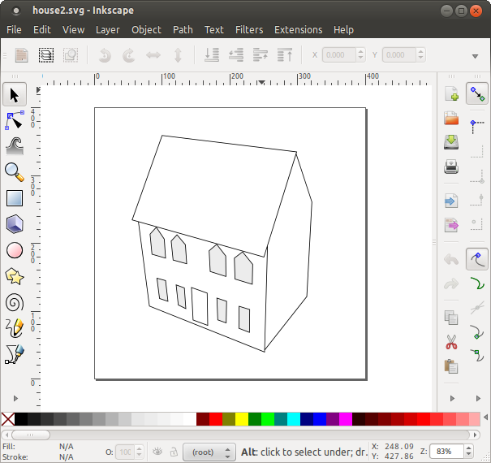

<!--- Copyright (c) 2013 Gordon Williams, Pur3 Ltd. See the file LICENSE for copying permission. -->
Graphical Web Interface
========================

<span style="color:red">:warning: **Please view the correctly rendered version of this page at https://www.espruino.com/Graphical+Web+Interface. Links, lists, videos, search, and other features will not work correctly when viewed on GitHub** :warning:</span>

* KEYWORDS: Wifi,Web Server,Graphical,SVG
* USES: Internet,CC3000,WS2811,Espruino Board



Introduction
-----------

In this tutorial we'll make an interactive graphical representation of a house. When you click the windows, it'll light the relevant LED lights.

This is done by embedding an SVG image into an HTML file. SVG elements can then be treated like normal HTML elements - they can call JavaScript when clicked, and their attributes can be changed to make them light up.

You'll Need
----------

* One [Espruino Board](/Original)
* A [[CC3000]] WiFi module
* A [model house](http://www.hazelwilliams.net/)
* A string of 8 [[WS2811]] Lights

Wiring Up
--------

* Follow [the instructions](/CC3000) for wiring up the CC3000 module
* Follow the [[WS2811]] instructions to wire the WS2811 to pin B15.
* Arrange the LEDs in a zig-zag, with 4 on the bottom row for the bottom set of windows, and 4 on the top-row for the top set of windows.

Software
-------

First off, you need to run [Inkscape](http://www.inkscape.org/en/) and design some graphics. I just drew around a photo of the model house:



Then, save the file as a `Plain SVG` file using `Save As`. This will remove any Inkscape-specific tags that aren't needed. The source to the picture I made was:

```SVG
<?xml version="1.0" encoding="UTF-8" standalone="no"?>
<!-- Created with Inkscape (http://www.inkscape.org/) -->

<svg
   xmlns:dc="http://purl.org/dc/elements/1.1/"
   xmlns:cc="http://creativecommons.org/ns#"
   xmlns:rdf="http://www.w3.org/1999/02/22-rdf-syntax-ns#"
   xmlns:svg="http://www.w3.org/2000/svg"
   xmlns="http://www.w3.org/2000/svg"
   version="1.1"
   width="400"
   height="400"
   id="svg2">
  <metadata
     id="metadata19">
    <rdf:RDF>
      <cc:Work
         rdf:about="">
        <dc:format>image/svg+xml</dc:format>
        <dc:type
           rdf:resource="http://purl.org/dc/dcmitype/StillImage" />
        <dc:title></dc:title>
      </cc:Work>
    </rdf:RDF>
  </metadata>
  <defs
     id="defs17" />
  <g
     transform="translate(0,-652.36218)"
     id="layer1">
    <path
       d="m 298.14029,720.42948 23.40489,71.44408 -7.4832,139.54296 -62.09459,78.69208 M 256.01376,857.36476 251.64895,1013.2945 81.605295,945.43453 65.389325,821.03539 M 100.3929,693.74746 56.130595,818.31663 250.69365,873.11433 299.09559,717.9604 z"
       id="path3002"
       style="fill:none;stroke:#000000;stroke-width:1px;stroke-linecap:butt;stroke-linejoin:miter;stroke-opacity:1" />
    <path
       d="m 85.426505,868.97264 -2.8659,-29.62898 9.23458,-10.19492 11.782055,17.52251 1.9106,28.03603 z"
       id="path3004"
       style="fill:#ececec;stroke:#000000;stroke-width:1px;stroke-linecap:butt;stroke-linejoin:miter;stroke-opacity:1" />
    <path
       d="m 116.63302,877.5746 -2.8659,-28.03603 8.59771,-9.23914 12.41892,14.6552 1.9106,28.03602 z"
       id="path3006"
       style="fill:#ececec;stroke:#000000;stroke-width:1px;stroke-linecap:butt;stroke-linejoin:miter;stroke-opacity:1" />
    <path
       d="m 171.40364,894.45994 -1.59217,-30.58476 11.14518,-9.55774 13.37422,17.20393 0.31843,30.26617 z"
       id="path3008"
       style="fill:#ececec;stroke:#000000;stroke-width:1px;stroke-linecap:butt;stroke-linejoin:miter;stroke-opacity:1" />
    <path
       d="m 208.02352,905.61063 -0.9553,-30.90335 12.10049,-9.23914 14.96638,18.47829 -0.63686,29.31039 z"
       id="path3010"
       style="fill:#ececec;stroke:#000000;stroke-width:1px;stroke-linecap:butt;stroke-linejoin:miter;stroke-opacity:1" />
    <path
       d="m 96.571685,934.28384 -3.8212,-29.94757 12.737355,3.5045 3.50277,30.58476 z"
       id="path3012"
       style="fill:#ececec;stroke:#000000;stroke-width:1px;stroke-linecap:butt;stroke-linejoin:miter;stroke-opacity:1" />
    <path
       d="m 124.27543,943.84158 -3.18433,-29.62899 12.10048,4.46028 2.22904,30.58476 z"
       id="path3014"
       style="fill:#ececec;stroke:#000000;stroke-width:1px;stroke-linecap:butt;stroke-linejoin:miter;stroke-opacity:1" />
    <path
       d="m 182.54882,965.82437 -1.27374,-32.17771 14.32952,4.77887 -0.63686,31.85914 z"
       id="path3016"
       style="fill:#ececec;stroke:#000000;stroke-width:1px;stroke-linecap:butt;stroke-linejoin:miter;stroke-opacity:1" />
    <path
       d="m 213.75533,978.24943 0.31843,-32.4963 15.60326,4.77887 -0.31843,33.77067 z"
       id="path3018"
       style="fill:#ececec;stroke:#000000;stroke-width:1px;stroke-linecap:butt;stroke-linejoin:miter;stroke-opacity:1" />
    <path
       d="m 146.08815,965.98367 -2.38825,-47.94798 23.24566,8.28337 0.79609,47.62939 z"
       id="path3022"
       style="fill:none;stroke:#000000;stroke-width:1px;stroke-linecap:butt;stroke-linejoin:miter;stroke-opacity:1" />
  </g>
</svg>
```

Then, delete the metadata, add `onclick` attributes to each of the paths you want to be clickable, and change the ids to something more useful. Finally, wrap that inside an HTML file with a script that will request a webpage from Espruino when you click on each window:

```HTML
<html><body>
<script>
  function toggle(n) {
    var e = document.getElementById("path"+n);
    var lit = e.style.fill != "rgb(236, 236, 236)";
    lit = !lit; // toggle
    e.style.fill = lit ? "#ffff30" : "#ececec";
    var xmlhttp=new XMLHttpRequest();
    xmlhttp.open("GET","set?l"+n+"="+lit,false);
    xmlhttp.send();
  }
</script>
<svg
   width="400"
   height="400">
  <g
     id="layer1"
     transform="translate(0,-652.36218)">
    <path
       id="path3002"
       style="fill:none;stroke:#000000;stroke-width:1px;"
       d="m 298.14029,720.42948 23.40489,71.44408 -7.4832,139.54296 -62.09459,78.69208 M 256.01376,857.36476 251.64895,1013.2945 81.605295,945.43453 65.389325,821.03539 M 100.3929,693.74746 56.130595,818.31663 250.69365,873.11433 299.09559,717.9604 z" />
    <path
       style="fill:#ececec;stroke:#000000;stroke-width:1px;"
       d="m 85.426505,868.97264 -2.8659,-29.62898 9.23458,-10.19492 11.782055,17.52251 1.9106,28.03603 z"
       id="path1" onclick="toggle(1)"/>
    <path
       style="fill:#ececec;stroke:#000000;stroke-width:1px;"
       d="m 116.63302,877.5746 -2.8659,-28.03603 8.59771,-9.23914 12.41892,14.6552 1.9106,28.03602 z"
       id="path2" onclick="toggle(2)"/>
    <path
       style="fill:#ececec;stroke:#000000;stroke-width:1px;"
       d="m 171.40364,894.45994 -1.59217,-30.58476 11.14518,-9.55774 13.37422,17.20393 0.31843,30.26617 z"
       id="path3" onclick="toggle(3)"/>
    <path
       style="fill:#ececec;stroke:#000000;stroke-width:1px;"
       d="m 208.02352,905.61063 -0.9553,-30.90335 12.10049,-9.23914 14.96638,18.47829 -0.63686,29.31039 z"
       id="path4" onclick="toggle(4)"/>
    <path
       style="fill:#ececec;stroke:#000000;stroke-width:1px;"
       d="m 96.571685,934.28384 -3.8212,-29.94757 12.737355,3.5045 3.50277,30.58476 z"
       id="path5" onclick="toggle(5)"/>
    <path
       style="fill:#ececec;stroke:#000000;stroke-width:1px;"
       d="m 124.27543,943.84158 -3.18433,-29.62899 12.10048,4.46028 2.22904,30.58476 z"
       id="path6" onclick="toggle(6)"/>
    <path
       style="fill:#ececec;stroke:#000000;stroke-width:1px;"
       d="m 182.54882,965.82437 -1.27374,-32.17771 14.32952,4.77887 -0.63686,31.85914 z"
       id="path7" onclick="toggle(7)"/>
    <path
       style="fill:#ececec;stroke:#000000;stroke-width:1px;"
       d="m 213.75533,978.24943 0.31843,-32.4963 15.60326,4.77887 -0.31843,33.77067 z"
       id="path8" onclick="toggle(8)"/>
    <path
       style="fill:none;stroke:#000000;stroke-width:1px;"
       d="m 146.08815,965.98367 -2.38825,-47.94798 23.24566,8.28337 0.79609,47.62939 z"
       id="path3022"/>
  </g>
</svg>
</body></html>
```

The code above will request the page `/set?l2=true` if the second window is clicked.

Save the HTML file to disk, and then use the [[File Converter]] page to convert it to a string. While you could load it off an SD card without converting it to a string, storing the file as a variable means that Espruino can work without requiring an SD card at all.

Finally, you just need to write some code for Espruino that will serve up the webpage, or will turn the LEDs on and off when the page `/set` is requested.

```JavaScript
var page = "<html><body>\n<script>\n  function toggle(n) {\n    var e = document.getElementById(\"path\"+n);\n    var lit = e.style.fill != \"rgb(236, 236, 236)\";\n    lit = !lit; // toggle\n    e.style.fill = lit ? \"#ffff30\" : \"#ececec\";\n    var xmlhttp=new XMLHttpRequest();\n    xmlhttp.open(\"GET\",\"set?l\"+n+\"=\"+lit);\n    xmlhttp.send();\n  }\n</script>\n<svg\n   width=\"400\"\n   height=\"400\">\n  <g\n     id=\"layer1\"\n     transform=\"translate(0,-652.36218)\">\n    <path\n       id=\"path3002\"\n       style=\"fill:none;stroke:#000000;stroke-width:1px;\"\n       d=\"m 298.14029,720.42948 23.40489,71.44408 -7.4832,139.54296 -62.09459,78.69208 M 256.01376,857.36476 251.64895,1013.2945 81.605295,945.43453 65.389325,821.03539 M 100.3929,693.74746 56.130595,818.31663 250.69365,873.11433 299.09559,717.9604 z\" />\n    <path\n       style=\"fill:#ececec;stroke:#000000;stroke-width:1px;\"\n       d=\"m 85.426505,868.97264 -2.8659,-29.62898 9.23458,-10.19492 11.782055,17.52251 1.9106,28.03603 z\"\n       id=\"path1\" onclick=\"toggle(1)\"/>\n    <path\n       style=\"fill:#ececec;stroke:#000000;stroke-width:1px;\"\n       d=\"m 116.63302,877.5746 -2.8659,-28.03603 8.59771,-9.23914 12.41892,14.6552 1.9106,28.03602 z\"\n       id=\"path2\" onclick=\"toggle(2)\"/>\n    <path\n       style=\"fill:#ececec;stroke:#000000;stroke-width:1px;\"\n       d=\"m 171.40364,894.45994 -1.59217,-30.58476 11.14518,-9.55774 13.37422,17.20393 0.31843,30.26617 z\"\n       id=\"path3\" onclick=\"toggle(3)\"/>\n    <path\n       style=\"fill:#ececec;stroke:#000000;stroke-width:1px;\"\n       d=\"m 208.02352,905.61063 -0.9553,-30.90335 12.10049,-9.23914 14.96638,18.47829 -0.63686,29.31039 z\"\n       id=\"path4\" onclick=\"toggle(4)\"/>\n    <path\n       style=\"fill:#ececec;stroke:#000000;stroke-width:1px;\"\n       d=\"m 96.571685,934.28384 -3.8212,-29.94757 12.737355,3.5045 3.50277,30.58476 z\"\n       id=\"path5\" onclick=\"toggle(5)\"/>\n    <path\n       style=\"fill:#ececec;stroke:#000000;stroke-width:1px;\"\n       d=\"m 124.27543,943.84158 -3.18433,-29.62899 12.10048,4.46028 2.22904,30.58476 z\"\n       id=\"path6\" onclick=\"toggle(6)\"/>\n    <path\n       style=\"fill:#ececec;stroke:#000000;stroke-width:1px;\"\n       d=\"m 182.54882,965.82437 -1.27374,-32.17771 14.32952,4.77887 -0.63686,31.85914 z\"\n       id=\"path7\" onclick=\"toggle(7)\"/>\n    <path\n       style=\"fill:#ececec;stroke:#000000;stroke-width:1px;\"\n       d=\"m 213.75533,978.24943 0.31843,-32.4963 15.60326,4.77887 -0.31843,33.77067 z\"\n       id=\"path8\" onclick=\"toggle(8)\"/>\n    <path\n       style=\"fill:none;stroke:#000000;stroke-width:1px;\"\n       d=\"m 146.08815,965.98367 -2.38825,-47.94798 23.24566,8.28337 0.79609,47.62939 z\"\n       id=\"path3022\"/>\n  </g>\n</svg></body></html>\n";

// Our lights aren't in exactly the same order. This just maps them to the correct order
var map = [undefined,7,6,5,4,0,1,2,3];

// 8 lights, one for each window
var rgb = new Uint8Array(3*8);
// Setup SPI to talk to the LED lights
SPI2.setup({baud:3200000, mosi:B15});

// this writes the data to the LED lights
function setLights() {
  SPI2.send4bit(rgb, 0b0001, 0b0011);
}

function onPageRequest(req, res) {
  var a = url.parse(req.url, true);
  res.writeHead(200, {'Content-Type': 'text/html'});
  // If /set is requested...
  if (a.pathname == "/set" && a.query) {
    for (var l in a.query) {
      if (l.length==2 && l[0]=="l") {
        var n = map[parseInt(l[1],16)];
        var v = JSON.parse(a.query[l]);
        rgb[n*3+0] = v ? (32+128*Math.random()) : 0;
        rgb[n*3+1] = v ? (32+128*Math.random()) : 0;
        rgb[n*3+2] = v ? (32+128*Math.random()) : 0;
        setLights();
      }
    }
    res.end();
  } else {
    // Otherwise just send the webpage
    res.end(page);
  }
}

// now just initialise WiFi and our server
var wlan;

function onInit() {
  wlan = require("CC3000").connect();
  wlan.connect( "AccessPointName", "WPA2key", function (s) { 
    setLights();
    if (s=="dhcp") {
      console.log("My IP is "+wlan.getIP().ip);
      require("http").createServer(onPageRequest).listen(80);
    }
  });
}

onInit();
```

Paste this into the right-hand side of the Web IDE, being sure to change your WiFi name and key. Then just click the `Send to Espruino` button.

The CC3000 takes a while to initialise so you may have to wait a minute or two. When connected, Espruino will print its IP address. You can then connect to that with a web browser...

When you connect, you should see a picture of the house - and clicking on the windows will turn the relevant lights on and off!


