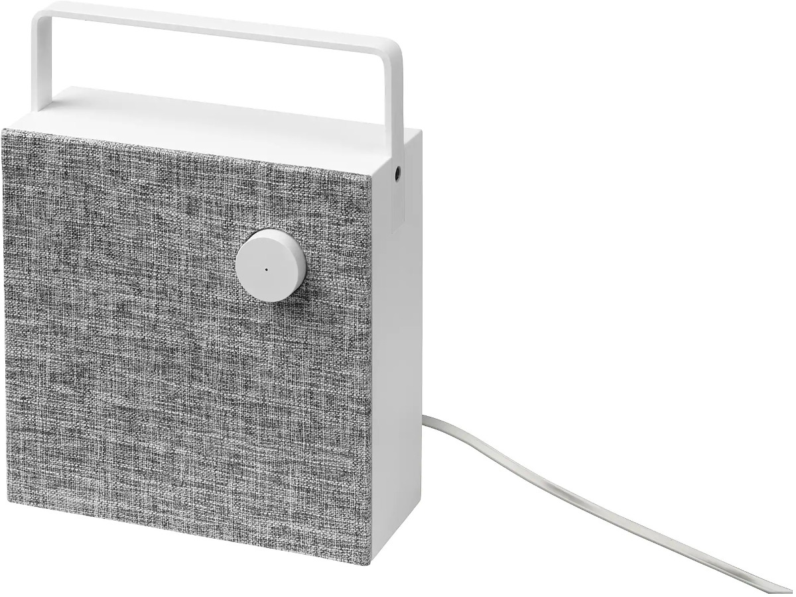
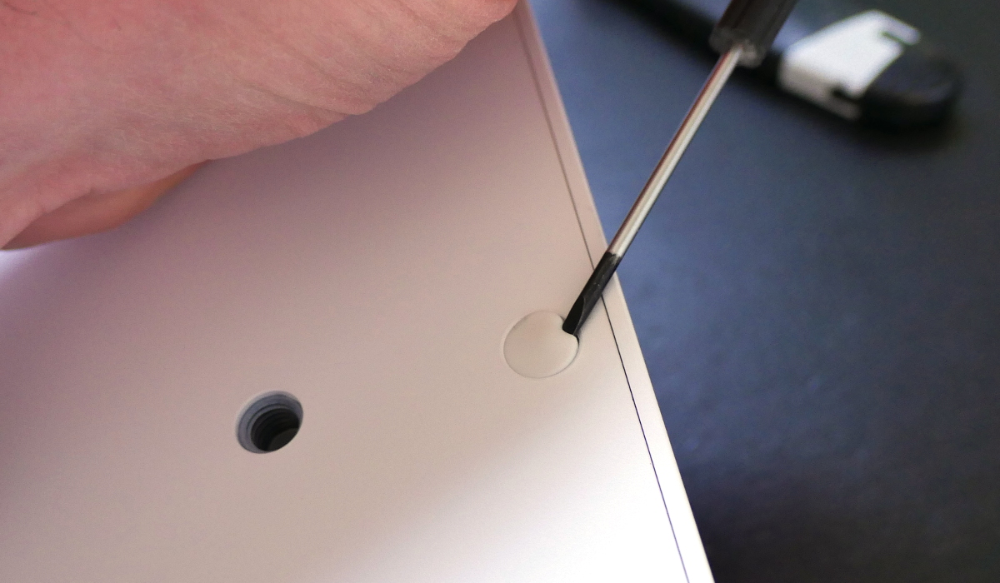
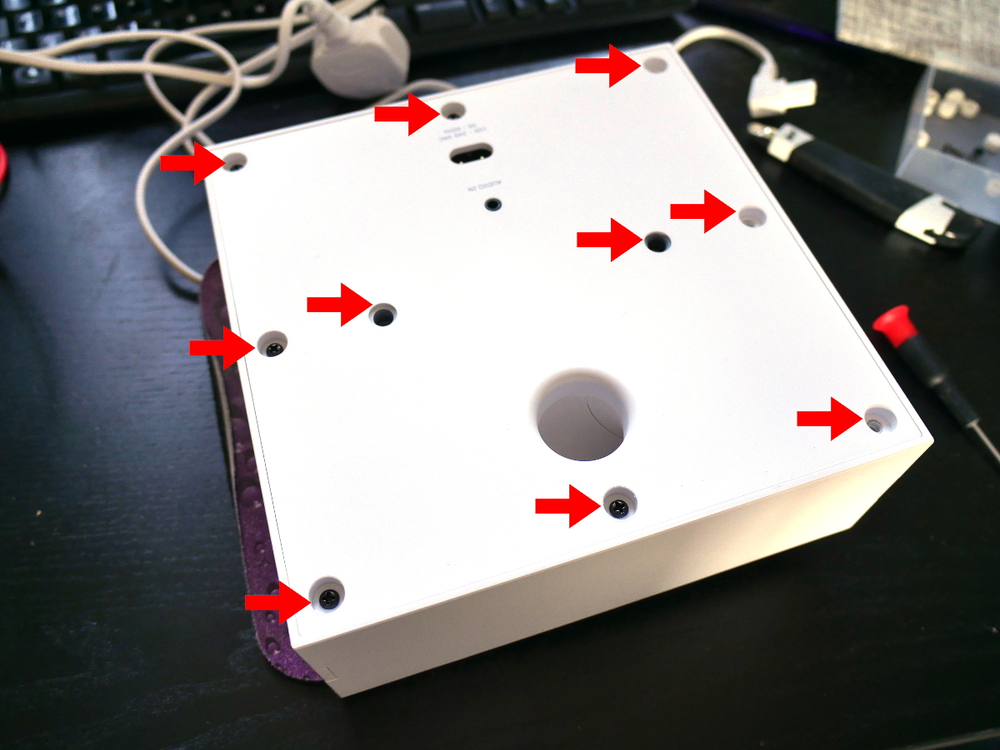
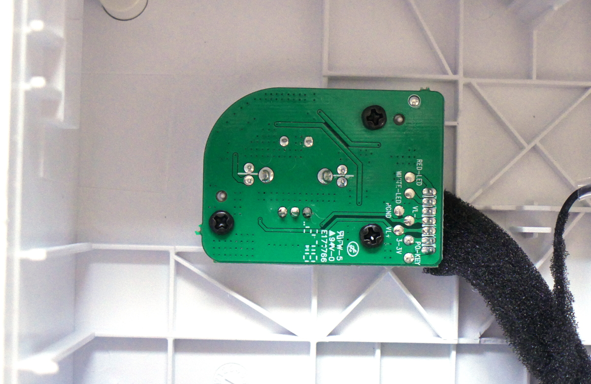

<!--- Copyright (c) 2019 Gordon Williams, Pur3 Ltd. See the file LICENSE for copying permission. -->
Ikea Eneby Speaker Controller
=============================

<span style="color:red">:warning: **Please view the correctly rendered version of this page at https://www.espruino.com/Ikea+Eneby+Speaker+Controller. Links, lists, videos, search, and other features will not work correctly when viewed on GitHub** :warning:</span>

* KEYWORDS: Ikea,Speaker,Remote Control
* USES: BLE,Puck.js,MQBT42Q



[[http://youtu.be/qSxaCE5hg1s]]

[Ikea Eneby Speakers](https://www.ikea.com/gb/en/products/smart-home/speakers/) seem
to be reasonably good sounding, good value for money speakers. However, if you're
planning to place one out of reach then they have some problems:

* After 20 minutes of inactivity the speaker goes to sleep, and the power button must be pressed to wake it up.
* When powering on, the speaker is very quiet, and the volume knob must be turned to make it louder.

However, you can easily fix this by hacking your speaker to add a remote control!


What you need
------------

* An [Ikea Eneby Speaker](https://www.ikea.com/gb/en/products/smart-home/speakers/)
* A [MDBT42Q Breakout board](/MDBT42Q)
* A [Puck.js](/Puck.js) if you want to use a button rather than your phone to turn the speaker on.


Wiring
------

The Eneby's volume control and power switch PCB is nicely designed so
that all the connections we're after are easily available on test points.

To make life even easier, all the buttons are connected via 1k resistors
so that we can connect direct to Espruino and can override the signal from
the button without risking any short circuits.

* Flip over your speaker and ping out the 8 rubber bungs:



* Undo the 10 screws. There are 8 around the edge where the bungs were,
and 2 hiding where the threaded inserts are on the rear:



* Now carefully lever out the rear of the speaker

* Inside, you'll find the power switch PCB:



* Wire up the MDBT42 module as follows:

| Eneby | Espruino |
|-------|----------|
| GND   | GND      |
| 3-3V  | 3.3v     |
| PO-KEY | D14 |
| VL- | D15 |
| VL+ | D16 |
| WHITE-LED | D17 |

You can use any GPIO pins on any Espruino board (including [Puck.js](/Puck.js), but `D14`-`D17` is what we've used in the code below.

* Glue the module down securely, test, and re-assemble the Eneby


Software
--------

When connected to the Eneby's MDBT42 via the Espruino Web IDE, upload the following code:

```JS
var BTN_PWR = D14;
var BTN_V1 = D15;
var BTN_V2 = D16;
var BTNS_VOL = [BTN_V1,BTN_V2];
var LED_PWR = D17;
var VOLUME_PATTERN = [ 0b00,0b10,0b11,0b01 ];

function pressPower() {
  digitalWrite(BTN_PWR,0);
  setTimeout(function() {
    digitalRead(BTN_PWR); // open circuit
  }, 200);
}

function turnOn(callback) {
  if (!LED_PWR.read()) pressPower();
  if (callback) setTimeout(callback,1000);
}

function turnOff(callback) {
  if (LED_PWR.read()) pressPower();
  if (callback) setTimeout(callback,1000);
}

function setVolume(dir, callback) {
  if (!dir) return callback?callback():undefined;
  var sign = dir>0?1:-1;
  var idx = VOLUME_PATTERN.indexOf(
    digitalRead(BTNS_VOL));
  function moveKnob() {
    idx = (idx+sign)&3;
    digitalWrite(BTNS_VOL, VOLUME_PATTERN[idx]);
  }
  moveKnob();
  setTimeout(moveKnob, 100);
  setTimeout(moveKnob, 200);
  // return to default position
  setTimeout(_=>digitalRead(BTNS_VOL), 300);
  setTimeout(_=>setVolume(dir - sign,callback), 400);
}

function onInit() {
  // Leave 30 seconds before the speaker becomes
  // unconnectable via the Web IDE.
  setTimeout(function() {
    NRF.setServices({
      "5c02000124f80e9c425c263166152320" : {
        "5c02000224f80e9c425c263166152320" : {
          writable : true,
          onWrite : function(evt) {
            var cmd = evt.data[0];
            if (cmd===0) turnOff();
            else if (cmd==1) turnOn(_=>setVolume(4));
            else if (cmd==2) setVolume(1);
            else if (cmd==3) setVolume(-1);
          }
        }
      }
    },{uart:false});
    NRF.setAdvertising({},{name:"IkeaSpk"});
  }, 30*1000);
}
```

Type `save()` and then disconnect.

**NOTE:** The code above is designed so that for the first 30 seconds
after power-on you can connect to the MDBT42Q via the Web IDE, then afterwards
it disables communications so the device can't be reprogrammed maliciously
(or by accident!). Usually you could just get to reprogram the MDBT42Q by
booting with the button held down but in this case it's a bit tricky to
get inside the box! As a result it'll take 30 seconds after power on before
you'll be able to remote-control your speaker.

On the [Puck](/Puck.js) you're using to control the Eneby,
just enter the following code:

```JS
function sendCommand(cmd) {
  var gatt;
  digitalPulse(LED3,1,[100]); // starting - flash blue
  NRF.requestDevice({ filters: [{ name: 'IkeaSpk' }] }).then(function(device) {
    digitalPulse(LED3,1,[100]); // found - flash blue
    return device.gatt.connect();
  }).then(function(g) {
    gatt = g;
    return gatt.getPrimaryService("5c02000124f80e9c425c263166152320");
  }).then(function(service) {
    return service.getCharacteristic("5c02000224f80e9c425c263166152320");
  }).then(function(characteristic) {
    return characteristic.writeValue([cmd]);
  }).then(function() {
    gatt.disconnect();
    // flash green once
    digitalPulse(LED2,1,[100]);
    NRF.sleep(); // put bluetooth back to sleep
  }).catch(function() {
    // flash red twice
    digitalPulse(LED1,1,[100,100,100]);
    try { gatt.disconnect(); } catch (e) {} // may fail
    NRF.sleep(); // put bluetooth back to sleep
  });
}

function onButton(e) {
  var d = e.time - e.lastTime;
  if (d>0.5) sendCommand(0); // off
  else sendCommand(1); // on
}


setWatch(onButton, BTN, {repeat:true, edge:"falling"});

function onInit() {
  NRF.setServices({},{uart:false});
  NRF.setAdvertising({},{connectable:false,showName:false});
}
```

Type `save()` to save it so that the code is remembered even after the
battery is removed.
