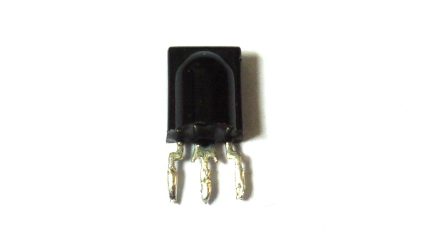
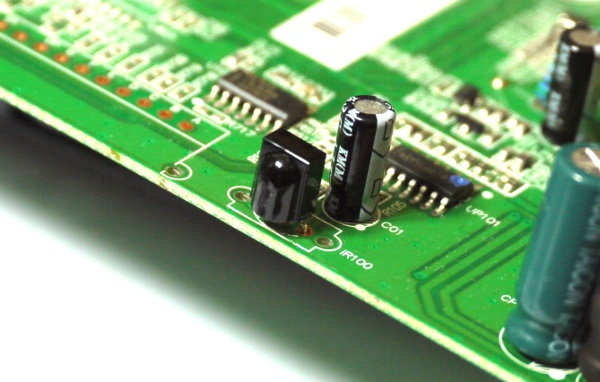

<!--- Copyright (c) 2013 Gordon Williams, Pur3 Ltd. See the file LICENSE for copying permission. -->
Infrared Remote Control
==========================

<span style="color:red">:warning: **Please view the correctly rendered version of this page at https://www.espruino.com/Infrared+Remote+Control. Links, lists, videos, search, and other features will not work correctly when viewed on GitHub** :warning:</span>

* KEYWORDS: Remote,IR,Infrared,,IR Remote,Control
* USES: Only Espruino Board,Espruino Board,IR Receiver

Introduction
-----------

Wouldn't it be cool if you could control Espruino from an Infrared remote control? You can!

Do you want to control IR devices from Espruino instead?  Check out [using Puck.js's IR](/Puck.js Infrared), using [an IR transmitter with Espruino](/Pico Infrared), and [decoding Pronto Hex Infrared codes](/pronto)

**Note:** There's now [an infrared receiver module](IRReceiver) that you can use to simplify responding to infrared signals.

You'll Need
----------

* One [Espruino Board](/Original)
* An Infrared Receiver

Getting an Infrared Receiver
-------------------------



You have a few options here:

* Buy one (could someone recommend one?)
* Use one from a PC TV card
* Scavenge one from an old remote control device

I'm going to use the third option here, because it's more fun.

Scavenging
---------

Find an old remote-controlled set top box that you were going to throw out, and crack it open. What you're looking for is something like this:



It'll have 3 wires, will be at the front of the case and will have a black plastic lens somewhere to let the IR light in.

Now, it looks like there are a few different types of receiver. To check yours, get a multimeter and set it to beep when it finds short circuits, then find something on your set top box that looks like it could be ground (like a big area of metal on the PCB, a big metal box, or a pin on a capacitor (the big cylindrical things) marked with a silver stripe of ```- - - -```). Put one terminal of the multimeter on that, and then connect it to each of the 3 terminals in turn. Remember which one buzzes as it's ground (GND).

The next terminal (power) is a bit harder. You'll have to go through all the capacitors (big cylindrical things) to check which of the other two pins is connected to one of them. You're after the positive pin of the capacitor, which is the one that's not marked with a silver stripe of ```- - - -```). If you can't find this, you're probably best off trying to find another device or buying an IR receiver.

And the final terminal (signal) is the one left over!

Now just unsolder the sensor and get ready to connect it to Espruino!

Wiring Up
--------

Just connect as follows:

| IR Receiver | Espruino |
|----------|----------|
| GND | GND |
| power | 3.3v |
| signal | Any signal pin. I'll use A0 |

Software
-------

First off, we'll just detect the times between pulses of IR light. The following will print the time between pulses. Copy and paste it into the left-hand side of the Espruino IDE:

```
function onPulseOn(e) {
  print(e.time - lastTime);
  lastTime = e.time;
}
function onPulseOff(e) {
  lastTime = e.time;
}
setWatch(onPulseOff, A0, { repeat:true, edge:"rising" });
setWatch(onPulseOn, A0, { repeat:true, edge:"falling" });
```

If (even before you've pressed a button on the IR remote) numbers keep being printed out then the IR module you've got probably doesn't have a built-in resistor. Run the following command to use one built in to Espruino:

```pinMode(A0,"input_pullup");```

Now, get your IR remote and press a button, and you'll see a bunch of numbers being printed out, a bit like this:

```
...
0.001324999999951614881
0.000425000000177533365
0.000450000000228101271
0.000450000000228101271
0.00045
0.0013
0.00045
0.0013
...
```

These numbers are divided into two distinct groups - either less than 0.001 or greater than it. If you have a different remote control then the numbers might be different. They're part of the remote control code. We can change our `onPulseOn` function to take advantage of this:

```
function onPulseOn(e) {
  print((e.time - lastTime)>0.001);
  lastTime = e.time;
}
```

So now, you'll see true and false being returned when you press a button. There's still too much to see though, so what we'll do next is to save the values into a single number, and then when we detect a pause in transmission, we'll look at what that number was:

```
// The code we're receiving
var code = 0;
// function to do something with the code when we get it
function handleCode() {
  timeout = undefined;
  print(code);
  code = 0;
}
/* change our original function so it writes values into
a number called 'code'. If there hasn't been anything happen
for 20ms, we'll print out what that number is */
function onPulseOn(e) {
  code = (code*2) | ((e.time - lastTime) > 0.0008);
  if (timeout!==undefined) clearTimeout(timeout);
  timeout = setTimeout(handleCode, 20);
  lastTime = e.time;
}
```

Now, when you press a button on your remote, you should get a number printed out. For instance on a Panasonic remote, I get 914810870957061 for volume up and 914810870989957 for volume down. We can write some code that handles these:

```
function handleCode() {
  timeout = undefined;
  if (code==914810870957061) digitalPulse(LED1,1,20);
  if (code==914810870989957) digitalPulse(LED2,1,20);
  code = 0;
}
```

This will flash either the red or the green LEDs depending on what button is pressed on **my** remote control. You might have to change the numbers for yours.


Making it do something
--------------------

Now it's pretty easy to make Espruino do something when it gets a code. As an example, I've got an old Amplifier that I use with speakers connected to the TV. It's got no remote control though so it's a real pain to get up and change the volume - what if that could be done automatically?

Get a model aircraft (Servo Motor)[/Servo Motors] and connect it to pin B13 (how to do this is in the previous link). Then you can use the following code:


```
// move the servo motor
volume = 0;

// change the volume
function changeVolume(dir) {
  volume += dir * 0.02;
  if (volume<0) volume = 0;
  if (volume>1) volume = 1;
  // give the servo a pulse to move it near the new location
  digitalPulse(B13, 1, 1+volume);
}

// do something depending on code from IR remote
function handleCode() {
  timeout = undefined;
  if (code==914810870957061) changeVolume(+1);
  if (code==914810870989957) changeVolume(-1);
  code = 0;
}
```

And now, all you have to do is make the servo motor turn your Amp's volume control and you can remote-control it!
