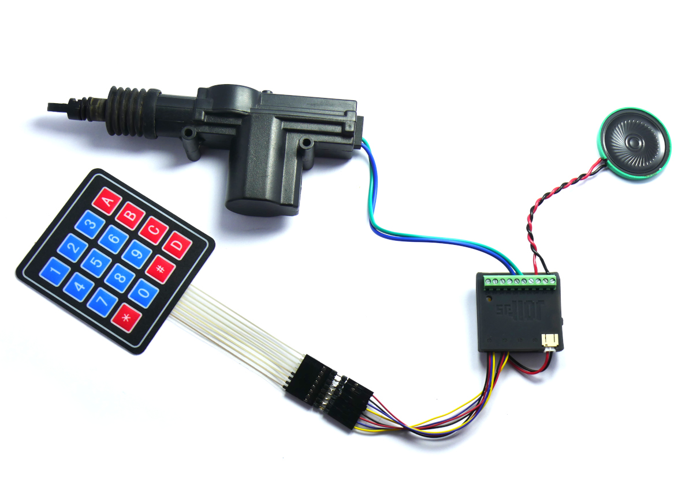

<!--- Copyright (c) 2024 Gordon Williams, Pur3 Ltd. See the file LICENSE for copying permission. -->
Jolt.js Combination Lock
==========================

<span style="color:red">:warning: **Please view the correctly rendered version of this page at https://www.espruino.com/Jolt.js+Combination+Lock. Links, lists, videos, search, and other features will not work correctly when viewed on GitHub** :warning:</span>

* KEYWORDS: Tutorials,LED,Lights,Motion
* USES: Jolt.js,KeyPad

This is a quick remix of the [KeyPad Combination Lock](/KeyPad+Combination+Lock) which uses a [Jolt.js](/Jolt.js) to drive a motor when the correct combination is entered.


You'll Need
------------

* A [Jolt.js](/Jolt.js)
* 2x Qwiic cables
* A [KeyPad](/KeyPad]
* A Central Locking Motor
* A [Speaker](/Speaker]/Piezo (optional)

Wiring Up
--------

Attach the KeyPad as Follows

| KeyPad | Jolt.js Quiic connector |
|--------|-------------------------|
| 1 | Q3 GND (Black) |
| 2 | Q3 VCC (Red) |
| 3 | Q3 SDA (Blue) |
| 4 | Q3 SCL (Yellow) |
| 5 | Q2 GND (Black) |
| 6 | Q2 VCC (Red) |
| 7 | Q2 SDA (Blue) |
| 8 | Q2 SCL (Yellow) |

**Note:** We can use all the pins on Q2 and Q3 because on those ports every pin is a GPIO. On Q0 and Q1 there are VCC and GND pins to allow more powerful loads to be controlled.



Attach the central locking motor between `H2` and `H3` on the terminal block. If it moves the wrong way for your use case you can easily adjust in software!

If you want audible feedback, attach a speaker between `GND` and `H0` on the terminal block

Software
---------

Paste the following onto the **right hand side of the IDE** and click the `Upload` button:

```JS
var code = "1234*";
var digit = 0;

function setLocked(isLocked) {
  // output red or green depending on whether we're locked or not
  digitalWrite([LED1,LED2,LED3], isLocked ? 0b100 : 0b010);
  // then two seconds later turn it off
  setTimeout(function() {
    digitalWrite([LED1,LED2,LED3], 0);
  }, 2000);
  // control our motor!
  if (isLocked == false) {
    // Pull motor one direction for 500ms
    digitalWrite([H2,H3], 2);
    setTimeout(() => digitalRead([H2,H3]), 500);
    // Now push it the other for 500ms
    setTimeout(() => digitalWrite([H2,H3], 1), 2000);
    setTimeout(() => digitalRead([H2,H3]), 2500);
  }
}

function onKey(key) {
  var ch = "123A456B789C*0#D"[key];
  // check against our code
  if (ch == code[digit]) {
    digit++; // go to next digit
    if (digit >= code.length) {
      console.log("We're at the end of the code - unlock!");
      digit = 0; // and go to the begining of the code again
      beep(4000, 1000); // show we're unlocked
      return setLocked(false);
    } else {
      console.log("Digit correct - next digit!");
    }
  } else {
    console.log("Wrong! Go back to the start");
    setLocked(true);
    digit = 0;
  }
  beep(4000);
}

function beep(freq,len) {
  len = len||100;
  H0.pwm(0.5,{freq:freq});
  return new Promise(resolve => setTimeout(() => {
    H0.read();
    resolve();
  }, len));
}

require("KeyPad").connect(
  [Q3.vcc,Q3.gnd,Q3.sda,Q3.scl],
  [Q2.gnd,Q2.vcc,Q2.sda,Q2.scl], onKey);
```

Now if you enter `1234*` the lock will unlock, but any other keycode will have no effect. To change the code, just change `code` at the top of the program code.