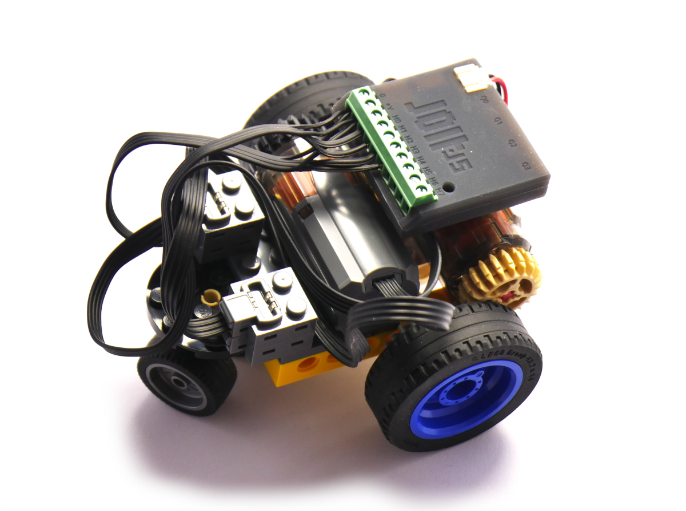
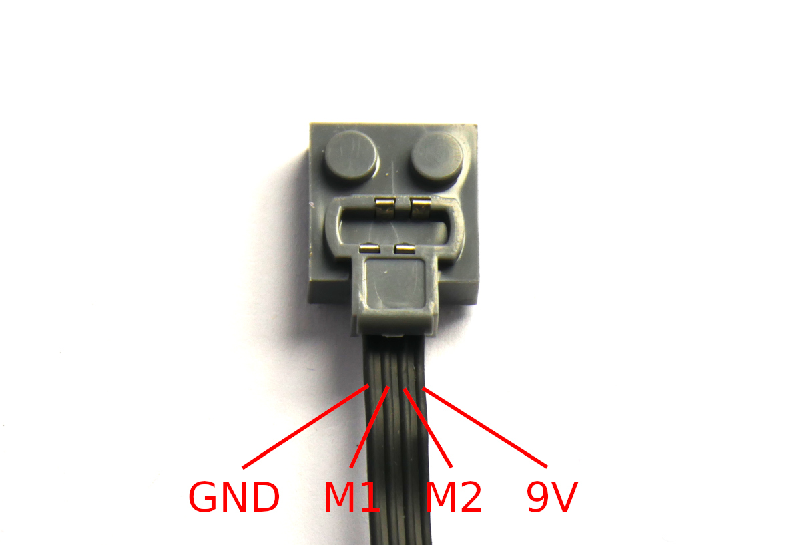

<!--- Copyright (c) 2024 Gordon Williams, Pur3 Ltd. See the file LICENSE for copying permission. -->
Jolt.js LEGO Control
=======================

<span style="color:red">:warning: **Please view the correctly rendered version of this page at https://www.espruino.com/Jolt.js+LEGO. Links, lists, videos, search, and other features will not work correctly when viewed on GitHub** :warning:</span>

* KEYWORDS: Tutorials,Lego,Power Functions,LEGO PF,Motor,Blockly
* USES: Jolt.js,Battery,Lego,Blockly

[Jolt.js](/Jolt.js)'s high power outputs are great for driving LEGO motors.

You might have an old LEGO set with motors you want to drive, or might just want to invest in some motors to power your LEGO constructions. You
can connect these to Jolt.js and control them via JS or even the built-in Blockly graphical programming language!



LEGO has gone through several variations of motors over the years, the main ones being:

* [4.5v](https://brickipedia.fandom.com/wiki/4.5V)  (retired 1986)
* [9v](https://brickipedia.fandom.com/wiki/9V) (retired 2009)
* [Power Functions](https://brickipedia.fandom.com/wiki/Power_Functions)  (retired 2018, clones still made)
* [Mindstorms / Spike](https://brickipedia.fandom.com/wiki/Powered_Up) (in production)
* [Powered Up](https://brickipedia.fandom.com/wiki/Powered_Up) (in production)

Very few solutions exist for powering old 4.5v/9v systems, and Jolt.js can power these easily. To make these work, simply cut an extension wire and attach it between any of the `H0..7` outputs on the Jolt.

While [LEGO Power Functions](https://brickipedia.fandom.com/wiki/Power_Functions) was officially retired in 2018, a
[wide variety of clones](https://brickexperimentchannel.wordpress.com/2023/11/15/characteristics-of-lego-parts/) are available at great prices (around $3) as well as new devices such as micro motors
and smoke machines that LEGO never produced. This makes it a great solution for adding power to
your LEGO models, and is what we're using here.

**Note:** Powered Up/Spike/Mindstorms motors can be used too, but these motors [have more connections](https://www.philohome.com/wedo2reverse/connect.htm) as
they can also be inputs. The motors and cables tend to be substantially more expensive to unless you have some already these may not be a good thing
to invest in.

**Note:** If you don't want to mess with hardware at all, we also have [the `mouldking` module](/LEGO+Power+Functions+Clone)
which is able to control some kinds of Bluetooth-capable Power Functions clone hubs.


You'll Need
------------

* A [Jolt.js](/Jolt.js)
* A [LEGO Power functions extension cable](https://www.amazon.com/s?k=lego+power+functions+wire)


Wiring
------

[Full details available here](https://scuttlebots.com/2014/03/02/lego-pf-hacking-wiring/) but the connections are as follows:



Permanent power is supplied so that the 'servo motor' can return back to its middle position when no motor power is applied.

We'd recommend cutting an extension lead in two, and then connection the two plugs at either end up to Jolt.js:

| Power Functions  | Jolt.js |
|------------------|---------|
| Plug 1 `GND`       | Terminal block `0` |
| Plug 1 `Motor 1`   | Terminal block `H0` |
| Plug 1 `Motor 2`   | Terminal block `H1` |
| Plug 1 `9V`        | Terminal block `+V` |
| Plug 2 `GND`       | Terminal block `0` |
| Plug 2 `Motor 1`   | Terminal block `H2` |
| Plug 2 `Motor 2`   | Terminal block `H3` |
| Plug 2 `9V`        | Terminal block `+V` |


Software
---------

You should now be able to control a motor attached to the Power Functions plug.
You if you set:

* `H0` to `0` and `H1` to `1`, the motor will go one way (eg. `digitalWrite([H0,H1], 1);`)
* `H0` to `1` and `H1` to `0`, the motor will go the other  (eg. `digitalWrite([H0,H1], 2);`)
* Setting both to `0` or `1` (eg. `digitalWrite([H0,H1], 0);`) will stop the motor, but the motor driver will be left on, drawing power. Instead
you can set both `H0` and `H1` to inputs with `digitalRead([H0,H1])` and the motor driver will turn off. See [the Jolt.js page](https://www.espruino.com/Jolt.js#-a-name-motor-a-motor-drivers)
for more information.

You can roll this into one function which will control both motors:

```JS
function motor(l,r) {
  if (l>0) {
    digitalWrite(H1,0);
    analogWrite(H0,l);
  } else if (l<0) {
    digitalWrite(H0,0);
    analogWrite(H1,-l);
  } else {
    digitalRead([H0,H1]);
  }
  if (r>0) {
    digitalWrite(H2,0);
    analogWrite(H3,r);
  } else if (r<0) {
    digitalWrite(H3,0);
    analogWrite(H2,-r);
  } else {
    digitalRead([H2,H3]);
  }
}
```

**Note:** I've assumed that you might be building a robot where there's
a motor on each wheel, so the second motor is set to turn the opposite
direction to the first.

Now `motor(1,1)` will turn both motors on, `motor(0,0)` will turn both off, or
`motor(-1,0.5)` will turn the first backward at full power and the second forwards
at half power.

So if you want to queue up one movement after another, you can do something like:

```JS
function move(l,r,time) {
  return new Promise(resolve => {
    motor(l,r);
    setTimeout(function() {
      motor(0,0);
      resolve();
    }, time||500);
  });
}

move(1,1, 500)
  .then(() => move(1,0,200))
  .then(() => move(1,1,500))
  .then(() => move(1,0,200))
  .then(() => move(0.7,0.7,1000))
```

Programming Graphically (Blockly)
----------------------------------

As it's LEGO you might like to let your device be controlled with a graphical
programming language for kids. With Espruino this is easy - all you need to
do is define a function called `motor` (which we already did) and save it
so it's always loaded by Espruino.

To write the file so it's always loaded with the `motor` function in,
copy this and paste it into the **left-hand** side of the IDE.

```JS
require("Storage").write(".boot0",`
function motor(l,r) {
  if (l>0) {
    digitalWrite(H1,0);
    analogWrite(H0,l);
  } else if (l<0) {
    digitalWrite(H0,0);
    analogWrite(H1,-l);
  } else {
    digitalRead([H0,H1]);
  }
  if (r>0) {
    digitalWrite(H2,0);
    analogWrite(H3,r);
  } else if (r<0) {
    digitalWrite(H3,0);
    analogWrite(H2,-r);
  } else {
    digitalRead([H2,H3]);
  }
}
`);
```

Now:

* Up the top of the screen to the right of the lift of files click the `+` sign, then `Blockly`. You'll see a new graphical programming screen
* In the tool area on the left, click `Robot`
* Now drag `Forward/Backward/Left/Right` blocks from the `Robot` tab onto the screen as needed
* Next click `Upload` and your program will be uploaded and will run!

