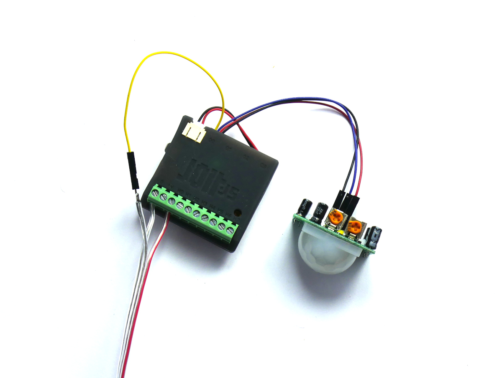

<!--- Copyright (c) 2024 Gordon Williams, Pur3 Ltd. See the file LICENSE for copying permission. -->
Jolt.js Motion Activated Lights
===============================

<span style="color:red">:warning: **Please view the correctly rendered version of this page at https://www.espruino.com/Jolt.js+Motion+Activated+Lights. Links, lists, videos, search, and other features will not work correctly when viewed on GitHub** :warning:</span>

* KEYWORDS: Tutorials,LED,Lights,Motion
* USES: Jolt.js,Battery,Pyroelectric,PIR,WS2811,ble_led

Sometimes it's really handy to have a motion activated light, but what if you want something a bit more interesting, that animates as it turns on or off?


For this you might use a [Neopixel LED string](/WS2811) but these draw a lot of power even when off. However Jolt.js's drivers can power the whole LED string, allowing it to last for ages on a battery.

At the end we'll also use the [`ble_led` module](/ble_led.md) to allow you to turn the light on and off wirelessly from [Home Assistant](https://www.home-assistant.io/)


You'll Need
------------

* A [Jolt.js](/Jolt.js)
* A Qwiic cable (supplied with Jolt.js)
* A [Lithium Polymer battery](/Battery) (available in the [Jolt.js Bundle](https://shop.espruino.com/joltjs-bundle))
* A [Pyroelectric (PIR) Motion Sensor](/Pyroelectric)
* A [Neopixel LED string](/WS2811) - we're using [some of Pimoroni's flexible wire](https://shop.pimoroni.com/products/5m-flexible-rgb-led-wire-50-rgb-leds-aka-neopixel-ws2812-sk6812) here

Wiring Up
--------

First, attach the LiPo battery - if you've got a battery with a JST connector of the right polarity you can plug it straight in.



Now to attach the Pyroelectric sensor. The [standard HC-SR501 sensors](/Pyroelectric) come with a voltage regulator and diode attached, but this means they won't run well off of the Lithium Ion battery's lower voltage. To work around this, perform the simple
low voltage modification shown in https://www.espruino.com/Pyroelectric#low-voltage-operation and you can then connect the sensor via the Qwiic connector. Take a Qwiic cable and wire as follows:

| Pyroelectric sensor | Qwiic cable |
|---------------------|-------------|
| GND                 | GND/Black   |
| OUT                 | SDA/Blue    |
| VCC                 | VCC/Red     |


Now plug the Qwiic cable into Q0 on the Jolt.

Now you just need to attach the Neopixel string!

| Neopixel String  | Jolt.js                  |
|------------------|--------------------------|
| GND              | Terminal block `0`       |
| DATA             | Qwiic Cable SCL (blue)   |
| 5V               | Terminal block H0        |


Software
---------

Let's test the Pyroelectric sensor. On the left-hand side of the IDE:

* Type `Q0.setPower(1)` to turn the sensor on
* Type `Q0.sda.read()` repeatedly to read the status of the pin. For a few seconds after starting it will probably return `true`, then `false` after. Whenever movement is detected it should return true again.
* Type `setWatch(e => LED2.write(e.state), Q0.sda, {repeat:true, edge:"both"});` to turn on the green LED whenever the output is true - you can now fiddle with the potentiometer labelled `Sx` on the sensor if you need to make it more/less sensitive.

Now to try out the LEDs.

* Type `H0.set()` - this will turn on the string's power (and will by default automatically turn on Jolt.js's drivers)
* Type `require("neopixel").write(Q0.scl, [20,0,0, 0,20,0, 0,0,20])` - this should set the string's first 3 LEDs to different colours (likely green, red and blue - but it depends on your strip) - other LEDs after that may also light.

More information is on the [Neopixel page](/WS2811) but these lights take 3 bytes (24 bits) per pixel, so to make it easier to handle them we're using `Uint24Array` which is an Espruino-specific
array of 24 bit numbers. `E.HSBtoRGB(..., 24)` can also be used to get a 24 bit number representing a certain hue, saturation and brightness.

Now we can upload the software! Paste the following onto the **right hand side of the IDE** and click the `Upload` button:

```JS
// How long should the lights turn on after movement
const LIGHT_TIMEOUT = 30 * 1000; // 30 seconds
const LED_COUNT = 50; // number of LEDs we have
/* Uint24Array is unique to Espruino, but it allows us
to write to Neopixels where each pixel is 24 bits very efficiently */
var leds = new Uint24Array(LED_COUNT);
let isAnimating = false; // true if we're currently animating the LEDs
let animateToState; // if not undefined, we should animate to this new state right after

/// This function updates all the LEDs
function setLEDs() {
  require("neopixel").write(Q0.scl, leds.buffer);
}

// Animate the lights on
function animateOn() {
  isAnimating = true;
  return new Promise(resolve => {
    H0.set();
    leds.fill(0);
    var n = 0; // number of LED we're setting
    var phase = 0; // which part of the animation are we on
    const shootingStar = [ // shooting star - bright in the middle and trailing off
      0x040000,
      0x080000,
      0x100000,
      0x201010,
      0x402020,
      0x402020,
      0x201010,
      0x100000,
      0x080000,
      0x040000,
      ];
    var interval = setInterval(() => {
      if (phase==0) { // first phase is we have a 'shooting star' move from one end to the other
        leds.set(shootingStar, n); // apply the shooting star
      } else if (phase==1) { // second phase slowly light up all the LEDs
        leds.fill(E.HSBtoRGB(0,0,0.25 * n / LED_COUNT,24)); // we only light LEDs 25% as they draw a lot of power!
      } else { // now finish
        clearInterval(interval);
        isAnimating = false;
        if (animateToState!==undefined) {
          if (!animateToState) animateOff();
          animateToState = undefined;
        }
        resolve();
      }
      setLEDs();
      n++;
      if (n>=leds.length) {
        n=0;
        phase++;
      }
    }, 20);
  });
}

// Animate the lights off
function animateOff() {
  isAnimating = true;
  return new Promise(resolve => {
    var n = 0; // number of LED we're setting
    var phase = 0; // which part of the animation are we on
    const left = [
      0x000000,
      0x040404,
      0x080808,
      0x101010,
      0x202020
      ];
    const right = left.slice().reverse();
    var interval = setInterval(() => {
      if (phase==0) { // first we slowly fade out the LEDs from each end
        leds.set(left, n>>1);
        leds.set(right, (leds.length-1)-(n>>1));
      } else { // now finish
        leds.fill(0);
        H0.read(); // LEDs off
        clearInterval(interval);
        isAnimating = false;
        if (animateToState!==undefined) {
          if (animateToState) animateOn();
          animateToState = undefined;
        }
        resolve();
      }
      setLEDs();
      n++;
      if (n>=leds.length) {
        n=0;
        phase++;
      }
    }, 25);
  });
}


Q0.setPower(1); // turn on Pyroelectric sensor
let lightsOffTimeout; // the timeout that turns lights off after LIGHT_TIMEOUT

setWatch(e => {
  // show state of PIR on green LED
  LED2.write(e.state);
  if (!e.state) return; // now we don't care about the falling edge
  // motion detected!
  if (lightsOffTimeout) {
    // lights are already on - no need to turn them on again
    clearTimeout(lightsOffTimeout);
  } else if (isAnimating) {
    // lights are currently turning off! Tell animateOff to turn them back on as soon as the animation has finished
    animateToState = 1;
  } else {
    // else lights are off - animate on!
    animateOn();
  }
  // after LIGHT_TIMEOUT from the last motion event, turn off!
  lightsOffTimeout = setTimeout(function() {
    lightsOffTimeout = undefined;
    animateOff();
  }, LIGHT_TIMEOUT);
}, Q0.sda, {repeat:true, edge:"both"});

```

You may want to change `LED_COUNT` to the number of LEDs you have.

Once uploaded:

* When movement is detected the LEDs will animate on
* After 30s they'll animate off, and any movement will make them, turn on again


Bonus - Home Assistant Integration
-----------------------------------

But, what if we wanted our lights to be controlled from [Home Assistant](https://www.home-assistant.io/)?

We could use the [LED BLE Library](/ble_led) to make Jolt.js appear as a Bluetooth LED bulb that
Home Assistant is aware of.

Just upload the following code instead, disconnect from Bluetooth and your light
should appear in Home Assistant. See [LED BLE Library](/ble_led) for more information.


```JS
// How long should the lights turn on after movement
const LIGHT_TIMEOUT = 10 * 1000; // 60 seconds
const LED_COUNT = 50; // number of LEDs we have
/* Uint24Array is unique to Espruino, but it allows us
to write to Neopixels where each pixel is 24 bits very efficiently */
var leds = new Uint24Array(LED_COUNT);
let isAnimating = false; // true if we're currently animating the LEDs
let animateToState; // if not undefined, we should animate to this new state right after
let lightsOn = false; // current state of the lights

/// This function updates all the LEDs
function setLEDs() {
  require("neopixel").write(Q0.scl, leds.buffer);
}

// Animate the lights on
function animateOn() {
  if (isAnimating) {
    animateToState = true;
    return Promise.resolve();
  }
  isAnimating = true;
  lightsOn = true;
  return new Promise(resolve => {
    H0.set();
    leds.fill(0);
    var n = 0; // number of LED we're setting
    var phase = 0; // which part of the animation are we on
    const shootingStar = [ // shooting star - bright in the middle and trailing off
      0x040000,
      0x080000,
      0x100000,
      0x201010,
      0x402020,
      0x402020,
      0x201010,
      0x100000,
      0x080000,
      0x040000,
      ];
    var interval = setInterval(() => {
      if (phase==0) { // first phase is we have a 'shooting star' move from one end to the other
        leds.set(shootingStar, n); // apply the shooting star
      } else if (phase==1) { // second phase slowly light up all the LEDs
        leds.fill(E.HSBtoRGB(0,0,0.25 * n / LED_COUNT,24)); // we only light LEDs 25% as they draw a lot of power!
      } else { // now finish
        clearInterval(interval);
        isAnimating = false;
        if (animateToState!==undefined) {
          if (!animateToState) animateOff();
          animateToState = undefined;
        }
        resolve();
      }
      setLEDs();
      n++;
      if (n>=leds.length) {
        n=0;
        phase++;
      }
    }, 20);
  });
}

// Animate the lights off
function animateOff() {
  if (isAnimating) {
    animateToState = false;
    return Promise.resolve();
  }
  isAnimating = true;
  return new Promise(resolve => {
    var n = 0; // number of LED we're setting
    var phase = 0; // which part of the animation are we on
    const left = [
      0x000000,
      0x040404,
      0x080808,
      0x101010,
      0x202020
      ];
    const right = left.slice().reverse();
    var interval = setInterval(() => {
      if (phase==0) { // first we slowly fade out the LEDs from each end
        leds.set(left, n>>1);
        leds.set(right, (leds.length-1)-(n>>1));
      } else { // now finish
        leds.fill(0);
        H0.read(); // LEDs off
        clearInterval(interval);
        isAnimating = false;
        lightsOn = false;
        if (animateToState!==undefined) {
          if (animateToState) animateOn();
          animateToState = undefined;
        }
        resolve();
      }
      setLEDs();
      n++;
      if (n>=leds.length) {
        n=0;
        phase++;
      }
    }, 25);
  });
}


Q0.setPower(1); // turn on Pyroelectric sensor
let lightsOffTimeout; // the timeout that turns lights off after LIGHT_TIMEOUT
let forceLightOn = false; // lights are forced on by HomeAssistant

setWatch(e => {
  // show state of PIR on green LED
  LED2.write(e.state);
  if (!e.state) return; // now we don't care about the falling edge
  if (forceLightOn) return; // if lights are forced on, we don't care about motion
  // motion detected!
  if (lightsOffTimeout) {
    // lights are already on - no need to turn them on again
    clearTimeout(lightsOffTimeout);
  } else {
    // else lights are off - animate on!
    animateOn();
  }
  // after LIGHT_TIMEOUT from the last motion event, turn off!
  lightsOffTimeout = setTimeout(function() {
    lightsOffTimeout = undefined;
    animateOff();
  }, LIGHT_TIMEOUT);
}, Q0.sda, {repeat:true, edge:"both"});

NRF.setTxPower(8); // highest power transmit
/* Make Jolt.js appear to be a Bluetooth LE Lightbolb that
HomeAssistant knows about */
require("ble_led").setup(function(state) {
  if (state.on) {
    // TODO: we could look at state.r/g/b and set colour accordingly!
    forceLightOn = true;
    if (lightsOffTimeout) clearTimeout(lightsOffTimeout);
    lightsOffTimeout = undefined;
    if (!lightsOn)
      animateOn();
  } else {
    if (lightsOn) animateOff();
    forceLightOn = false;
  }
});
```
