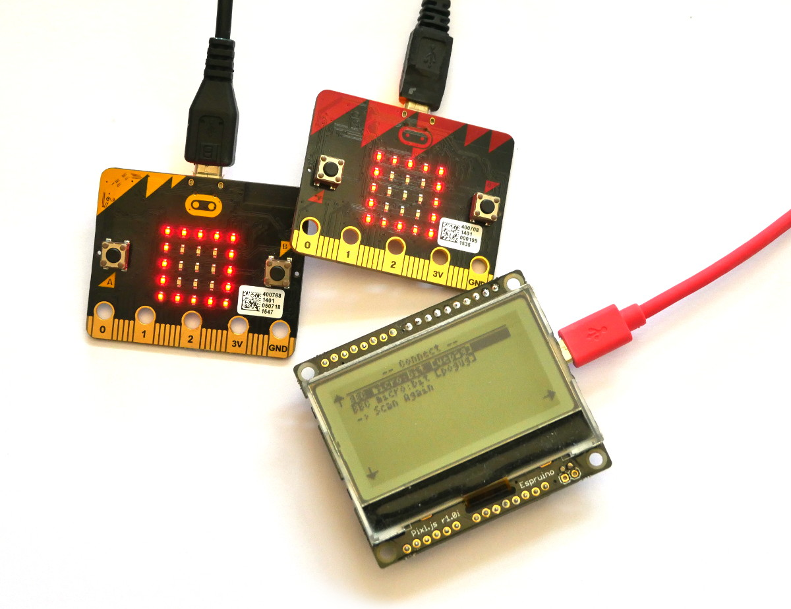
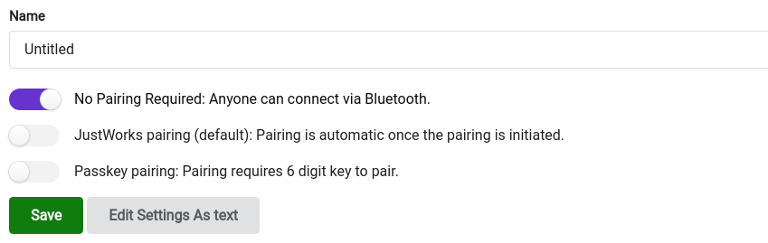
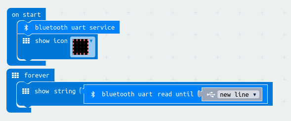
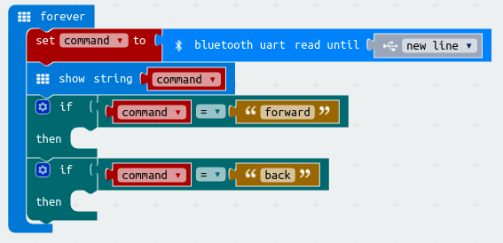

<!--- Copyright (c) 2018 Gordon Williams, Pur3 Ltd. See the file LICENSE for copying permission. -->
Sending Text to Micro:Bit
=========================

<span style="color:red">:warning: **Please view the correctly rendered version of this page at https://www.espruino.com/MicroBit+Text. Links, lists, videos, search, and other features will not work correctly when viewed on GitHub** :warning:</span>

* KEYWORDS: MicroBit,Micro:bit,Voting,Advertising,Eddystone
* USES: MicroBit,Pixl.js



We're going to use a [Pixl.js](/Pixl.js) board with Espruino to scan for
[Micro:bit](/MicroBit) devices programmed with [MakeCode](https://makecode.microbit.org)
and to then send text to them using the UART service.

Micro:Bit software
-------------------

* Go to [MakeCode](https://makecode.microbit.org) and ensure you're in `Blocks`
mode up the top.
* Under the `Advanced` heading click `Add Package` (you may have to expand
  `Advanced` first)


* Type `Bluetooth` and click on the `Bluetooth` package


* Click `Yes` to the dialog telling you that radio functions won't be available.


* Click the `Settings` icon in the top right, and click `Project Settings`
* Ensure that the `No Pairing Required` slider is set to `On`, and click `Save`



* Pull in an `on start` block from `Basic`
* Click `Bluetooth`, then `... More`, and pull a `bluetooth uart service` block into `on start`
* Pull `show icon` from `Basic` into the end of `on start` as well - it'll show that everything is working

* Now pull in a `forever` block from `Basic`
* Pull `show string` from `Basic` and put it in `forever`
* Click `Bluetooth`, then `... More`, and pull a `bluetooth red until newline` block into the `show string` block

Your code should look like this:



Click `Download` and save the file to each [Micro:bit](/MicroBit) you're interested in.


Pixl.js Software
----------------

On the Pixl, we'll write code that scans for any Micro:Bits (with names beginning
with `BBC`) and displays them in a menu. When chosen from a menu you have a choice
of text to send, and then a connection will be made and the text will be sent.

For [Pixl.js](/Pixl.js), follow the [Getting Started Guide](/Quick+Start+BLE#pixljs)
to get connected with the Espruino IDE.

Copy and paste the following code to the right-hand side of the IDE and click `Upload`,
and you're done!

```

// Do a scan and display the results in a menu
function doScan() {
  Pixl.menu(); // remove menu
  Terminal.println("Scanning...");
  NRF.findDevices(function(devs) {
    var menu = { "" : {title:"No Devices Found"} };
    // Add any device with a name beginning with 'BBC'
    devs.forEach(function(dev) {
      if (dev.name && dev.name.substr(0,3)=="BBC") {
        found = true;
        menu[""].title = "-- Connect -- ";
        menu[dev.name] = function() {
          askForText(dev);
        };
      }
    });
    // Add a menu option to rescan
    menu["-> Scan Again"] = function() {
      doScan(); // scan
    };
    // Show the menu
    Pixl.menu(menu);
  });
}

// Show a list of text to send to the micro:bit
function askForText(dev) {  
  Pixl.menu({
    "":{title:"Which text?"},
    "Hello":function() { doConnect(dev,"Hello\n"); },
    "Goodbye":function() { doConnect(dev,"Goodbye\n"); },
    "A Test":function() { doConnect(dev,"A Test\n"); },
    "-> Scan Again":function() { doScan(); },
  });
}

/* Connect and send, max 20 characters. The micro:bit's
UART isn't actually a standard Nordic UART so we can't
use built-in libraries and have to do this manually. */
function doConnect(dev, text) {
  Pixl.menu(); // remove menu
  Terminal.println("Connecting...");
  var device;
  dev.gatt.connect().then(function(d) {
    Terminal.println("Connected! Finding service");
    device = d;
    return d.getPrimaryService("6e400001-b5a3-f393-e0a9-e50e24dcca9e");
  }).then(function(s) {
    Terminal.println("Finding characteristic");
    return s.getCharacteristic("6e400003-b5a3-f393-e0a9-e50e24dcca9e");
  }).then(function(c) {
    Terminal.println("Sending");
    return c.writeValue(text);
  }).then(function() {
    device.disconnect();
    Terminal.println('Done!');
    setTimeout(function() {
      doScan();
    }, 2000);
  }).catch(function(err) {
    print(err);    
    Terminal.println("Error!");
    setTimeout(function() {
      doScan();
    }, 2000);
    if (device) device.disconnect();
  });
}

// When initialised start scanning
function onInit() {
  doScan();
}

onInit();
```

Type `save()` to write this code to Pixl.js so it'll be run automatically
even after power is removed and restored.


More functionality
------------------

You can now send any text to a  [Micro:bit](/MicroBit), so you could write
code on the [Micro:bit](/MicroBit) that checked if the text was a command
and that did what it said - for instance `"forward"` might move a Micro:bit Robot
forwards.


