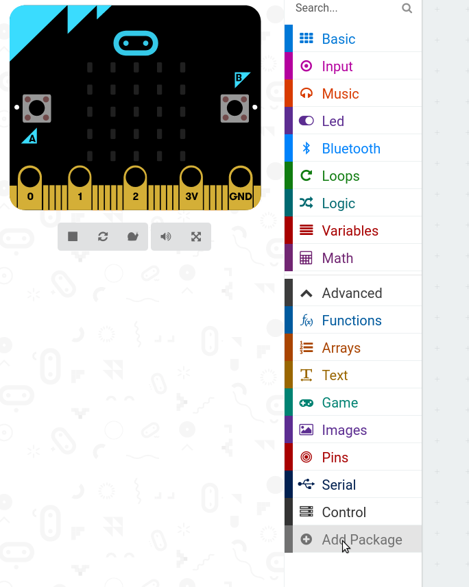
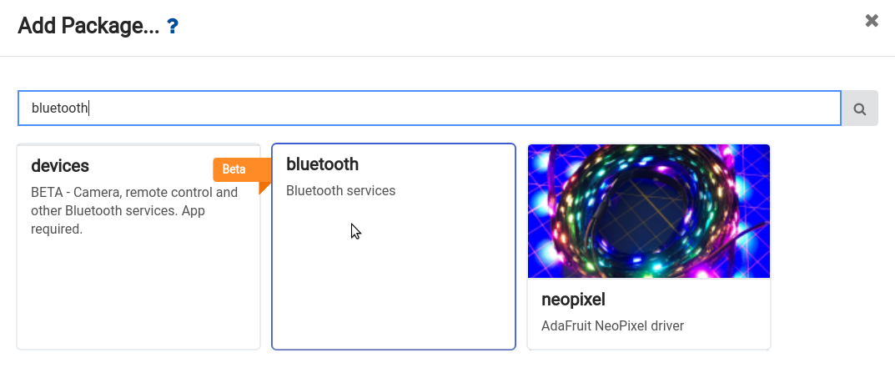
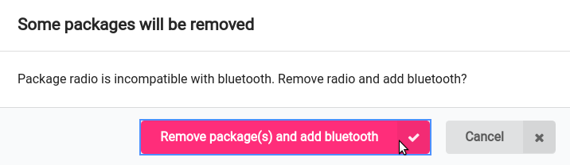
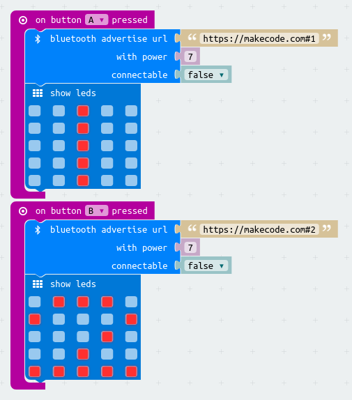
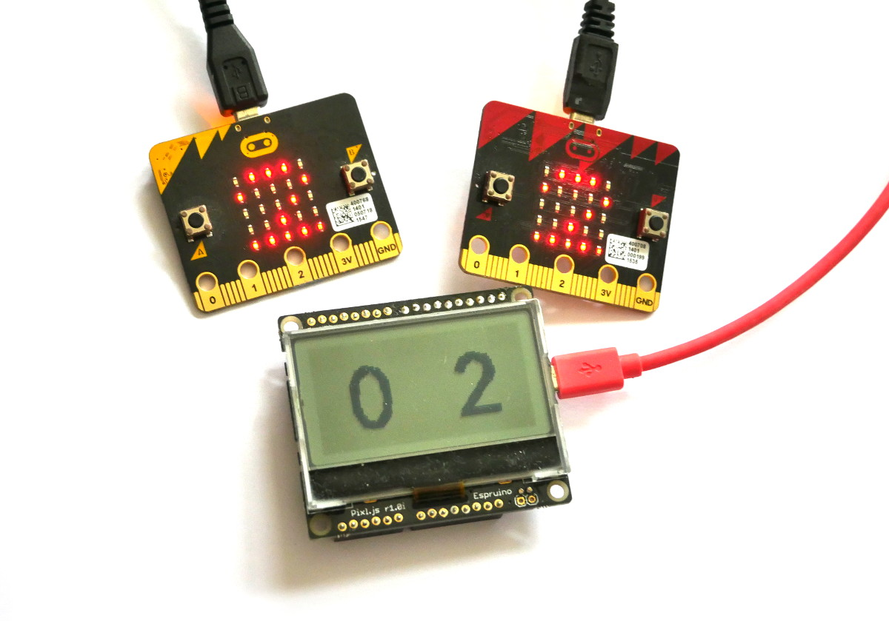

<!--- Copyright (c) 2018 Gordon Williams, Pur3 Ltd. See the file LICENSE for copying permission. -->
Micro:Bit Voting
===============

<span style="color:red">:warning: **Please view the correctly rendered version of this page at https://www.espruino.com/MicroBit+Voting. Links, lists, videos, search, and other features will not work correctly when viewed on GitHub** :warning:</span>

* KEYWORDS: MicroBit,Micro:bit,Voting,Advertising,Eddystone
* USES: MicroBit,Pixl.js

[[https://youtu.be/E7BA-zetcLw]]

If you have a classroom of kids, one thing you might want to do is to make
a voting system where children can do something with their [Micro:bit](/MicroBit) and
have it shown at the front of the class.

We're going to use a [Pixl.js](/Pixl.js) board with Espruino to receive
data that is transmitted over Bluetooth by [Micro:bits](/MicroBit) programmed with
[MakeCode](https://makecode.microbit.org) and display it on the [Pixl.js](/Pixl.js) screen.

Because standard Eddystone Bluetooth advertising is used, multiple receivers
can be made - using other Bluetooth LE Espruino devices or just a PC with
special software.


Micro:Bit software
-------------------

* Go to [MakeCode](https://makecode.microbit.org) and ensure you're in `Blocks`
mode up the top.
* Under the `Advanced` heading click `Add Package` (you may have to expand
  `Advanced` first)



* Type `Bluetooth` and click on the `Bluetooth` package



* Click `Yes` to the dialog telling you that radio functions won't be available.



* Now pull in the `On Button A Pressed` block from `Input`
* Pull `bluetooth advertise url` from `Bluetooth` into the `On Button A Pressed`
* Pull `show leds` from `Basic` into the end of `On Button A Pressed` as well
* Right-click and duplicate all the blocks
* In the first block, change `https://makecode.com` to `https://makecode.com#1`, and write `1` in the `show leds` block
* In the second block, change `On Button A Pressed` to `On Button B Pressed`, `https://makecode.com` to `https://makecode.com#2`, and write `2` in the `show leds` block

Your code should look like this:



Click `Download` and save the file to each [Micro:bit](/MicroBit) you're interested in.


Pixl.js Software
----------------

On the Pixl, we'll write code that scans for any advertised URLs that contain
a `#` character, and use the text after the `#` as a vote.

For [Pixl.js](/Pixl.js), follow the [Getting Started Guide](/Quick+Start+BLE#pixljs)
to get connected with the Espruino IDE.

Copy and paste the following code to the right-hand side of the IDE and click `Upload`,
and you're done!

```
// List of eddystone devices
var eddystone = {};
// List of votes
var votes = {};

// Start scanning for devices
NRF.setScan(function(dev) {
  if (dev.serviceData && dev.serviceData.feaa)
    eddystone[dev.id] = dev;
});

/* Every so often, scan over the list of devices
we have and tally up the votes */
setInterval(function() {
  // reset votes
  votes = {};
  // tally them up
  for (var id in eddystone) {
    var dev = eddystone[id];
    if (!dev.age) dev.age=0;
    dev.age++;
    // only use votes from devices we heard from recently
    if (dev.age < 40) {
      // if the URL contains a hash, the vote is what comes after
      var url = E.toString(dev.serviceData.feaa).substr(3);
      var hash = url.lastIndexOf("#");
      if (hash) {
        var vote = url.substr(hash+1);
        if (vote in votes)
          votes[vote]++;
        else
          votes[vote]=1;
      }
    }
  }
  // now display on the screen
  g.clear();
  g.setFontVector(40);
  g.setFontAlign(0,0);
  g.drawString(0|votes["1"], g.getWidth()/4, g.getHeight()/2);
  g.drawString(0|votes["2"], 3*g.getWidth()/4, g.getHeight()/2);
  g.flip();  
}, 500);
```

Type `save()` to write this code to Pixl.js so it'll be run automatically
even after power is removed and restored.




More functionality
------------------

Since anything after a `#` is used as a vote, you can easily have more than
two items to vote with. The following code for MakeCode will vote with
a number between `0` and `9` (changed by pressing the `A` and `B` buttons)


You can then pick up the results in the `votes` variable. For instance to
display a bar graph instead of 2 numbers, just change the code at the end of
the `setInterval` to:

```
// now display on the screen
g.clear();
g.setFontAlign(0,0);
for (var i=0;i<10;i++) {
  g.fillRect(i*12, 55-(0|votes[i])*10, i*12+11, 55);
  g.drawString(0|votes[i], i*12+5, 60);
}  
g.flip();  
```

You could also use the [Arduino connectors](/Pixl.js#pinout) on the back of
the [Pixl.js](/Pixl.js) to connect extra hardware that can be controlled by the
Micro:bits, for instance motors, WiFi connection, or large LED displays.
