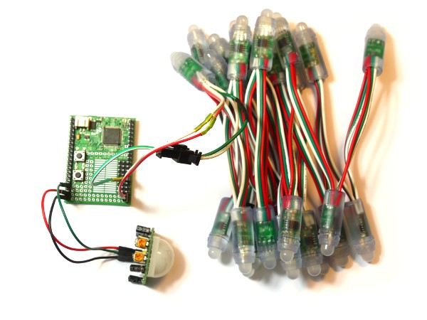

<!--- Copyright (c) 2013 Gordon Williams, Pur3 Ltd. See the file LICENSE for copying permission. -->
Motion Sensing Lights
=======================

<span style="color:red">:warning: **Please view the correctly rendered version of this page at https://www.espruino.com/Motion+Sensing+Lights. Links, lists, videos, search, and other features will not work correctly when viewed on GitHub** :warning:</span>

* KEYWORDS: Pyroelectric,Motion,Movement,Sensor,HC-SR501,LED,WS2811
* USES: WS2811,Pyroelectric,Espruino Board

Introduction
-----------

If you're trying to save energy, one way is to turn the lights off in rooms when you're not using them. But what about the hallway if you're always going up and down the stairs? You want something that lights automatically.

Sure, you can buy those - but what if you want it to light up in an awesome way as well?

[[http://youtu.be/k7shHXNUL40]]

You'll Need
----------

* An [Espruino Board](/Original)
* [[WS2811]] Lights
* A [[Pyroelectric]] motion sensor - or something else you can use to detect movement

Wiring Up
--------



Connect the [[Pyroelectric]] sensor as follows:

| HC-SR501 | Espruino   |
| ------- | ------- |
| VCC | VBAT (5v) |
| OUT | A1      |
| GND | GND     |

Connect the [[WS2811]] lights as follows:

| LED String | Espruino   |
| -------    | ---------- |
| White	     | GND        |
| Green (DI) | B15        | 
| Red        | VBAT       |


Software
-------

Just copy and paste this into the right-hand window, then click the ```Send to Espruino``` button.

```
// Set up the SPI port (for communications with the lights)
SPI2.setup({baud:3200000, mosi:B15});
// stores the timeout used to turn lights off
var timeout; 
// stores the RGB data we want to send to our lights
var rgb = new Uint8ClampedArray(25*3); // 25 x RGB lights

// Turn lights on
function lightsOn() {
  digitalWrite(LED3,1); // turn blue LED on as indicator
  // Turn all lights on
  for (var i in rgb)
    rgb[i] = 255;
  // send data to the lights
  SPI2.send4bit(rgb, 0b0001, 0b0011);
}

// turn lights off
function lightsOff() {
  digitalWrite(LED3,0); // turn blue LED off as indicator
  // Turn all lights off
  for (var i in rgb)
    rgb[i] = 0;
  // send data to the lights
  SPI2.send4bit(rgb, 0b0001, 0b0011);
}

// When the signal from the PIR changes...
setWatch(function(e) {
  // If we had a timeout, it's because lights are already On.
  // clear it...
  if (timeout!==undefined)
    clearTimeout(timeout);
  else // otherwise turn the lights on
    lightsOn();
  // Now set a timeout to turn the lights off after 15 seconds
  timeout = setTimeout(function() {
    timeout = undefined;
    lightsOff();
  }, 15000);
}, A1, { repeat:true, edge: "rising" });
```

Note, if you want to see what the signal you're getting from the PIR looks like, just add this command and it will use the red LED as an indicator:

```setInterval("digitalWrite(LED1,digitalRead(A1));",50);```

The comments in the code describe pretty clearly what it's doing, but it's a bit boring really. It suddenly turns the lights on, and then suddenly turns them off after 15 seconds. Wouldn't it be better if they lit up smoothly?

Copy and paste the following into the right-hand window:

```
// Set up the SPI port (for communications with the lights)
SPI2.setup({baud:3200000, mosi:B15});
// stores the timeout used to turn lights off
var timeout; 
// stores the RGB data we want to send to our lights
var rgb = new Uint8ClampedArray(25*3); // 25 x RGB lights

// Turn lights on
function lightsOn() {
  digitalWrite(LED3,1); // turn blue LED on as indicator
  // animate to turn lights on
  var pos = 0;
  var interval = setInterval(function() {
    pos += 0.025;
    if (pos>=1) clearInterval(interval);
    // Work out colours - fade in from one end
    for (var i=0;i<rgb.length;) {
      var a = (i/rgb.length)+(pos*2)-1;
      rgb[i++] = a*512; // red
      rgb[i++] = (a*512)-128; // green
      rgb[i++] = (a*512)-256; // blue
    }
    // send data to the lights
    SPI2.send4bit(rgb, 0b0001, 0b0011);
  }, 50);
}

// turn lights off
function lightsOff() {
  digitalWrite(LED3,0); // turn blue LED off as indicator
  // animate to turn lights off
  var pos = 0;
  var interval = setInterval(function() {
    pos += 0.05;
    if (pos>=1) clearInterval(interval); 
    // Work out colours - fade all out the same amount
    var amtr = (1-pos)*255; // red
    var amtg = (1-pos*1.5)*255; // green
    var amtb = (1-pos*2)*255; // blue
    for (var i=0;i<rgb.length;) {
      rgb[i++] = amtr;
      rgb[i++] = amtg;
      rgb[i++] = amtb;
    }
    // send data to the lights
    SPI2.send4bit(rgb, 0b0001, 0b0011);
  }, 50);
}

// When the signal from the PIR changes...
setWatch(function(e) {
  // If we had a timeout, it's because lights are already On.
  // clear it...
  if (timeout!==undefined)
    clearTimeout(timeout);
  else // otherwise turn the lights on
    lightsOn();
  // Now set a timeout to turn the lights off after 15 seconds
  timeout = setTimeout(function() {
    timeout = undefined;
    lightsOff();
  }, 15000);
}, A1, { repeat:true, edge: "rising" });
```

Now the lights will smoothly turn on, and smoothly turn off.

Because the code above is written in an event-based way (listening for movement using setWatch, rather than 'polling' using setInterval), you can add the ```setDeepSleep(true);``` command. This will send the Espruino board into a very low power sleep mode - which means that the whole project can run on batteries for a long time. Having said that, the LED strip draws around 20mA even when all LEDs are off - so if you want seriously low power you'll have to use a [relay](Relays) or FET on the 5v line of the LED string to ensure that when the LEDs are off, they are not drawing any power at all.

Another good addition to this would be a [Light Dependent Resistor](/LDR), so that you could detect when the area was light enough that the lights do not need to light up.
