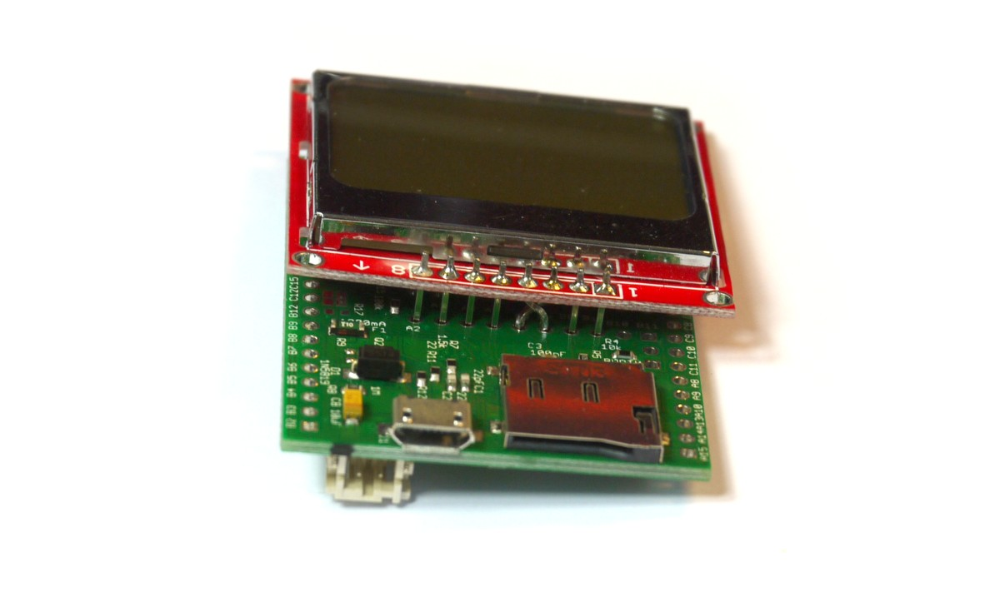
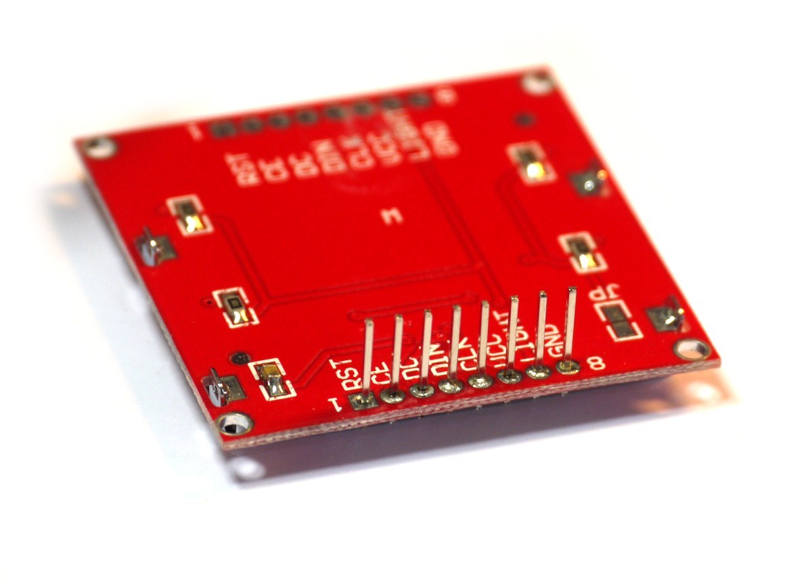

<!--- Copyright (c) 2013 Gordon Williams, Pur3 Ltd. See the file LICENSE for copying permission. -->
Soldering an LCD directly to Espruino
===============================

<span style="color:red">:warning: **Please view the correctly rendered version of this page at https://www.espruino.com/Onboard+LCD. Links, lists, videos, search, and other features will not work correctly when viewed on GitHub** :warning:</span>

* KEYWORDS: LCD,Small,Compact
* USES: PCD8544,Espruino Board




Sometimes you might want to make a very small device with an LCD display. Using the row of pins along the middle of Espruino, you can easily do this!

The [[PCD8544]] LCD uses so little power that it can easily be powered directly from GPIO lines - requiring no special wiring other that the swapping of two signal wires.

You'll Need
----------

* One [Espruino Board](/Original)
* A [[PCD8544]] LCD Display and some pin strip (this should come with it)

Wiring Up
--------

* First, take the LCD display and solder pin strip onto the top row of connectors (the ones by the large bar of silver)
* Then pull off the black plastic bar that hold the pin strip together



* Carefully twist the pins for `DC` and `DIN` so that they are swapped over (but not shorting). I'd suggest doing this in stages, bending each pin at 45 degrees first, and then making another bend. then another.


* Solder the LCD display to the rear of the board, ensuring that the `CLK` pin is connected to `A5`, and the bent `DIN` pin is now connected to `A7`.


**Note:** If you want to fit the LCD the other way around, you could insert the pin strip into the bottom row of pins and can then place the LCD on the opposite side of the board.

The LCD should now be connected as follows:

| LCD pin | Pin type | Example pin on Espruino Board |
|---------|----------|-------------------------------|
|  GND    | GND      | A2                            |
|  LIGHT  | Any      | A3                            |
|  VCC    | 3.3v     | A4                            |
|  CLK    | SPI SCK  | A5                            |
|  DIN    | SPI MOSI | A7                            |
|  DC     | Any      | A6                            |
|  CE     | Any      | B0                            |
|  RST    | Any      | B1                            |


Software
-------

Because the display is now powered directly from Espruino's GPIO pins, they must be set correctly in order to power the LCD. Otherwise, initialisation happens just as before:

```
A2.write(0); // GND
// A3.write(1); // light on
A4.write(1); // VCC
SPI1.setup({ baud: 1000000, sck:A5, mosi:A7 });

var g;

function onInit() {
  setTimeout(function() {
    g = require("PCD8544").connect(SPI1,A6,B0,B1, function() {
      g.clear();
      g.drawString("Hello",0,0);
      g.drawLine(0,10,84,10);
      g.flip();
    });
  }, 200);
}

onInit();
```
