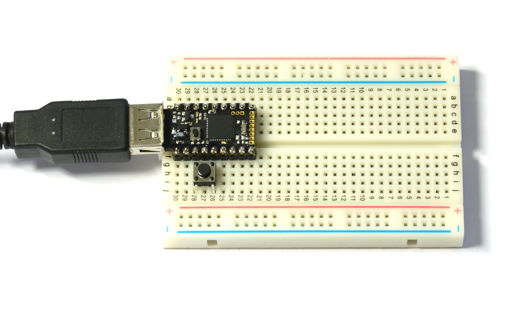
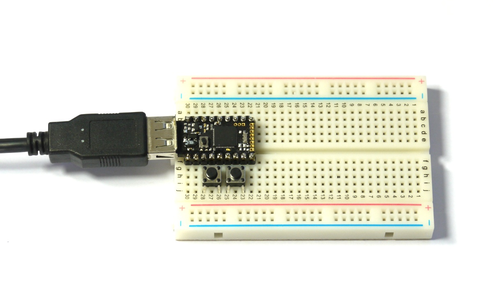

<!--- Copyright (c) 2015 Gordon Williams, Pur3 Ltd. See the file LICENSE for copying permission. -->
Pico Buttons
===========

<span style="color:red">:warning: **Please view the correctly rendered version of this page at https://www.espruino.com/Pico+Buttons. Links, lists, videos, search, and other features will not work correctly when viewed on GitHub** :warning:</span>

* KEYWORDS: Pico,LCD,Hello World
* USES: Pico,Button,PicoStarterKit

Introduction
-----------

Here we're going to find out how to attach external buttons and switches to the Espruino Pico.

You'll Need
----------

* An Espruino [[Pico]]
* Two [Pushbuttons](/Button)
* [[Breadboard]]

Wiring Up
--------



Firstly, we're going to just use the built-in button, but after that we'll use a second, external button which we'll wire up now.

We want to connect one side to 3.3V, and the other side to an input pin (in this case we'll use `B4`). While usually you'd want a resistor to make `B4` zero volts when the button is in its 'open' state, the Espruino board has resistors built in that can be enabled with software.

* Take the Pico board and place it in the breadboard so that the USB connector sticks out to the left. Make sure it's as high as it can go, with the bottom row of pins in the top row of the lower half of the breadboard.
* Simply push the button into the 3rd and 5th holes from the left, on the bottom edge of the Pico board. While the button has 4 pins, the opposite pins (that are furthest apart) are connected together. This means if it looks like you'll have to squeeze the pins together to get them to fit in the 3rd and 5th holes, you should rotate the switch by 90 degrees instead.

Software - Internal button
-----------------------

Let's look at using the built-in button. It has its own variable, called `BTN`. In the left-hand side of the Web IDE copy and paste the following, then hit Enter: 

```
digitalRead(BTN)
```

It should return `=0`. Hold down the button, then press up-arrow and Enter (to repeat the last command), and it should now return `=1`, indicating that the button is pressed.

You can use this to light an LED. Type the following:

```
setInterval(function() {
  digitalWrite(LED1, digitalRead(BTN));
}, 20);
```

Every 20ms (50 times a second), this will choose whether to light the Red LED based on the value of the button. If you now press the button, the LED will light.

This works, and is similar to what you might implement on an Arduino board. However it's not ideal. Right now your Espruino is busy checking the status of the button, even though it isn't pressed. Not only does this waste energy, it can cause you problems. For instance type:

```
digitalWrite(LED1, 1);
```

The red LED will just flash for a fraction of a second. Why? Well, every 20ms Espruino will be turning it off.

There's a much better way. To get rid of the Interval we created, type:

```
clearInterval();
```

Now, we'll add a Watch. This uses Espruino's hardware to call your function only when something changes:

```
setWatch(function(e) {
  digitalWrite(LED1, e.state);
}, BTN, { repeat: true });
```

Now, the light will still turn on when the Button if pressed, but Espruino won't be doing anything except when the button is pressed or released. You can now do the following again:

```
digitalWrite(LED1, 1);
```

The LED will now stay lit, until you press and release the button.

We now have some other problems. Let's try counting button presses:

```
var presses = 0;
clearWatch(); // remove our last watch
setWatch(function(e) {
  digitalWrite(LED1, e.state);
  presses++;
  console.log("Pressed "+presses);
}, BTN, { repeat: true });
```

If you press the button now, you'll see that the counter increases when the button is pressed, and also when it's released. But sometimes it increases by more than one.

Why? Well, the button is a mechanical device, with metal contacts. Sometimes, when you press it the contacts actually bounce, making it look like the button was pressed very quickly. It's such a common problem we've added something called 'debouncing' to Espruino to make it easier to use. Try this:

```
clearWatch(); // remove our last watch
setWatch(function(e) {
  digitalWrite(LED1, e.state);
  presses++;
  console.log("Pressed "+presses);
}, BTN, { repeat: true, debounce : 50 });
```

We've set `debounce` to 50ms, so your code will only be called after the button has stayed in the same state for at least 50ms.

But we're still calling our code when the button is pressed and released. You could add some code starting with `if (e.state) ` to the function to change this, but Espruino can help you out here too:

```
clearWatch(); // remove our last watch
setWatch(function() {
  digitalPulse(LED1, 1, 50);
  presses++;
  console.log("Pressed "+presses);
}, BTN, { repeat: true, debounce : 50, edge: "rising" });
```

Now, we've added `edge: "rising"`, so the function is only called when the button is pressed. I've changed `digitalWrite` to `digitalPulse` to just flash the LED, and we don't even need access to the pin's state any more, because we know that it will always be pressed when the code is called.


Software - External button
-----------------------

So now we've done that, it should be easy to use an external button the same way.

It's connected between 3.3v and `B4`, so just try the following with the button pressed and without:

```
digitalRead(B4)
```

It doesn't work properly, returning `1` most of the time. Why? Because while pressing the button connects `B4` to 3.3v, nothing exists to connect it to 0v when it isn't pressed. For that, you need a resistor.

Handily Espruino has some built in, that can be turned on and off from Espruino itself. Try:

```
pinMode(B4, "input_pulldown");
```

This will turn on an internal pull-down resistor (of around 40k Ohms). If you try `digitalRead(B4)` now, you'll find that it works perfectly, and you can now use `setWatch` as we did before, to flash the green LED:

```
setWatch(function() {
  digitalPulse(LED2, 1, 50);
}, B4, { repeat: true, debounce : 50, edge: "rising" });
```

Note that you can still use the onboard button to flash the Red LED too.

Software - External button 2
-------------------------

So that's great, you can add new buttons as long as you connect one side of them to 3.3v. But what if you're lazy?

You can use one of Espruino's pins, and just tell it to output 3.3v to that pin instead. Take the second pushbutton and put it in to the right of the existing one (so connected to the 6th and 8th pins from the left). These are pins `B5` and `B7`.



All you need to do now is use `digitalWrite` just like we would have done to turn the LED on, alongside the other code that we used for the second button.

```
digitalWrite(B5,1);
pinMode(B7, "input_pulldown");
setWatch(function() {
  digitalPulse(LED1, 1, 500);
  digitalPulse(LED2, 1, 500);
}, B7, { repeat: true, debounce : 50, edge: "rising" });
```

Now, when you press the second button it'll flash both LEDs together - and for 1/2 a second this time.
