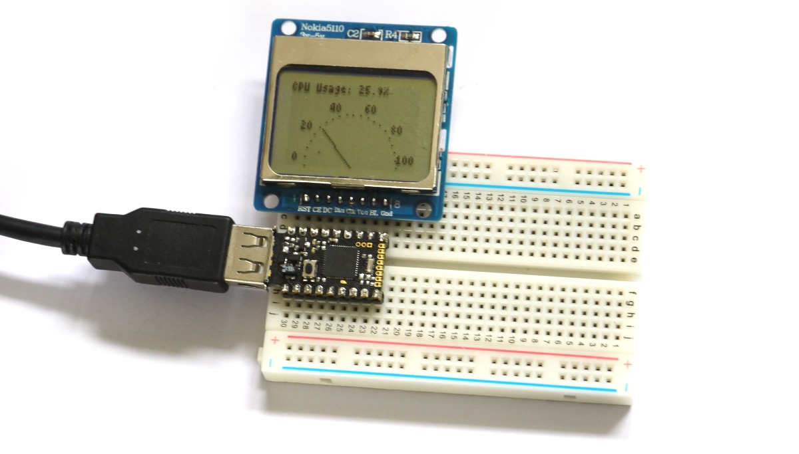

<!--- Copyright (c) 2015 Gordon Williams, Pur3 Ltd. See the file LICENSE for copying permission. -->
Controlling Pico from a Computer
============================

<span style="color:red">:warning: **Please view the correctly rendered version of this page at https://www.espruino.com/Pico+CPU+Monitor. Links, lists, videos, search, and other features will not work correctly when viewed on GitHub** :warning:</span>

* KEYWORDS: Pico,LCD,CPU Usage,Connecting to PC
* USES: Pico,PCD8544,PicoStarterKit,Graphics

Introduction
-----------

In this tutorial you'll use the Pico to display information that came from your computer on the LCD screen.

To send the data we'll use shell scripts that are already part of your computer.

You'll Need
----------



* An Espruino [[Pico]]
* A [Nokia 5110 LCD](/PCD8544)
* [[Breadboard]]

Wiring Up
--------

Wiring this up is really simple, because the LCD draws so little power that we can power it from Espruino's GPIO lines... Simply place the Espruino Pico on the breadboard with the USB connector facing left, and then place the LCD directly above it, aligned to the right (so the pin on the Pico nearest the USB connector should not be connected to anything). See the picture for an example.

Software - Espruino
-----------------

Just copy and paste the following into the right-hand side of the Web IDE, click `Send to Espruino`.

```
A5.write(0); // GND
A7.write(1); // VCC
var initialised = false;
var g;

function onInit() {
  // Setup SPI
  var spi = new SPI();
  spi.setup({ sck:B1, mosi:B10 });
  // Initialise the LCD
  g = require("PCD8544").connect(spi,B13,B14,B15, function() {
    initialised = true;
    draw(10);
  });
}

function draw(usage) {
  if (!initialised || usage===undefined) return;
  usage = parseFloat(usage.toString().replace(",",".")); // deal with numbers in the format `1,234` as opposed to `1.234`
  g.clear();
  g.drawString("CPU Usage: "+usage+"%");
  // draw 'needle'
  var ang = Math.PI*usage/100;
  g.drawLine(42,47,42-28*Math.cos(ang), 47-Math.sin(ang)*28);
  // draw labels
  for (var i=0;i<=100;i+=20) {
    ang = Math.PI*i/100;
    g.drawString(i, 42-36*Math.cos(ang)-(g.stringWidth(i)/2), 40-Math.sin(ang)*30);
  }
  // draw markings
  for (i=0;i<=100;i+=5) {
    ang = Math.PI*i/100;
    g.setPixel(42-30*Math.cos(ang), 47-Math.sin(ang)*30);
  }
  g.flip();
}
```

When it is sent, type `save()` on the right-hand side. This will save the code into Espruino itself so it always gets run when it powers on. You should see a little CPU usage meter!

Now, if you type `draw(20)` (or any number between 0 and 100) you'll see the CPU usage meter change position.

The next step is to get your computer to send the command `draw(...)` every so often to update the CPU usage.

Software - Host Computer
---------------------

Unforunately every Operating system is different - pick yours from below:

### Linux

Open a command prompt and try and run the following:

```
echo -e "draw(\"`ps -A -o pcpu | tail -n+2 | paste -sd+ - | bc`\")\n"
```

This should print something like `draw("13.0338")` - it's looking at the file `/proc/stat` and working out what your current CPU usage is. We're putting the number in a string so that even if your computer's language uses `,` as a decimal point, the Pico will still be able to parse it.

Next step is to 'pipe' the data straight to Espruino:

On Linux:

```
echo -e "draw(\"`ps -A -o pcpu | tail -n+2 | paste -sd+ | bc`\")\n" > /dev/ttyACM0
```

On Mac:

```
echo -e "draw(\"`ps -A -o pcpu | tail -n+2 | paste -sd+ - | bc`\")\n" > /dev/cu.usbmodem*
```

If a different device name was listed when you connected with the Web IDE, you may need to change it (note that on Mac, the device that you echo too should begin with `/dev/cu.`

When you execute that you should see the 'CPU Usage' indicator on the LCD change.

So now you just need to call it repeatedly:

```
;Linux
while :; do echo -e "draw(\"`ps -A -o pcpu | tail -n+2 | paste -sd+ | bc`\")\n" > /dev/ttyACM0; sleep 1; done
;Mac
while :; do echo -e "draw(\"`ps -A -o pcpu | tail -n+2 | paste -sd+ - | bc`\")\n" > /dev/cu.usbmodem*; sleep 1; done
```

And you're done - an external CPU usage meter!

### Windows

Open Notepad, and paste in the following:

```
@echo off
:start
(@for /f "skip=1" %%p in ('wmic cpu get loadpercentage') do (@echo draw^(%%p^) > \\.\COM32))
@timeout 1 > nul
goto start
```

Be sure to change the `COM32` to the number of the COM port you connected to with the Web IDE.

Then, save the file as `cpumon.bat`, disconnect the Web IDE from the board, and click on the batch file to run it.
