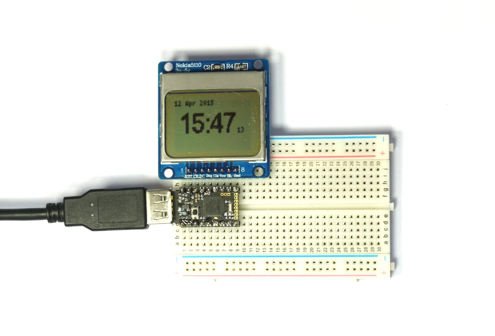

<!--- Copyright (c) 2015 Gordon Williams, Pur3 Ltd. See the file LICENSE for copying permission. -->
Pico Clock
=========

<span style="color:red">:warning: **Please view the correctly rendered version of this page at https://www.espruino.com/Pico+Clock. Links, lists, videos, search, and other features will not work correctly when viewed on GitHub** :warning:</span>

* KEYWORDS: Pico,LCD,Clock,Time
* USES: Pico,PCD8544,PicoStarterKit,Graphics

Introduction
-----------

On most Arduinos, if you want to keep track of time then you have to use an external RTC (Real Time Clock) chip.

Both the [[Pico]] and the original [Espruino Board](/Original) have one built-in though. As an example we'll make a simple clock using the LCD display.

**Note:** While the Pico has an RTC built in, by default it doesn't have an accurate watch crystal and so uses its internal oscillator which isn't that accurate. It won't keep proper time over a month, but in conjunction with some other time source (an internet connection, or [the NPL time signal](http://en.wikipedia.org/wiki/Time_from_NPL)) it'll be just fine.



You'll Need
----------

* An Espruino [[Pico]]
* A [Nokia 5110 LCD](/PCD8544)
* [[Breadboard]]

Wiring Up
--------

Wiring this up is really simple, because the LCD draws so little power that we can power it from Espruino's GPIO lines... Simply place the Espruino Pico on the breadboard with the USB connector facing left, and then place the LCD directly above it, aligned to the right (so the pin on the Pico nearest the USB connector should not be connected to anything). See the picture for an example.

Software
-------

First step is to go into the Web IDE's settings (top right icon), then click `Communications`, then scroll down and make sure that `Set Current Time` is checked. Then the next time you send code to the Espruino board, the Web IDE will automatically set up its RTC.

Next, copy the following into the right-hand side and click 'Send to Espruino':

```
console.log((new Date()).toString());
```

In the left hand side of Espruino, the current time should be displayed (it may not include daylight saving time).

So the next step is to display the time on the LCD. We'll use the same basic code from the [[Pico LCD Hello World]] tutorial, but set to update the LCD just once a second:

```
A5.write(0); // GND
A7.write(1); // VCC

var g;

function draw() {
  g.clear();
  g.drawString((new Date()).toString(),0,0);
  g.flip();
}

function onInit() {
  clearInterval();
  // Setup SPI
  var spi = new SPI();
  spi.setup({ sck:B1, mosi:B10 });
  // Initialise the LCD
  g = require("PCD8544").connect(spi,B13,B14,B15, function() {
    // When it's initialised, set up an animation at 20fps (50ms per frame)
    setInterval(draw, 1000);
  });
}

onInit();
```

While it displays the time, it only just fits on the screen and it's all in the same tiny font.

It'd be a lot better if the time was bigger than everything else. We can do that by getting everything we want to display using the [Date](http://www.espruino.com/Reference#Date) class's functions, and then using the `Graphics.setFontVector` function to use a bigger font for the time. As the width of what is displayed varies depending on the time (`1:11` vs `10:00`) we can use the `Graphics.stringWidth` function to work out how wide the text is in the current font, and to position everything accordingly:

```
A5.write(0); // GND
A7.write(1); // VCC

var g;

var MONTHS = [
  "Jan","Feb","Mar","Apr","May","Jun",
  "Jul","Aug","Sep","Oct","Nov","Dec"
  ];

function draw() {
  g.clear();
  var t = new Date();
  var date = t.getDate()+" "+MONTHS[t.getMonth()]+" "+t.getFullYear();
  var time = t.getHours()+":" +
       ("0"+t.getMinutes()).substr(-2);
  var secs = ("0"+t.getSeconds()).substr(-2);
  // top left date
  g.setFontBitmap();
  g.drawString(date,0,0);
  // middle time
  g.setFontVector(20);
  var timeWidth = g.stringWidth(time);
  g.drawString(time,(g.getWidth()-timeWidth-12)/2,10);
  // seconds over to the right
  g.setFontBitmap();
  g.drawString(secs,(g.getWidth()+timeWidth-8)/2,26);
  // send to LCD
  g.flip();
}

function onInit() {
  clearInterval();
  // Setup SPI
  var spi = new SPI();
  spi.setup({ sck:B1, mosi:B10 });
  // Initialise the LCD
  g = require("PCD8544").connect(spi,B13,B14,B15, function() {
    // When it's initialised, set up an animation at 20fps (50ms per frame)
    setInterval(draw, 1000);
  });
}

onInit();
```

And once that is sent to Espruino you should have a much better time display. You can then just type `save()` to save it to Espruino, and every time Espruino starts up the clock will start as well.

**Note:** if you unplug the power then Espruino will forget the time. However if you keep a battery (of at least 3v) connected between the `GND` and `Bat` pins then even when you plug and unplug Espruino or reset it, it will still remember the correct time.
