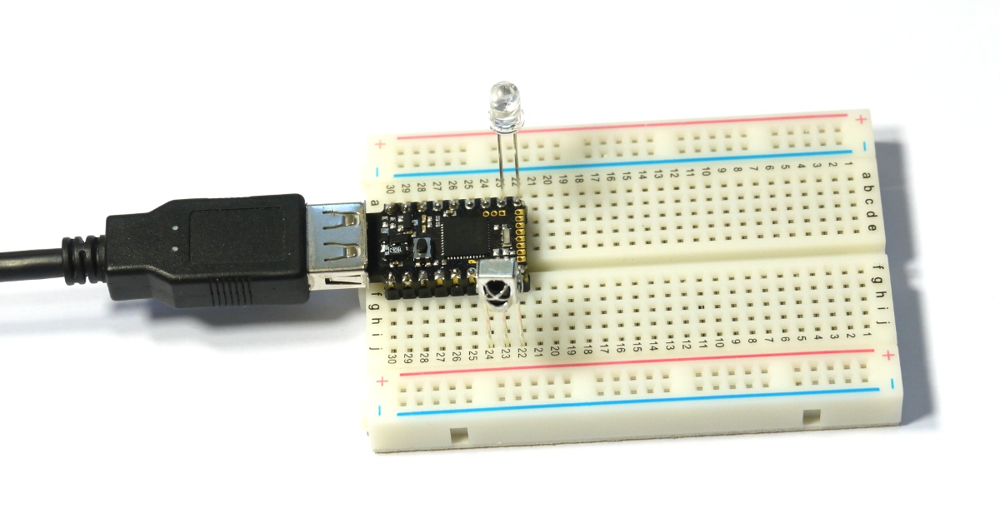

<!--- Copyright (c) 2015 Gordon Williams, Pur3 Ltd. See the file LICENSE for copying permission. -->
Pico Infrared Transmit and Receive
===============

<span style="color:red">:warning: **Please view the correctly rendered version of this page at https://www.espruino.com/Pico+Infrared. Links, lists, videos, search, and other features will not work correctly when viewed on GitHub** :warning:</span>

* KEYWORDS: Pico,Infrared,IR,VS1838B
* USES: Pico,IRReceiver,VS1838B,PicoStarterKit

Introduction
-----------

We'll add an infrared receiver so that we can receive signals from a remote control, and then we'll record and replay those same signals when a button is pressed.

**Note:** If you don't have an IR receiver you may be able to find the
'pronto hex' code for your device online. You can then [decode it with this library](/pronto).

See [howstuffworks](http://electronics.howstuffworks.com/remote-control.htm) for a more complete article on how remote controls themselves work.

You'll Need
----------

* An Espruino [[Pico]]
* A [VS1838B Infrared Receiver](/IRReceiver)
* An Infrared LED
* [[Breadboard]]

Wiring Up
--------



This is pretty simple. The IR receiver needs nothing more than 3.3v and a Pullup resistor (which can be provided from the Espruino). The IR transmitter LED would normally be connected with a resistor to reduce current consumption, but because we'll be pulsing the IR LED at 40kHz, it won't do it much harm not to have it.

* Take the Pico board and place it in the breadboard so that the USB connector sticks out to the left.
* Simply push the VS1838B into the board under the Pico so that the opening is facing down, and the three pins are connected to the rightmost 3 pins on the Pico (`B6`, `B7` and `A8`).
* Push the Infrared LED in above the Pico board, into the rightmost 2 pins (`A6` and `A5`). The shortest pin on the flat side is the Cathode, and should be connected to the rightmost pin.

Software - Receiving
------------------

To get started, let's use the existing [[IRReceiver]] module to try and receive some commands from an existing IR remote control.

Copy and Paste the following code into the right hand side of the Web IDE and click `Send to Espruino`. It has to be the right this time, because we're using a [Module](/Modules) that needs to be automatically downloaded from the net.

```
digitalWrite(B7, 0); // Set B7 to GND
digitalWrite(A8, 1); // Set A8 to 3.3V
// Initialise the IR receiver
require("IRReceiver").connect(B6, function(code) {
  // We got a code!
  console.log(code);
});
```

Now, if you get a remote control, point it at the receiver and press some buttons, some codes should be output in the left-hand side. Each button should have a different code. For instance I get:

```
0100000000000010000011100011000111
1
100000000000010001011100001000111
1
100000000000010000101100010100111
1
1
100000000000010000011100011000111
1
100000000000010000011100011000111
1
100000000000010001011100001000111
1
```

Note that some makes of remote control use a different signal pattern and won't work. If yours doesn't try another remote control.

Press a button and take note of which code went with it, and then do the same with another button. Then copy and paste the two codes into the code below, replacing the ones that I have put in:

```
digitalWrite(B7, 0); // Set B7 to GND
digitalWrite(A8, 1); // Set A8 to 3.3V
// Initialise the IR receiver
require("IRReceiver").connect(B6, function(code) {
  // We got a code!
  if (code == "100000000000010000011100011000111") digitalWrite(LED1,1);
  if (code == "100000000000010001011100001000111") digitalWrite(LED1,0);
  console.log(code);
});
```

If you `Send to Espruino` now, you should be able to turn LED1 on and off using the two buttons on the remote control.

You could add more `if` statements to turn different things on and off. You could change `LED1` to `A8`, connect a [Relay Module](/Relays) to pin `A8`, and then turn anything on and off from your remote control.


Software - Transmitting
--------------------

But what about transmitting? You just need to create small bursts of a 38kHz square wave, around 1ms long (the exact length determines whether a 1 or a 0 is sent). Because the transmitter is a diode, it's easy enough to create a 38kHz square wave on one pin with `analogWrite(A6,0.9,{freq:38000})` and then to create pulses on the other with `digitalPulse(A5,...)`.

However, to know the exact pattern we'd need to know the exact remote control model, and to look up what it should be transmitting.

Instead, it'd be much easier to use out IR receiver to receive a signal, and to then replay it on the output. So that's what we'll do:

```
digitalWrite(B7, 0); // Set B7 to GND
digitalWrite(A8, 1); // Set A8 to 3.3V
// Because we're not using the module, we have to manually pull up the data pin
pinMode(B6,"input_pullup");
// Keep somewhere to put the signal times
var times = [];
// now watch the input
setWatch(function(e) {
  // work out how long the pulse was, in milliseconds
  var pulseLen = 1000 * (e.time - e.lastTime);
  // then save it, if it was less than 1 second
  if (pulseLen < 1000)
    times.push(pulseLen);
  else
    times = [];
}, B6, {repeat:true});
```

This records each pulse length in an array, which we'll be able to look at.

Now, point your remote control at the receiver and press a button. In the left-hand side of the Web IDE, type `times`.

It should display something like this:

```
=[ 8.10241699218, 4.11701202392, 0.45776367187, 0.55694580078, 0.45776367187,  ... 0.45776367187, 44.54231262207, 8.10337066650, 2.07042694091, 0.46062469482 ]
```

This is part of the array of values that was recorded (Espruino only displays some of it so it doesn't fill up your screen). If you do want all of it you can always type `console.log(times)`.

**Note:** This is a good example of how easily you can use up memory on a microcontroller. If you type `process.memory().free` you'll see how many memory blocks Espruino has free. Now press random buttons on the remote control for a few seconds and run `process.memory().free` again - it'll be a lot less. This is because Espruino is storing 64 bit floating point values, as well as an array index for each time, when realistically it only needed to store 8 bits. This is easy to work around (see the [[Performance]] page) but for now we're focussing on getting the job done, rather than doing it efficiently.

So now, playing this back is really easy. You just feed the whole array into digitalPulse. To see what it might look like, try the following in the left-hand side of the IDE:

```
digitalPulse(LED1,1,times);
```

You might even recognise this flashing from the light in your remote control, as some remotes connect the activity light straight to the IR transmitter.

So now, let's try and record and replay a whole sequence of button presses. Use the following code on the right-hand side of the Web IDE:

```
digitalWrite(B7, 0); // Set B7 to GND
digitalWrite(A8, 1); // Set A8 to 3.3V
// Because we're not using the module, we have to manually pull up the data pin
pinMode(B6,"input_pullup");
// Keep somewhere to put the signal times
var times = [];
/* The ID of the watch we're using to record IR. We want to
turn it off while we transmit in case we record outselves! */
var currentWatch;

function startWatching() {
  currentWatch = setWatch(function(e) {
    // work out how long the pulse was, in milliseconds
    var pulseLen = 1000 * (e.time - e.lastTime);
    // then save it, if it was less than 1 second
    if (pulseLen < 1000)
      times.push(pulseLen);
    else
      times = [];
  }, B6, {repeat:true});
}
startWatching();

function stopWatching() {
  clearWatch(currentWatch);
}

setWatch(function(e) {
  // stop recording
  stopWatching();
  // Light up LED1
  digitalWrite(LED1,1);
  // Start the 38kHz square wave
  analogWrite(A5,0.9,{freq:38000});
  // Send the pulses
  digitalPulse(A6, 1, times);
  // Wait until pulsing is finished
  digitalPulse(A6, 1, 0);
  // Turn LED1 off
  digitalWrite(LED1,0);
  // start recording again
  startWatching();
}, BTN, {repeat:true, edge:"rising", debounce:50});
```

Send it to Espruino, then press some buttons on the remote control. You can then press the button on Espruino itself, and those same commands should be replayed from the IR transmitter!
