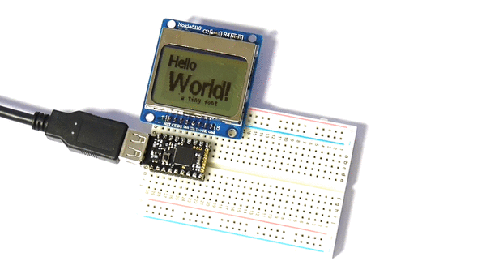

<!--- Copyright (c) 2015 Gordon Williams, Pur3 Ltd. See the file LICENSE for copying permission. -->
Pico LCD Display Hello World
=========================

<span style="color:red">:warning: **Please view the correctly rendered version of this page at https://www.espruino.com/Pico+LCD+Hello+World. Links, lists, videos, search, and other features will not work correctly when viewed on GitHub** :warning:</span>

* KEYWORDS: Pico,LCD,Hello World
* USES: Pico,PCD8544,PicoStarterKit,Graphics

Introduction
-----------

When writing code, most people test a piece of software by making it print `Hello World!`.

In Espruino, this is easy - you can connect with the Web IDE and type `print("Hello World!")`, however what if you want to display it without a computer connected.

Here, we'll wire up an LCD and will display `Hello World` on that.

You'll Need
----------

* An Espruino [[Pico]]
* A [Nokia 5110 LCD](/PCD8544)
* [[Breadboard]]

Wiring Up
--------



Wiring this up is really simple, because the LCD draws so little power that we can power it from Espruino's GPIO lines...

* Put the Espruino Pico on the breadboard with the USB connector facing left
* Put the LCD directly above it, **aligned to the right** (so the pin on the Pico nearest the USB connector should not be connected to anything)

See the picture above for an example.

Software
-------

We're going to start off using the code from the [Nokia 5110 LCD](/PCD8544) page, but with a few small tweaks:

* We're going to manually set up the pins for the LCD's power
* As the Pico's hardware [[SPI]] pins don't align with the LCD, we'll just use Software SPI instead (which will work on any pins).

```
A5.write(0); // GND
A7.write(1); // VCC

// Setup SPI
var spi = new SPI();
spi.setup({ sck:B1, mosi:B10 });
// Initialise the LCD
var g = require("PCD8544").connect(spi,B13,B14,B15, function() {
  // When it's initialised, clear it and write some text
  g.clear();
  g.drawString("Hello World!",0,0);
  // send the graphics to the display
  g.flip();
});
```

Copy and paste this code into the right-hand side of the Web IDE and click the `Send to Espruino` button. The display should now show `Hello World!`.

But we're not quite done. What if we wanted it to work without a computer? The LCD itself needs initialising each time the power turns on.

We'd have to write our code in the special `onInit` function that is called when Espruino starts up:

```
A5.write(0); // GND
A7.write(1); // VCC
A6.write(1); // Turn on the backlight

var g; // Define g globally, so that it can be used by other functions

function onInit() {
  // Setup SPI
  var spi = new SPI();
  spi.setup({ sck:B1, mosi:B10 });
  // Initialise the LCD
  g = require("PCD8544").connect(spi,B13,B14,B15, function() {
    // When it's initialised, clear it and write some text
    g.clear();
    g.drawString("Hello World!",0,0);
    // send the graphics to the display
    g.flip();
  });
}
```

**Note:** If you send this over in the same way as the last code, nothing will happen - because `onInit()` hasn't been run.

You can run `onInit()` manually by typing `onInit()` on the left hand side or adding it to the end of the right hand side before sending code over. However this time, just type `save()`. Your code will be saved to flash, reloaded, and the LCD will display `Hello World!` again.

Try unplugging the board from USB and re-plugging it - it'll still display `Hello World!`.


Improving it...
--------------

What we've displayed is a bit boring though - what if you wanted to display the text at slightly different sizes?

Espruino has a [Vector font](/Fonts) built in, which can be accessed using `g.setFontVector(size)`. You can switch back to the original (small) font with `g.setFontBitmap()` too.

```
A5.write(0); // GND
A7.write(1); // VCC

var g;

function onInit() {
  // Setup SPI
  var spi = new SPI();
  spi.setup({ sck:B1, mosi:B10 });
  // Initialise the LCD
  g = require("PCD8544").connect(spi,B13,B14,B15, function() {
    // When it's initialised, clear it and write some text
    g.clear();
    // draw in a vector font at location x:0, y:0
    g.setFontVector(12);
    g.drawString("Hello",0,0);
    // draw in a slightly bigger vector font at location x:10, y:16
    g.setFontVector(20);
    g.drawString("World!",10,16);
    // switch back to the small font again
    g.setFontBitmap();
    g.drawString("a tiny font",25,40);
    // send the graphics to the display
    g.flip();
  });
}
```

Finally, we might want to animate the text. We can do this using `setInterval` to repeatedly call the code that updates the screen:

```
A5.write(0); // GND
A7.write(1); // VCC

var g;
var pos = 0;

function draw() {
  g.clear();
  // draw in a vector font
  g.setFontVector(12);
  g.drawString("Hello",0,0);
  // draw in a font that changes size over time
  pos += 0.5;
  g.setFontVector(18 + Math.sin(pos)*4);
  // here we centre the text by finding out how long
  // it is with g.stringWidth first
  g.drawString("World!",42-g.stringWidth("World!")/2,16);
  // switch back to the small font again
  g.setFontBitmap();
  g.drawString("a tiny font",25,40);
  // send the graphics to the display
  g.flip();
}

function onInit() {
  // Setup SPI
  var spi = new SPI();
  spi.setup({ sck:B1, mosi:B10 });
  // Initialise the LCD
  g = require("PCD8544").connect(spi,B13,B14,B15, function() {
    // When it's initialised, set up an animation at 20fps (50ms per frame)
    setInterval(draw, 50);
  });
}
```
