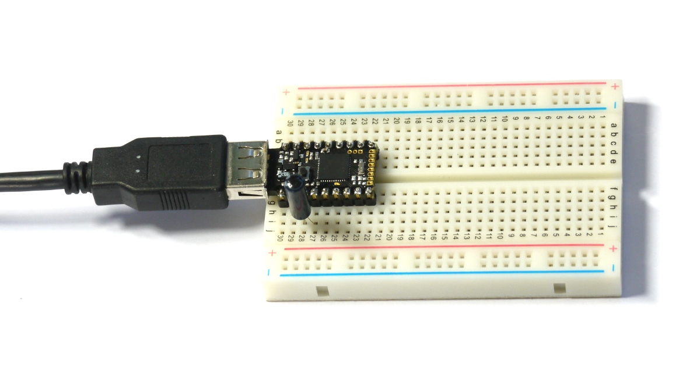

<!--- Copyright (c) 2015 Gordon Williams, Pur3 Ltd. See the file LICENSE for copying permission. -->
Pico Vibration
===============

<span style="color:red">:warning: **Please view the correctly rendered version of this page at https://www.espruino.com/Pico+Vibration. Links, lists, videos, search, and other features will not work correctly when viewed on GitHub** :warning:</span>

* KEYWORDS: Pico,Vibration,SW18010P,Shake
* USES: Pico,Vibration,SW18010P,PicoStarterKit

Introduction
-----------

We'll add a vibration detector so we can detect movements, and then find out how to deal with the 'noisy' data from it.

You'll Need
----------

* An Espruino [[Pico]]
* An [SW18010P Vibration Sensor](/Vibration)
* [[Breadboard]]

Wiring Up
--------



The vibration sensor is a simple switch. We want to connect one side to 3.3V, and the other side to an input pin (in this case we'll use B3). While usually you'd want a resistor to pull B3 down to 0v when it is in its 'open' state, the Espruino board has resistors built in that can be enabled with software.

* Take the Pico board and place it in the breadboard so that the USB connector sticks out to the left.
* Simply push the vibration sensor into the 3rd and 4th holes from the left, on the bottom edge of the Pico board, it can be any way around. Be careful as one of the wires is very delicate and bends easily.

Software
-------

Now, we just need to set up the 'pull-down' resistor, and to respond when an input is detected (we'll toggle the state of the Red LED). Type the following in the **right-hand side** of the Web IDE, and click 'send to Espruino':

```
pinMode(B3,"input_pulldown"); // enable the pull-down resistor

var on = false;
function shaken() {
  on = !on; // toggle between on and off
  digitalWrite(LED1, on);
}

// Now 'watch' B3 for shakes
setWatch(shaken, B3, {repeat:true, edge:"rising"});
```

Now, gently lift the breadboard and tap it on the desk. You should see the LED flicker.

So why does the LED not just change state once? Well, the Vibration sensor is basically just a spring that touches a contact when shaken - but it doesn't just touch once, it wobbles around and touches several times.

So how can we fix this? On a button we'd use the 'debounce' option in `setWatch` function, but unlike the button, the vibration sensor spends most of it's time in the 'open' state, and only shorts out momentarily. Instead, we need to add a timeout:

```
pinMode(B3,"input_pulldown"); // enable the pull-down resistor

var on = false;
function shaken() {
  if (on) return; // if we haven't timed out, ignore this
  // otherwise, turn the light on
  on = true;
  digitalWrite(LED1, on);
  // now set a timeout to turn it off after 200ms = 1/5 second
  setTimeout(function() {
    on = false;
    digitalWrite(LED1, on);
  }, 200);
}

// Now 'watch' B3 for shakes
setWatch(shaken, B3, {repeat:true, edge:"rising"});
```

If you shake now, the LED will light for 1/2 a second, in a much more controlled way. In fact you could even use this to count the shakes:

```
pinMode(B3,"input_pulldown"); // enable the pull-down resistor

var on = false;
var shakes = 0;
function shaken() {
  if (on) return; // if we haven't timed out, ignore this
  // otherwise, turn the light on
  on = true;
  digitalWrite(LED1, on);
  // count shakes
  shakes++;
  console.log("Shaken "+shakes+" times");
  // now set a timeout to turn it off after 200ms = 1/5 second
  setTimeout(function() {
    on = false;
    digitalWrite(LED1, on);
  }, 200);
}

// Now 'watch' B3 for shakes
setWatch(shaken, B3, {repeat:true, edge:"rising"});
```
