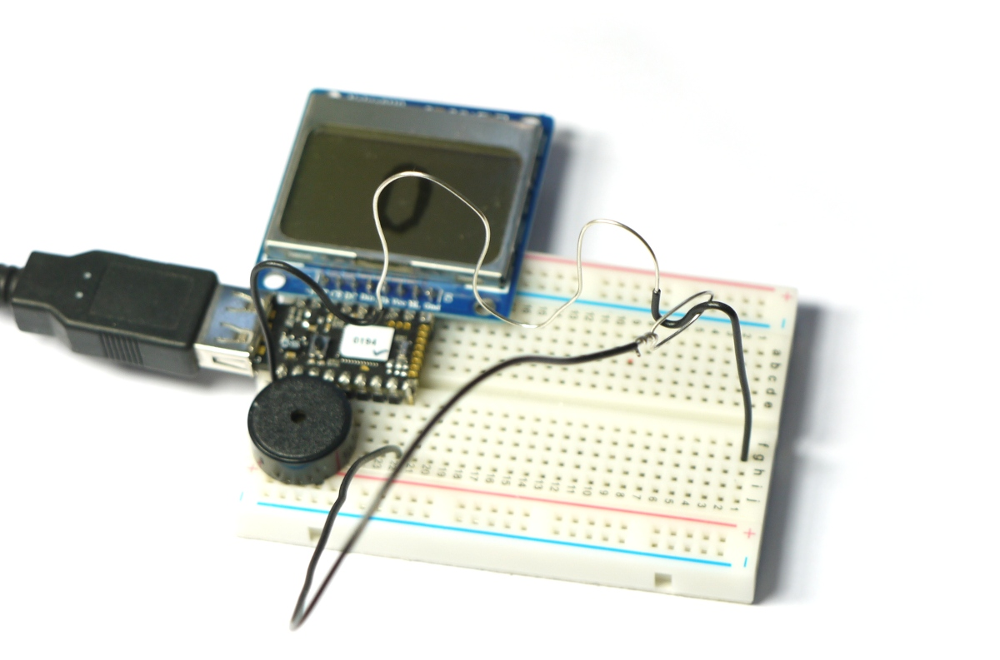

<!--- Copyright (c) 2015 Gordon Williams, Pur3 Ltd. See the file LICENSE for copying permission. -->
5 Minute Wire Loop Game
=====================

<span style="color:red">:warning: **Please view the correctly rendered version of this page at https://www.espruino.com/Pico+Wire+Loop+Game. Links, lists, videos, search, and other features will not work correctly when viewed on GitHub** :warning:</span>

* KEYWORDS: Pico,LCD,Game,Wire Loop
* USES: Pico,PCD8544,PicoStarterKit,Speaker,Graphics

[[http://youtu.be/uyOHnJVVBiI]]

Introduction
-----------

This is a really quick version of the [Wire Loop Game](http://en.wikipedia.org/wiki/Wire_loop_game). Try and move the loop along the wire without touching it - otherwise an alarm goes off!

Because we're using the [[Pico]] it's easy to create a noise, flash lights, and to keep track of how many times the wire has been hit.

You'll Need
----------

* An Espruino [[Pico]]
* A [Nokia 5110 LCD](/PCD8544)
* A [[Speaker]]
* [[Breadboard]]
* Solid core wire (around 0.6mm/22 AWG)

Wiring Up
--------



Wiring up is pretty simple - see the picture above:

* Place the Espruino Pico on the breadboard with the USB connector facing left, and as near the top as possible
* Put the LCD directly above it, aligned to the right (so the pin on the Pico nearest the USB connector should not be connected to anything)
* Put the Piezo [[Speaker]] below the Pico, with one pin as far left as possible (so the other pin is on pin B4)
* Take a 20cm long piece of solid code wire and strip the final 5cm off one end, and 0.5cm off the other. Fold the long end around into a loop and twist it closed, and then plug the other end into the breadboard at the bottom right of the Espruino Pico (pin A8).
* Take a 30cm piece of solid core wire and strip the middle 20cm (you can do this carefully with a knife, or can pull all of the insulation off and then push some back on the end.
* Strip 0.5cm off each end, and bend the wire into whatever pattern you want (leaving some insulation at each end for the loop to rest on at the beginning and end of the game).
* Thread the loop onto the bent wire, then push it into the pin at the very bottom left of the Pico (GND), and into the right-hand side of the breadboard where it won't be connected to anything else.

And that's it!


Software
-------

Now just copy and paste the following code into the right-hand side of the Web IDE and click `Send to Espruino`. Some comments are in the code to explain how it works:

```
A5.write(0); // LCD GND
A7.write(1); // LCD VCC
var LOOP = A8; // the pin we've got our loop attached to
var SPEAKER = B4; // where the speaker is attached

var g;         // the LCD's graphics
var score = 0; // current score

function drawScore() {
  g.clear();
  // draw the score
  g.setFontVector(40);
  g.drawString(score,(g.getWidth()-g.stringWidth(score))/2,0);
  // send the graphics to the display
  g.flip();
}


// flash and make a sound, and call the callback when done
function hasHit(callback) {
  // increment the score...
  score++;

  var i = 1;

  // This will make the beeping and flashing
  function siren() {
    if (i>7) {
      clearInterval(interval);
      digitalWrite(LED1, 0); // turn the LED off
      // set normal colours on LCD
      g.setColor(1);
      g.setBgColor(0);
      // turn the sound off
      digitalRead(SPEAKER);
      callback();
      return;
    }

    // every other time around the loop:
    if (i&1) {
      digitalWrite(LED1, 1); // turn red LED on
      // set inverted colours on LCD
      g.setColor(0);
      g.setBgColor(1);
      // beep high frequency
      analogWrite(SPEAKER, 0.5, {freq:1000});
    } else {
      digitalWrite(LED1, 0); // turn the LED off
      // set normal colours on LCD
      g.setColor(1);
      g.setBgColor(0);
      // beep low frequency
      analogWrite(SPEAKER, 0.5, {freq:700});
    }

    // draw the text 'hit' on the LCD
    g.clear();
    g.setFontVector(40);
    g.drawString("Hit!",(g.getWidth()-g.stringWidth("Hit!"))/2,0);
    g.flip();

    i++;
  }
  // call the siren function every so often (and call it once immediately)
  var interval = setInterval(siren, 300);
  siren();
}


function onInit() {
  // Setup SPI for LCD
  var spi = new SPI();
  spi.setup({ sck:B1, mosi:B10 });
  // Initialise the LCD
  g = require("PCD8544").connect(spi,B13,B14,B15, function() {
    // When it's initialised, draw the score and start
    drawScore();
    startWatchingLoop();
  });
}


// Add the internal pull-up resistor to the loop, so when it touches the wire (which is GND) it'll get pulled down
pinMode(LOOP, "input_pullup");
// This code watches the 'loop' to see if it has touched the wire
var loopWatch;
function startWatchingLoop() {
  // first, ensure we don't start watching the wire loop twice
  if (loopWatch) clearWatch(loopWatch);
  loopWatch = setWatch(function() {
    loopWatch = undefined;
    // now if we've touched, flash everything and make noises
    hasHit(function() {
      // When that's done, draw the score and start watching the loop again
      drawScore();
      startWatchingLoop();
    });
  }, LOOP, { repeat: false, edge: "falling" });
}

// When button is pressed, reset the game:
setWatch(function() {
  clearInterval();
  digitalRead(SPEAKER); // make sure speaker is off
  score = 0;
  drawScore();
  startWatchingLoop();
}, BTN, { repeat: true, edge: "rising", debounce: 50 });


// Finally, start everything going
onInit();
```

If you touch the wire as you move the loop across, the siren will sound and the score will increment. To reset everything, just touch the button and the score will be reset to 0.
