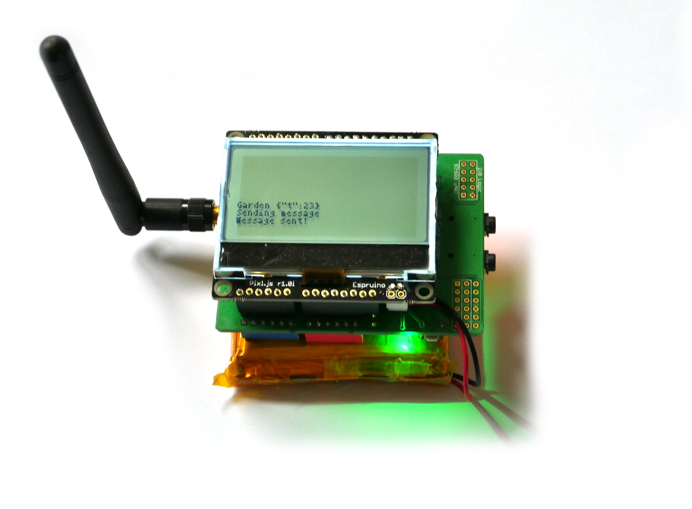

<!--- Copyright (c) 2018 Gordon Williams, Pur3 Ltd. See the file LICENSE for copying permission. -->
Pixl.js SMS Remote Monitoring
=============================

<span style="color:red">:warning: **Please view the correctly rendered version of this page at https://www.espruino.com/Pixl.js+SMS+Remote+Monitoring. Links, lists, videos, search, and other features will not work correctly when viewed on GitHub** :warning:</span>

* KEYWORDS: Remote Monitoring,GSM,SMS,Text message
* USES: Pixl.js,BLE,Only BLE,SIM900,arduino-sim900,ATSMS



If you have something that you want to monitor where there's no internet
connection - an allotment or shed for example - you may want to use the
mobile network to send data. The obvious solution is to use internet
connectivity (which you can do using the hardware in this tutorial), but
you can also just use SMS text messages. Pre-pay SIM cards with just voice
and text messages tend to be extremely cheap, often with no monthly fee.

In addition to this, you might have remote sensors that you don't want to
connect to the main mobile phone connection. That's what we'll do here -
using [Pixl.js](/Pixl.js) as a hub for remote devices.

This is similar to the [Puck.js with SMS control](/Puck.js+SMS) except there's
less wiring and we can also display the status on the Pixl's screen.

You'll Need
----------

* An Espruino [Pixl.js](/Pixl.js)
* A [SIM900 Arduino shield](/arduino-sim900) (or you can wire up a GSM/LTE module manually)
* A [LiPo battery](/Battery)
* Other Bluetooth LE devices (like [Puck.js](/Puck.js)) to act as sensors

Wiring Up
--------

The wiring is very simple - just plug the [SIM900 Arduino shield](/arduino-sim900)
into the back of the Pixl.js. The only thing you have to worry about is power - the
SIM900 needs to draw a lot of power, and it's unlikely that the USB connector on
Pixl.js will provide enough.

You can:

* Use the external power connector on the SIM900 shield - there's a switch next
to it to select the power source.
* [Solder a JST battery connector to Pixl.js](/Pixl.js#powering) and short the
 Pixl.js solder jumper from `Vin` to `5V` to provide power for the SIM900.

After this, ensure the jumpers on the SIM900 board are set to `Xduino`, add
the battery, long-press the power button on the SIM900 to turn it on and
you're ready to go! (this module )

**Note:** The SIM900 module used here is only connected to pins `D0` and `D1`.
All the other inputs and outputs are available if you need to measure or
control something directly from the Pixl.


Software
--------

On your remote Espruino devices, upload the following:

```
function updateAdvertising() {
  /* we could advertise binary data here, but let's just use JSON as
  it won't be more than a few characters */
  var data = JSON.stringify({
    t:Math.round(E.getTemperature()),
    l:Mathg});
  NRF.setAdvertising({},{
    manufacturer:0x590, // Espruino's Manufacturer ID
    manufacturerData:data,
    showName: false, // don't show a name
    connectable: false, // don't allow anyone to connect
    interval:1000 // save power by advertising less often
  });
}


setInterval(updateAdvertising, 30000);

function onInit() {
  // Output with as much power as we can
  NRF.setTxPower(4);
}
```

You may want to change the code to report different data back. You can't send
many characters of advertising data, so you might want to consider encoding
the data as binary.

Next, copy & paste the following code into the right-hand side of the IDE:

```
/* List of known device IDs and what they are.
We can get this by typing NRF.findDevices(print,10000) */
var devices = {
  "c7:59:51:ec:90:54 random" : "Garden",
  "da:34:7c:4c:5a:47 random" : "Shed",
};

var sms;

function onInit() {
  Terminal.setConsole();
  g.clear();
  Terminal.println("Initialising...");
  // Connect to serial device  
  Serial1.setup(115200, { rx: D0, tx : D1 });
  Serial1.removeAllListeners(); // in case we'd been running before
  var ATSMS = require("ATSMS");
  sms = new ATSMS(Serial1);
  //Use sms.at.debug(); here if you want debug messages

  sms.init(function(err) {
    if (err) throw err;
    Terminal.println("Initialised!");

    sms.list("ALL", function(err,list) {
      if (err) throw err;
      if (list.length) {
        Terminal.println(list.length+" Messages");
      } else
        Terminal.println("No Messages");
    });
  });
}

// Handle any messages coming in
sms.on('message', function(msgIndex) {
  Terminal.println("New message #"+msgIndex);
  sms.get(msg, function(err, msg) {
    if (err) throw err;
    // delete all messages to stop us overflowing
    sms.delete("ALL");
    // if (msg.oaddr!="+441234567890") throw "Unknown number!";
    var txt = msg.text.trim().toLowerCase();
    Terminal.println("<< ", txt);
    // do a scan and return the result
    if (txt=="scan") doScan(msg.oaddr);
    // Change output D3 on the Pixl
    if (txt=="on") D3.set();
    if (txt=="off") D3.reset();
  });
});

// Actually scan for advertisements
function doScan(sendMessageToNumber) {
  Terminal.print("Scanning...");
  NRF.findDevices(function(devs) {
    // keep only devices that match our manufacturer ID
    devs = devs.filter(x => x.manufacturer==0x590);
    // Scroll everything we had off the screen
    Terminal.print("\n\n\n\n\n\n\n\n\n");
    // What are we going to send?
    var textMessage = "";
    // Now iterate over them and display on the screen    
    devs.forEach(function(dev, idx) {
      var name = devices[dev.id];
      if (!name) {
        // ignore any devices that aren't in our list
        Terminal.println("Unknown "+dev.id);
        return;
      }
      try {        
        var j = JSON.parse(E.toString(dev.manufacturerData));
        Terminal.println(name+" "+JSON.stringify(j));
        textMessage += name+" "+JSON.stringify(j)+", ";
      } catch (e) {
        Terminal.println(name+": bad data");
      }
    });
    if (!devs.length) {
      textMessage = "No devices found!";
      Terminal.println("No devices found!");
    }
    if (sendMessageToNumber) {
      Terminal.println("Sending message");
      sms.send(sendMessageToNumber, textMessage, function() {
        Terminal.println("Message sent!");
      });
    }
  }, 10000 /* scan for 10 seconds */);
}

onInit();
```

You'll want to change the list of known devices up the top to match
your devices. Then upload!

Using
-----

Once powered on, you can text your Pixl.js with the following commands:

* `scan` - scan for devices in the area and the send a text back with all
the information received.
* `on`/`off`- Turn pin D3 on or off.

What Next?
----------

You can implement many more commands - for instance you could use the [BLE UART](/Puck.js+BLE+UART)
library to send command directly to other Pucks (however if so, you need to remove
`connectable:false` and increase the advertising interval on any connected devices).

You could also make Pixl.js send a text message automatically - once a day,
or when some event occurs (like movement is detected by a sensor).

You might also want to make Pixl.js use the power switch pin to automatically
power the SIM900 on at boot, so if there was a power failure your Pixl.js
would be able to communicate using GSM. By doing this you could also leave
the SIM900 powered off for the majority of the time so that you can save
power.
