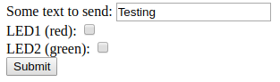

<!--- Copyright (c) 2018 Gordon Williams, Pur3 Ltd. See the file LICENSE for copying permission. -->
Handling POSTed data from Forms
===============================

<span style="color:red">:warning: **Please view the correctly rendered version of this page at https://www.espruino.com/Posting+Forms. Links, lists, videos, search, and other features will not work correctly when viewed on GitHub** :warning:</span>

* KEYWORDS: Internet,Form,Forms,HTTP,Server,HTTP Server,POST,GET,HTTP Request
* USES: Internet,EspruinoWiFi,Pico,ESP8266

On the [[Internet]] page there is a simple example of sending data in the
URL from a webpage, but it can be unreliable if anywhere between
your browser and the Espruino decides to cache the received data.

To work around this, HTTP provides `POST` requests, that differ from the normal
`GET` requests in that they signal that data needs to always be sent back
to the server. This is an example of using that style of request to turn two
LEDs on and off via a form.

The code below is broken into 5 main parts:

* `onInit` - is run at startup and initialises the WiFi
* `onConnected` - is called when there is a WiFi connection, it prints the IP address and starts the Web Server.
* `onPageRequest` - handles the webpage request or sends a `404 Page Not Found` for unknown URLs
* `handlePOST` - is called when data is `POST`ed to Espruino. It receives all the data, splits it up and decodes it, and turns on LEDs based on the data that was received, and then calls the callback function.
* `sendPage` - serves up the actual HTML for the form

Normally in `handlePOST` you could receive all the `POST`ed data and then handle
it when the connection is closed. However, we want to send back a webpage as
a response which shows the current state of the two LEDs. This
means that when there is a `POST`, we must delay sending the webpage with
`sendPage` until `handlePOST` has received and processed all the data from the
form (which happens on the `end` event of the HTTP request).

You'll Need
----------

A device that'll connect to the [[Internet]], like an [Espruino WiFi](/WiFi)
or a [[Pico]] with an ESP8266 attached.


Software
--------

Simply copy & paste the code below into the Web IDE, then update the `WIFI_NAME`
and `WIFI_KEY` variables and delete the `onInit` function that *isn't* for
your platform (if you're using [Espruino WiFi](/WiFi) or a [[Pico]] with ESP8266).

For other hardware you'll have to consult the documentation and create your
own `onInit` function.

Finally click the `Send to Espruino` button in the IDE.

```
var WIFI_NAME = "";
var WIFI_KEY = "";
var wifi;
// The last data that was POSTed to us
var postData = {};

// This serves up the webpage itself
function sendPage(res) {
  // We're using ES6 Template Literals here to make the HTML easy to read.
  var d = `
<html>
 <body>
  <form action="#" method="post">
    <label for="mytext">Some text to send:</label>
    <input type="text" id="mytext" name="mytext" value="Testing"/><br/>
    <label for="led1">LED1 (red):</label>
    <input type="checkbox" id="led1" name="led1" value="1" ${postData.led1?"checked":""}><br/>
    <label for="led2">LED2 (green):</label>
    <input type="checkbox" id="led2" name="led2" value="1" ${postData.led2?"checked":""}><br/>
    <button>Submit</button>
  </form>
 </body>
</html>`;
  res.writeHead(200, {'Content-Type': 'text/html', 'Content-Length':d.length});
  res.end(d);
}  

// This handles the HTTP request itself and serves up the webpage or a
// 404 not found page
function onPageRequest(req, res) {
  var a = url.parse(req.url, true);
  if (a.pathname=="/") {
    // handle the '/' (root) page...
    // If we had a POST, handle the data we're being given
    if (req.method=="POST" &&
        req.headers["Content-Type"]=="applicatio­n/x-www-form-urlencoded")
      handlePOST(req, function() { sendPage(res); });
    else
      sendPage(res);
  } else {
    // Page not found - return 404
    res.writeHead(404, {'Content-Type': 'text/plain'});
    res.end("404: Page "+a.pathname+" not found");
  }
}

// This handles any received data from the POST request
function handlePOST(req, callback) {
  var data = "";
  req.on('data', function(d) { data += d; });
  req.on('end', function() {
    // All data received from the client, so handle the url encoded data we got
    // If we used 'close' then the HTTP request would have been closed and we
    // would be unable to send the result page.
    postData = {};
    data.split("&").forEach(function(el) {
      var els = el.split("=");
      postData[els[0]] = decodeURIComponent(els[1]);
    });
    // finally our data is in postData
    console.log(postData);
    // do stuff with it!
    console.log("We got sent the text ", postData.mytext);
    digitalWrite(LED1, postData.led1);
    digitalWrite(LED2, postData.led2);
    // call our callback (to send the HTML result)
    callback();
  });
}


// This is called when we have an internet connection
function onConnected() {
  console.log("Connected!");
  wifi.getIP(function(err, ip) {
    console.log("Connect to http://"+ip.ip);
    require("http").createServer(onPageRequest).listen(80);
  });
}

// Initialisation for Espruino WiFi ONLY
function onInit() {
  wifi = require("EspruinoWiFi");
  wifi.connect(WIFI_NAME, { password : WIFI_KEY }, function(err) {
    if (err) {
      console.log("Connection error: "+err);
      return;
    }
    onConnected();
  });
}

// Initialisation for Espruino Pico + ESP8266 ONLY
function onInit() {
  Serial1.setup(115200, { tx: B6, rx : B7 });
  wifi = require("ESP8266WiFi_0v25").connect(Serial1, function(err) {
    if (err) throw err;
    console.log("Connecting to WiFi");
    wifi.connect(WIFI_NAME, WIFI_KEY, function(err) {
      if (err) {
        console.log("Connection error: "+err);
        return;
      }
      onConnected();
    });
  });
}

// Comment this line out if you're planning on saving your code
onInit();
```

A few seconds after the upload you should see a line like: `Connect to http://192.168.1.85`

If you click on the URL, or copy/paste it into your browser, you should see
something like this:



You can then choose some options and click `Submit`, and the relevant
LEDs will light.

Information about the code itself is in the comments, but for more information
on forms check out [the great MDN Article](https://developer.mozilla.org/en-US/docs/Learn/HTML/Forms)
