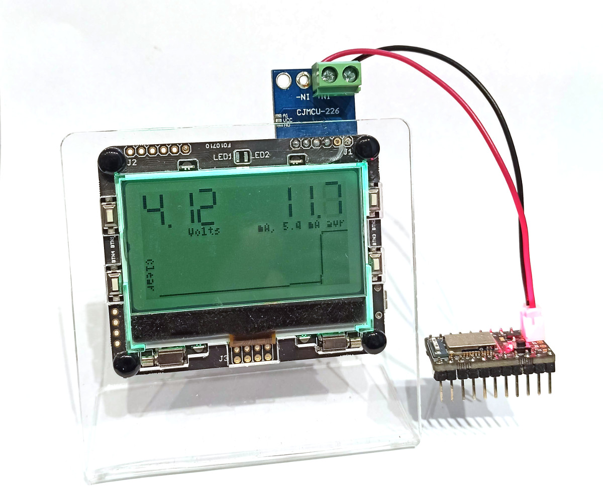

<!--- Copyright (c) 2020 Gordon Williams, Pur3 Ltd. See the file LICENSE for copying permission. -->
Power Meter
============

<span style="color:red">:warning: **Please view the correctly rendered version of this page at https://www.espruino.com/Power+Meter. Links, lists, videos, search, and other features will not work correctly when viewed on GitHub** :warning:</span>

* KEYWORDS: Tutorials,Pixl.js,Power,Current,Voltage,Amps,Power Usage
* USES: Pixl.js,Pixl.js Multicolour



Sometimes (especially when developing battery-powered devices) it's really handy
to have a way to see how much power they're using - both in the instant, and
over a period of time.

You can sometimes just use a multimeter, or something more single purpose
like [Nordic's PPK](https://www.nordicsemi.com/Software-and-tools/Development-Tools/Power-Profiler-Kit),
but it's also good to have a device that 'just works' (some multimeters can
give unreliable results).

Here we'll make one using a [Pixl.js](/Pixl.js). As built it's accurate to
around 10uA, which is great for debugging other Espruino devices!

You'll need
-----------

* A [Pixl.js](/Pixl.js) or [Pixl.js Multicolour](/Pixl.js+Multicolour)
* A [INA226 Current/Voltage Measurement IC](/INA226)
* A large capacitor (220uF or above)

In the picture I'm using a [Pixl.js Multicolour](/Pixl.js+Multicolour) -
since it has a LiPo battery and charger built in it makes for a simple
'Plug and Play' device.

Wiring
------

Connect the [INA226](/INA226) as follows:

| INA226 | |
|--------|---|
| VCC | Pixl.js 3.3v |
| GND | Pixl.js GND |
| SDA | Pixl.js A0 (but can be any GPIO) |
| SCL | Pixl.js A1 (but can be any GPIO) |
| ALE | Pixl.js A2 (but can be any GPIO) |
| VBS | Connect to IN- |
| IN- | Connect to voltage source (see below) |
| IN+ | Not connected |

You can then connect the device you intend to power to the big `GND`/`IN+`
terminals at the top of the INA226. I used a terminal block and a JST connetor
wire to make it easy to connect.

I'd also recommend you attach a large capacitor (220uF or above) between `GND` and `IN+`.
This will even out any power spikes that your device might be drawing, allowing you
to get an more accurate reading.

Now, `IN-` should be connected to the voltage you intend to power the target device
from.

* If you're planning on using this with something like [Puck.js](/Puck.js) I'd
recommend `3.3v`
* Otherwise devices with a voltage regulator on board could use Pixl.js's `Vin`
which is 5v, or the power from a Lithium Ion battery (built into [Pixl.js Multicolour](/Pixl.js+Multicolour)).

Personally, I have added a two-way switch to allow selection between either 3.3v
or LiPo Power (around 4v). In this case you need to be careful to only switch
with the device off, since switching from LiPo to 3.3v would then cause the capacitor
on `IN+` to discharge into the 3.3v rail.

Ranges
------

Most [INA226 modules](/INA226) come with a shunt of 0.1 Ohms.

While suitable for a lot of uses, this means the module is less good at
measuring very low amounts of current. I have unsoldered the resistor
and replaced it with a 1 Ohm resistor (providing support for less maximum
current, but better accuracy at lower currents).

If you don't want to unsolder the resistor, just change the `shunt:1` line
to `shunt:0.1`.

Software
--------

```
// For Pixl.js Multicolour only - setup backlight
var NC = require("nodeconfeu2018");
function bl(R,G,B) {
  NC.backlight([B,G,R,B,G,R,B,G,R,B,G,R]);
}
bl(10,20,0);

// For all devices
// Show loading message
E.showMessage("Loading...");
require("Font7x11Numeric7Seg").add(Graphics);

// Setup I2C
var i2c = new I2C();
i2c.setup({sda:A0, scl:A1});
var IRQ = A2;
// initialise INA226
var INA226 = require("INA226");
var ina = new INA226(i2c, {
  average:512, // how many samples to take and average (1024 = about 1 readings a second
  shunt:1, // the shunt resistor's value
  maxCurrent: 0.1  // max current we expect to measure (the lower this is the more accurate measurements are)
});
// You can now simply read the data
var lastData = ina.read();
// we're looking at current output
setWatch(function(e) {
  lastData = ina.read();
  plotData(lastData);
}, IRQ, {repeat:true,edge:"falling"});

var history = new Float32Array(128);
var historyLen = 0;

function scaleCurrent(v) {
  if (Math.abs(v)>0.2) return {v:v.toFixed(2),s:"A"};
  if (Math.abs(v)>0.002) return {v:(v*1000).toFixed(1),s:"mA"};
  if (Math.abs(v)>0.0002) return {v:(v*1000).toFixed(2),s:"mA"};
  if (Math.abs(v)>0.00009) return {v:(v*1000000).toFixed(1),s:"uA"};
  return {v:(v*1000000).toFixed(2),s:"uA"};
}

function plotData(d) {
  // d.current += 6/1000000; // calibration

  g.clear();
  var x= 48, y=22;
  g.setFont("7x11Numeric7Seg",2).setFontAlign(1,1);
  g.drawString(d.vbus.toFixed(2),x,y);
  g.setFont("4x6").setFontAlign(1,-1);
  g.drawString("Volts",x,y+1);

  x=127;
  var current = scaleCurrent(-d.current);
  g.setFont("7x11Numeric7Seg",2).setFontAlign(1,1);
  g.drawString(current.v,x,y);
  g.setFont("4x6").setFontAlign(1,-1);


  history.set(new Float32Array(history.buffer,4));
  history[history.length-1] = -d.current;

  historyLen++;
  if (historyLen>history.length) historyLen=history.length;
  var avr = scaleCurrent((E.sum(history)/historyLen));
  g.drawString(current.s+", "+avr.v+" "+avr.s+" avr",x,y+1);

  require("graph").drawLine(g, history, {
    miny: 0,
    //axes : true,
    //xlabel : null,
    //gridy : 20,
    x:8,y:30,
    width:120,height:32
  });

  g.setFont("4x6").setFontAlign(0,0,1);
  g.drawString("Clear",2,50);
  g.flip();
}

setWatch(function() {
  history.fill(0);
  historyLen = 0;
},BTN4,{repeat:true});
```

Calibration
------------

After uploading you may find that with no device connected, a certain
amount of power draw is shown on the screen.

There will always be some noise in the readings, but you may also find that
the capacitor that you added between `IN+` and `GND` is drawing power and
offsetting the reading  (electrolytic capacitors often have a reasonable internal resistance).

In this case I'd recommend uncommenting the `// calibration` line and adjusting
it until your meter is reading mostly 0 with nothing connected.
