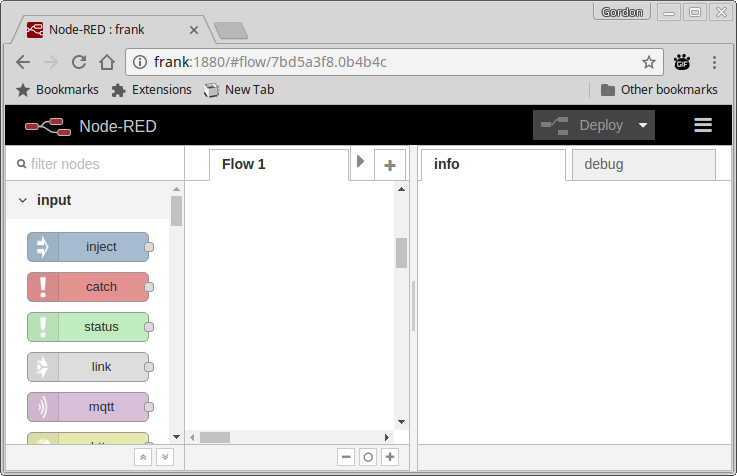
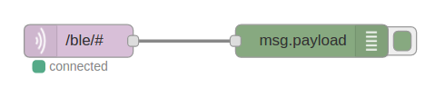
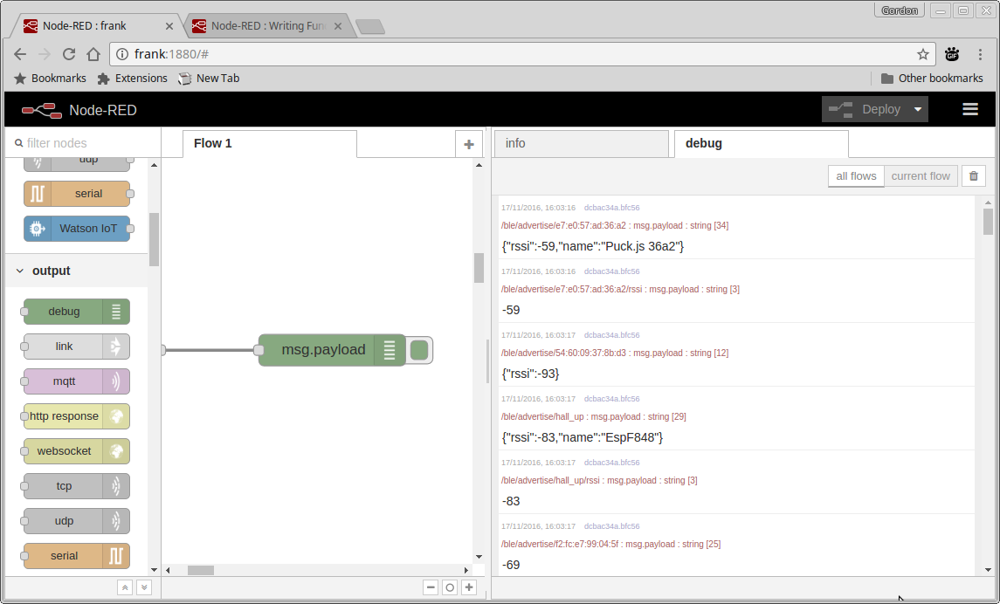

<!--- Copyright (c) 2016 Gordon Williams, Pur3 Ltd. See the file LICENSE for copying permission. -->
Puck.js and Node-RED with MQTT
===============================

<span style="color:red">:warning: **Please view the correctly rendered version of this page at https://www.espruino.com/Puck.js+Node-RED. Links, lists, videos, search, and other features will not work correctly when viewed on GitHub** :warning:</span>

* KEYWORDS: Tutorials,BLE,Bluetooth,Node,Node-red,nodered,MQTT,Pi,Raspberry Pi,EspruinoHub
* USES: Puck.js,BLE,Only BLE

The easiest way to get started with Puck.js and [Node-RED](http://nodered.org/) is to use the
[EspruinoHub](https://github.com/espruino/EspruinoHub) software on a
Raspberry Pi. This provides a bridge between Bluetooth Low Energy and
MQTT.

To get this set up, please follow the instructions
[on the EspruinoHub GitHub page](https://github.com/espruino/EspruinoHub)

Getting Started
---------------

Once the server is installed, you can access Node-RED via HTTP on port
1880. For instance at [http://raspberry:1880](http://raspberry:1880)



To start receiving MQTT packets:

* Drag an `mqtt` input node and a `debug` output node onto the page, and connect them together.
* Double-click on the `mqtt` node, and:
  * Make sure `Server` says `localhost:1883` (you'll need to add a new server the first time you use Node-RED)
  * Make sure `Topic` says `/ble/#` - `#` is a wildcard in MQTT
* Now click `Deploy` in the top right
* Make sure the button to the right of the `debug` node is bright green



* Click on &#x1D362; in the top right, `View`, and then `Debug messages`

You should now see a whole load of advertising messages appearing:



If you modify your Puck's software to use the [`NRF.setAdvertising`](http://www.espruino.com/Reference#l_NRF_setAdvertising)
function then the new information you are advertising will also appear in the
debug messages.


Narrowing it down
-----------------

Getting all the adverising information isn't very useful, but
we can easily narrow it down by changing `Topic` in the `mqtt` input.

In my example, there was `/ble/advertise/e7:e0:57:ad:36:a2/rssi` in
the Debug pane. This is the `rssi` (signal strength) of advertising packets
from the Puck with address `e7:e0:57:ad:36:a2`.

To listen to all messages from `e7:e0:57:ad:36:a2` we could use
`/ble/advertise/e7:e0:57:ad:36:a2/#` but as we're just interested in
rssi we'll use the full path in `topic`. Change the address to the address
that was reported in your debug window.

If you hit `Deploy` now you'll see just the `rssi` value reported.


Graphing the Data
-----------------

If you followed the instructions for [EspruinoHub](https://github.com/espruino/EspruinoHub)
you should also have the UI library installed.

* Grab a `chart` element from `ui`
* Connect it up to the `mqtt` node
* Double-click on it and give it a name
* Now click `Deploy`
* You can now go to `http://raspberry:1880/ui` in your web browser, and
you'll see a UI with a graph. The more `ui` widgets you drag into your Node-RED
flow, the more you'll see in the UI frame.


Using the data
--------------

Perhaps we want to use the signal strength to make something happen
when the Puck is nearer than a certain distance away (so a certain signal
strength).

* From the debug messages, figure out a good value for signal strength to use
(remember it's negative!).
* Drag a `function` block on, double-click it and use the following code inside it,
where `-70` is replaced with your value:

```
msg.payload = msg.payload > -70;
return msg;
```

* Now link it inbetween `mqtt` and `debug`, You can delete existing links
by clicking them and pressing delete.
* Click `Deploy` - the number will now change to a boolean which will
change to true when the Puck is closer than a certain distance.
* The RSSI value can fluctuate, so you might want to draw on a `smooth`
Node to smooth it out:


Doing something
---------------

Now you might want to do something with that information. If you have used
a Raspberry Pi, you can drag out an `rpi gpio` block to change the value on
a GPIO pin with the value you now have.

Or you might want to send an email with the `email` block. The problem is
that you don't want to send an e-mail several times a second. You only
want something to happen when it changes.

For this you need to use the unhelpfully named `rbe` (Report By Exception)
block. This will only let messages through if the value in them has changed.


Detecting Button presses
------------------------

Since Puck.js has a button, detecting button presses is an obvious thing
to want to do. We can't guarantee that every single advertising packet
Puck.js sends will be received, so we need an error-tolerant way of
detecting a press.

A simple way to do that is to send a number that increments every time
the button is pressed. That way, even if some advertising packets are
missed, as long as the hub detects that the value has changed it'll
know a button has been pressed.

Some code to do this on Puck.js would be:

```
var pressCount = 0;
setWatch(function() {
  pressCount++;
  NRF.setAdvertising({
    0xFFFF : [pressCount]
  });
}, BTN, { edge:"rising", repeat:true, debounce:50 });
```

The choice of 0xFFFF for the advertising is completely random.

You can then use the `rbe` (Report By Exception) block to detect
when the received count has changed - for example:


In this case `show toast` just presents a banner to anyone that is
currently viewing the UI page. This method could be used for detecting
any kind of event - not just button presses.


Detecting presence
------------------

You can also detect when a beacon is available, and when it disappears
(that is, there is no advertising message for 1 minute).

Simply subscribe to the `/ble/presence/de:vi:ce:ad:dr` MQTT topic,
and you'll get a `1` when it appears, and a `0` when it disappears.


Controlling the Puck
--------------------

The next step is to send a message to the Puck when something happens.

This time we'll just add some buttons to trigger events.

* Add two `inject` buttons
* Double-click on one and set `Payload` to `LED1.set();`
* Double-click on the other and set `Payload` to `LED1.reset();`
* Now drag in a `function` node and connect them both to it
* Double-click on it and set the code to:

```
msg.payload += "\n";
return msg;
```

This will add a newline to the commands which are to be send (which is needed so
Puck.js knows it's the end of a command).

* Finally drag an `mqtt` output, and set the topic to `/ble/write/e7:e0:57:ad:36:a2/nus/nus_tx`
where the address is the address of your device.


And you're done! Click `Deploy` and when you click the buttons you'll be able
to turn the LED on or off. You can use this functionality to execute functions
that you have previously defined on the Puck as well.

**Note:** The format is `/ble/write/de:vi:ce:ad:dr/service/characteristic`, so
you don't have to write to the Nordic UART on Puck.js. You can define your own
services and write directly to those (the format is either `6e400001b5a3f393e0a9e50e24dcca9e` 
for 128 bit uuids or `abcd` for 16 bit UUIDs).


More!
-----

You can also make Node-RED talk to IFTTT, with the [node-red-contrib-ifttt](https://www.npmjs.com/package/node-red-contrib-ifttt) module.

* Log into your Raspberry Pi as the `pi` user
* Type `cd .node-red`
* Type `npm install node-red-contrib-ifttt`
* Restart Node-RED with `node-red-stop` then `node-red-start`

Now you'll have an IFTTT block that you can use to trigger IFTTT events!
