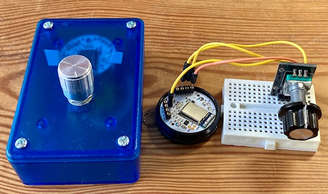

<!--- Copyright (c) 2022 Jeffrey Magee, Pur3 Ltd. See the file LICENSE for copying permission. -->
Puck.js Rotary Encoder
=======================

<span style="color:red">:warning: **Please view the correctly rendered version of this page at https://www.espruino.com/Puck.js+Rotary+Encoder. Links, lists, videos, search, and other features will not work correctly when viewed on GitHub** :warning:</span>

* KEYWORDS: Tutorials,Rotry Encoder,BLE HID,HID
* USES: Puck.js,ble_hid

This tutorial is based off [a forum port here](https://forum.espruino.com/conversations/380937)

This project was driven by the inconvenience of using SDR (Software Defined Radio) programs without having an explicit physical tuning knob to adjust frequency. Subsequently, I have found it also useful for scrolling with tablets.

The implementation uses an Espruino Puck.js and a rotary encoder as shown below in the breadboard prototype and the final device.



Connections are:

| Encoder | Puck |
|---------|------|
| GND     | GND  |
| SW      | D28  |
| ENCODER | D29,D30 |

The program below presents the Rotary Encoder as the middle wheel and button of a bluetooth mouse.

```JS
function createEncoder(pinA,pinB){
  pinMode(pinA,"input_pullup");
  pinMode(pinB,"input_pullup");
  var a0=pinA.read(), c0=pinB.read(), incr0 =0, second=false;
  var OBJ = {};

  function handler () {
    var a = pinA.read();
    var b = pinB.read();
    if (a != a0) {              // A changed
      a0 = a;
      if (b != c0) {
        c0 = b;
        var incr = (a == b)?1:-1;
        if (incr!=incr0 || !second) OBJ.emit("change",incr);
        incr0=incr; second = !second;
      }
    }
  }
  setWatch(handler,pinA,{repeat:true,edge:"both"});
  return OBJ;
}

function createSwitch(pinA){
  pinMode(pinA,"input_pullup");
  var OBJ = {};

  function handler(ns){
      OBJ.emit("change",!ns.state);
  }
  setWatch(handler,pinA,{repeat:true,edge:"both",debounce:25});
  return OBJ;
}

//HID report for Mouse device
var report = new Uint8Array([
  0x05, 0x01, 0x09, 0x02, 0xA1, 0x01,
  0x09, 0x01, 0xA1, 0x00, 0x05, 0x09,
  0x19, 0x01, 0x29, 0x03, 0x15, 0x00,
  0x25, 0x01, 0x95, 0x03, 0x75, 0x01,
  0x81, 0x02, 0x95, 0x01, 0x75, 0x05,
  0x81, 0x01, 0x05, 0x01, 0x09, 0x30,
  0x09, 0x31, 0x09, 0x38, 0x15, 0x81,
  0x25, 0x7F, 0x75, 0x08, 0x95, 0x03,   
  0x81, 0x06, 0xC0, 0x09, 0x3c, 0x05,
  0xff, 0x09, 0x01, 0x15, 0x00, 0x25,
  0x01, 0x75, 0x01, 0x95, 0x02, 0xb1,
  0x22, 0x75, 0x06, 0x95, 0x01, 0xb1,
  0x01,   0xc0 ]
);
NRF.setServices(undefined, { hid :report });

var ROT = createEncoder(D29,D30);
ROT.on("change",(wheel)=>NRF.sendHIDReport([0,0,0,wheel,0,0,0,0],()=>{}));

var SW = createSwitch(D28);
SW.on("change",(sw)=>NRF.sendHIDReport([sw?1:0,0,0,0,0,0,0,0],()=>{}));
```

The encoder handler is adapted from [here](http://www.technoblogy.com/show?1YHJ) and I found it worked much more reliably than the [Espruino encoder module](/Encoder). In addition the following code allows the device to switch from HID to normal Espruino mode for connection to the WebIDE. i.e. hold down the encoder switch until the Puck flashes GREEN. On reboot or reset, it will go into HID mode by default and flash BLUE. On connection, there is a BlUE flash and a RED flash on disconnection.

```JS
pinMode(D28,"input_pullup");
E.kickWatchdog();
setInterval(()=>{
  if(D28.read()) E.kickWatchdog();
},5000);
E.enableWatchdog(10, false);

function flash(pin){
    pin.set();
    setTimeout(()=>{pin.reset();},500);
}
function delayms(d) {
    var t = getTime()+d/1000;
    while(getTime()<t);
}
var STOR = require("Storage");

NRF.on("connect",()=>{flash(LED3);});
NRF.on("disconnect",()=>{flash(LED1);});

delayms(2000);

if (D28.read()){
  flash(LED3);
  if (STOR.read("main.js")) eval(STOR.read("main.js"));
} else {
  flash(LED2);
}
```
