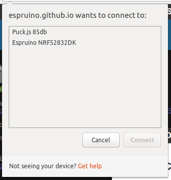
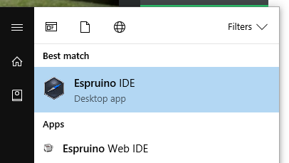

<!--- Copyright (c) 2016 Gordon Williams, Pur3 Ltd. See the file LICENSE for copying permission. -->
Quick Start (Bluetooth LE)
===========================

<span style="color:red">:warning: **Please view the correctly rendered version of this page at https://www.espruino.com/Quick+Start+BLE. Links, lists, videos, search, and other features will not work correctly when viewed on GitHub** :warning:</span>

* KEYWORDS: Tutorials,Puck.js,Quick Start,Getting Started,Web Bluetooth,BLE
* USES: Puck.js,Pixl.js,MDBT42Q,Ruuvitag,Thingy52,Web Bluetooth,BLE,Only BLE


Turning On
----------

### <a class="specific puckjs"></a>Puck.js

Your Puck.js shipped with a battery installed, but with a small plastic tab inserted to keep it turned off.

To turn on your Puck.js, simply:

* Remove Puck.js from its packaging
* Peel the silicone case away from the hard base using your fingers
* Tip the Puck.js circuit board out of the case
* Remove the battery by poking it out from the rear with a blunt object
* Remove the clear plastic tab that was under the battery
* Re-insert the battery - the red LED should flash once, very briefly.
* If the green LED lights or red stays lit, it is because you have accidentally
pressed the button down while inserting the battery. Remove the battery and try
again, making sure the button next to the battery connector isn't pressed.
* Re-assemble Puck.js. **To make sure the button works correctly you need to put
the battery side facing down, with the silver shield facing towards the 'shelf' in the
case.**

While Puck.js ships with firmware that's fine for simple tasks, we're constantly
improving the software and adding new features.

To get the best out of it, we'd recommend that you [update Puck.js's firmware](/Puck.js#firmware-updates) first.

### <a class="specific pixljs"></a>Pixl.js

To turn on your Pixl.js you have three main options:

* Use a Micro USB cable for power (there is no USB data connection on Pixl.js)
* Slide a CR2032 battery into the holder on the board (with `+` facing away from the PCB)
* Connect a power source (under 16v) between the `Vin` and `GND` pins on Pixl.js

While Pixl.js ships with firmware that's fine for simple tasks, we're constantly
improving the software and adding new features.

To get the best out of it, we'd recommend that you [update Pixl.js's firmware](/Pixl.js#firmware-updates) first.

### <a class="specific mdbt42q"></a>MDBT42Q

Check out [the MDBT42Q](/MDBT42Q#getting-started) page for more information about powering the MDBT42Q.

While pre-programmed MDBT42Q modules from us ship with firmware that's fine for simple tasks, we're constantly
improving the software and adding new features.

To get the best out of it, we'd recommend that you [update the firmware](/MDBT42Q#firmware-updates) first.

### <a class="specific ruuvitag"></a>Ruuvitag

Check out [Ruuvi's getting started page](https://lab.ruuvi.com/start/) for more information about powering MDBT42Q.

### <a class="specific thingy52"></a>Nordic Thingy:52

You'll need to have your Thingy:52 flashed with Espruino and powered on. [Check out the Thingy:52 page](/Thingy52#getting-started) for more information.

### <a class="specific nrf52832dk"></a>Nordic nRF52832DK

Simply plug your nRF52832DK into a USB connector. [You need to have it flashed with Espruino](/nRF52832DK#getting-started).

### <a class="specific end"></a>

Once your device is powered up it'll start advertising itself via Bluetooth Low Energy.

[Puck.js](/Puck.js) and [Pixl.js](/Pixl.js) will also act as NFC tags that
can direct your NFC-capable phone to the relevant URLs.


Requirements
------------

For Bluetooth LE you need a Bluetooth 4.0-capable adaptor in your computer (Bluetooth versions before 4.0 won't work). Pretty much all new computers come with Bluetooth 4, but you *may* need to get an external Bluetooth LE dongle if your computer:

* Is an Apple Mac made before 2012
* Is a Windows PC (especially pre-windows 10)
* Is a Desktop PC - it may not have any wireless support *at all*
* Is running Linux - much of the built-in Bluetooth LE functionality in laptops is still buggy. External USB adaptors will be much more reliable.

If your computer doesn't have Bluetooth LE then Bluetooth LE USB adaptors and small, cheap (~$10), and easily available. There are two main types of USB Bluetooth Adaptor available:

* **Broadcom chipset** (eg. BCM20702) works well on all platforms.
* **Cambridge Silicon Radio (CSR)** - these work great on Linux and Windows. However while they used to work on Macs, *Apple removed support in the High Sierra OS update* - so you're better off with a Broadcom module.

To be sure that you get a usable adaptor we'd recommend that you buy ONLY adaptors that explicitly mention `CSR` or `Broadcom` in the descriptuon. **The BlueGiga BLED112 module WILL NOT WORK** - it is a serial port device, not a general purpose Bluetooth adaptor.

Common USB Bluetooth adaptors that have been tested and work are:

* [iAmotus UD-400M](https://www.amazon.com/gp/product/B01J3AMITS) - Broadcom BCM20702A1
* [Plugable USB-BT4LE](https://www.amazon.com/gp/product/B009ZIILLI) - Broadcom BCM20702A1
* [Whitelabel 06Q Nano](https://www.amazon.com/gp/product/B01AXGYS30) - CSR chipset
* [Whitelabel BM35](https://www.amazon.com/gp/product/B01J35AUS4) - CSR chipset
* [Unbranded 'CSR 4.0'](https://www.amazon.com/dp/product/B0775YF36R) - CSR Chipset


Using your Espruino device
---------------------------

By default, Espruino appears as a Bluetooth Low Energy device with a serial port. When you connect to this serial port you get full command-line access to the Espruino Javascript interpreter built into it.

**Note:** Bluetooth LE serial ports (known as 'Nordic UART') will not appear in your Operating System's list of serial devices.

To get started you have two options:

* [Use the Espruino IDE](#using-the-espruino-ide) or command-line tools to write code to Espruino
* [Send individual JavaScript commands](#sending-individual-commands) to Espruino without programming it


Using the Espruino IDE
----------------------

### With Web Bluetooth

<script><!--
  document.write("<p><b>Note:</b> Web Bluetooth is  <b>" +
    (navigator.bluetooth?'already enabled':'currently disabled')+
    "</b> on this computer.</p>");
--></script>

If your computer supports it, Web Bluetooth is the easiest way to get started with Espruino.

You'll need an up to date version of [Google Chrome](https://www.google.com/chrome/browser/desktop/) or Opera Web Browsers on one of:

#### Mac OS

OS X Yosemite or later required, and check that your Mac supports Bluetooth Low Energy:

* Click the Apple logo then `About this Mac` in the top left
* Click `System Report`
* Click `Bluetooth` under `Hardware`
* See if it says `Bluetooth Low Energy Supported`

If it doesn't:

* Get a Bluetooth 4.0 (or later) adaptor (they cost ~$10) - [see the requirements section above](#requirements).
* Open a terminal and type `sudo nvram bluetoothHostControllerSwitchBehavior=al­ways`
(to go back to the old behaviour type `sudo nvram -d bluetoothHostControllerSwitchBehavior`)
* Reboot your Mac
* **Make sure that you turn off (or un-pair) any Bluetooth devices that were using your internal Bluetooth** - they may stop your Mac from using the new adaptor

#### Windows

Windows 10 support for Web Bluetooth is under development as of late 2017. However
[there is currently a bug in Google's implementation](https://github.com/WebBluetoothCG/web-bluetooth/issues/387)
which means the web-based Espruino IDE cannot receive data over Bluetooth.

For now there are two options:

* [Install the Espruino Native IDE application](#with-an-application) instead (recommended)
* Use the [Web Bluetooth Polyfill Plugin](https://github.com/urish/web-bluetooth-polyfill) to add Web Bluetooth to Chrome on Windows 10 (this can be tricky to install).

**Neither the Online IDE [`espruino.com/ide`](/ide) nor the
[Chrome Web App](https://chrome.google.com/webstore/detail/espruino-web-ide/bleoifhkdalbjfbobjackfdifdneehpo)
will work to access Bluetooth Low Energy devices on Windows unless you install
the polyfill above.** Please try the [Native IDE](#with-an-application) first - this is by far the easiest option.

#### Linux

Linux is not officially supported in Chrome.  However, because ChromeOS is supported it can be possible to enable Linux support:

BlueZ 5.41+ required (5.43 is more stable) - you can check by typing `bluetoothd --version`. If it isn't there are some [Bluez installation instructions here](/Web Bluetooth On Linux)

* Type `chrome://flags` in the address bar
* You need to enable `Experimental Web Platform Features` (`chrome://flags/#enable-experimental-web-platform-features`).
* Restart your browser

#### Chromebook

All Chromebooks with Bluetooth should support Web Bluetooth.

#### Android

Android 6 (Marshmallow) or later supported out of the box.

Android 5 (Lollipop) devices can use [Chromium installed over ADB to a developer mode device](https://stackoverflow.com/questions/34810194/can-i-try-web-bluetooth-on-chrome-for-android-lollipop).

#### iOS (iPhone, iPad)

Apple's built-in web browser does not support Web Bluetooth. Instead you'll
need to [install the WebBLE app](https://itunes.apple.com/us/app/webble/id1193531073)

However once that is done you'll be able to access Web Bluetooth through any
webpage viewed with [WebBLE](https://itunes.apple.com/us/app/webble/id1193531073)

### Once Web Bluetooth is set up:

* Go to the [Puck.js site](https://puck-js.com/go). It should tell you that you have Web Bluetooth.
* Click the [Web IDE option](/ide).
* Click the orange **Connect/Disconnect** icon in the Top Left: 
* You may see a list of connection options - choose `Web Bluetooth`:


* You should be shown a list of devices - click on `YourDevice ABCD` (where `ABCD` is the last 4 digits of your device's MAC address)



* Wait a few seconds - you should now be connected!
* You can now try [writing some code](#next)!


### With an application

On some platforms (Windows, or Linux with older versions of `Bluez`) Web
Bluetooth isn't supported yet.

On these you'll need to install a native application. We've created a
[Web IDE installer for Windows](/Web+IDE#as-a-native-application) - don't
use the Chrome Web Store version at the top of that page, as it won't
give you access to Bluetooth devices.

Once installed, you need to run `Espruino IDE` - which is confusingly
similar to the `Espruino Web IDE` which you may have had installed if you'd
used normal Espruino USB devices before.



**Note:**

* Bluetooth LE Serial devices (Nordic UART Service) like Espruino are not treated as serial port devices by Windows. If the IDE's connection menu shows devices beginning with the word `COM` (eg. `COM5`), they are not your device and connecting to them won't work.
* If using Windows 8.1/10 or later you'll need to pair your Espruino device using the Windows
Bluetooth menu before it'll appear in the Web IDE.
* If you're using a Bluetooth dongle with Windows 10 you should use Windows'
built-in Bluetooth software, rather than installing the software that came with
your Bluetooth Dongle. Often the Bluetooth dongle's software will not pair
with Bluetooth LE devices and expose them via Windows 10's API.
* If using Windows 7 you'll need to have [set up your Bluetooth adaptor with Zadig first](/Web+IDE#zadig)

On Linux, Mac OS and other platforms you'll need to follow the NPM install
[instructions on the Web IDE GitHub Page](https://github.com/espruino/EspruinoWebIDE#installing-from-npm)

Once set up, you can try [writing some code](#next)!


### Via a Raspberry Pi

There are two ways of using the Raspberry Pi to control Espruino devices.

* You can use the Espruino Hub software (which provides an MQTT bridge) and the
Node-RED UI - see the [Node RED Tutorial](/Puck.js Node-RED)

* Or you can [use the Raspberry Pi to host a web-based version of the Web IDE](/Raspberry Pi Web IDE).

Once set up, you can try [writing some code](#next)!


### By wired connection

In the worst case, you don't have any computers that allow you to communicate using Bluetooth Low Energy.

But all is not lost! With many devices you can connect directly using a USB-TTL converter:

* [Connecting Serial to Puck.js](/Puck.js#serial-console)
* [Connecting Serial to Pixl.js](/Pixl.js#serial-console)
* [Connecting Serial to to the MDBT42Q](/MDBT42Q#serial-console)
* [Connecting Serial to to the Thingy:52](/Thingy52#serial-console)
* The nRF52832DK has [USB serial built-in](/nRF52832DK#serial-console)

You can then use the normal [Espruino Web IDE](/Web+IDE), which has [separate instructions for Getting Started](/Quick+Start+USB)


Command-line
------------

You can use the Espruino command-line app. It works under [Node.js](https://nodejs.org), so you'll need to:

* Install [Node](https://nodejs.org)
* In a command prompt, type `npm install -g espruino` (on Linux you'll want to use `sudo` before the command)
* On Linux, you need to run ```sudo setcap cap_net_raw+eip $(eval readlink -f `which node`)``` to give node permissions for BLE (or you'll have to run it as `sudo`)
* When that completes, you can type `espruino --help` for help
* To connect, try `espruino --list` to list devices, then copy your device's MAC address and type `espruino -p aa:bb:cc:dd:ee` to connect.
* Press `Ctrl-C` twice to exit.
* You can also type `espruino -p aa:bb:cc:dd:ee -w filename.js` to upload a file, enter terminal mode,
and then re-upload it if it changes (so you can use your favourite editor)
* You can now start [writing some code](#next)!


Sending Individual Commands
---------------------------

### Using Adafruit 'Bluefruit LE' app

**This is the easiest solution on iOS**

* Start the app
* Choose the Espruino device you want to communicate with and click `Connect`
* Click `UART`
* When connected you're ready to enter some commands - see `Commands` below

### `nRF UART` app

* Start the app
* Tap `Connect` and choose your Espruino device
* Type commands into the console - see `Commands` below.

**Note:** In this app, you need to manually press the `Enter` key *before* sending a line. If you're on iOS you need to do this by copy/pasting out of code in notepad - which is much trickier (the Adafruit app above is easier).

### A Website

You can use Web Bluetooth on your own website to control Espruino BLE devices, as long as you have a compatible browser.

While you can use Web Bluetooth directly, we've provided a helpful library. Just include
`<script src="https://puck-js.com/puck.js"></script>` in your website (served off `HTTPS`)
and you can easily execute commands just by running JS code like:

```
Puck.write('LED1.set();\n');
```

We've got [a proper tutorial on it here](/Puck.js Web Bluetooth)

### Your own app

You can make your own application to control Espruino for whatever platform you need.

For the simplest control, all you need to do is connect to the Espruino bluetooth
device and the characteristic with ID `6e400002b5a3f393e0a9e50e24dcca9e`.
You can then write repeatedly to it to send commands to Espruino.

### Commands...

Type in `LED1.set()` and click send.

* The red LED should light up.
* You can now type `LED1.reset()` to turn it off. `LED2` and `LED3` work too
* Note that responses are also being sent back. You can type in `BTN.read()` and `false` will be returned - it'll be `true` if the button is pressed


Having Trouble?
----------------

Try:

* The [Bluetooth Troubleshooting](/Troubleshooting+BLE) page
* [General Troubleshooting](/Troubleshooting)
* Or ask on [our forums](http://forum.espruino.com) if you can't find the answer you need


<a id="next"></a>What now?
---------------------------

**Please [try the walkthrough](/Quick+Start+Code) to get started writing
your first code for Espruino**

There's lots of detailed information on specific boards, as well
as a list of tutorials for them:

* [Puck.js](/Puck.js)
* [Pixl.js](/Pixl.js) and [Pixl.js Getting Started video](https://www.youtube.com/watch?v=pawHDr4i3jI)
* [MDBT42Q](/MDBT42Q)
* [Thingy:52](/Thingy52)
* [nRF52832DK](/nRF52832DK)
* [RuuviTag](/RuuviTag)

There is more general information:

* [Bluetooth Troubleshooting](/Troubleshooting+BLE)
* [Language Reference](/Reference), specifically:
  * [Puck Object](/Reference#Puck) - for Puck.js specific functionality
  * [Pixl Object](/Reference#Pixl) - for Pixl.js specific functionality
  * [NRF Object](/Reference#NRF) - for nRF52 Bluetooth functionality
  * [Global Functions](/Reference#_global) and [E Object](/Reference#E) - for built-in Espruino functionality
* Instantly [Search](/Search) all the Espruino website's documentation (using the box in the top right)
* [List of available modules](/Modules)
* [Tutorials](/Tutorials)
* [Frequently Asked Questions](/FAQ)
* See other [ways of Programming Espruino devices](/Programming)
* Or check out [our forums](http://forum.espruino.com)

**Note:** Espruino runs on many other devices, and [espruino.com](http://espruino.com)
caters for all of them. Unless [a tutorial](/Tutorials) explicitly says it is for your device it's
possible that you will have to change some pin names and wiring to match
the pins that you used on your device.


Power Usage
------------

Out of the box, Espruino bluetooth devices don't draw that much power and can
run for a while on a battery (see your board's specific reference page for
more information). When they're running a small amount
of JavaScript code once a minute or when a button is pressed the battery
life won't be impacted significantly.

However, it's very easy to draw more power:

* Staying connected via Bluetooth will often draw around 10x more power than idle
* Lighting a LED can draw around 100x more power than when idle
* Running JavaScript code continuously will draw around 200x more power than at idle

As a result, if you've been using your device but don't intend to use the code
you've uploaded it's recommended that you either remove the battery, or connect
to your device and type `reset()`, to ensure that no code is running in the
background that might flatten the battery.

* [Puck.js power consumption](/Puck.js#power-consumption)
* [Pixl.js power consumption](/Pixl.js#power-consumption)


<script>
var device;
if (window.location.hash=="#pixljs") device="pixljs";
if (window.location.hash=="#puckjs") device="puckjs";
// Remove any sections that aren't relevant
if (device) {
  var divs = document.getElementsByClassName("specific");
  for (var i=0;i<divs.length;i++)
    if (!divs[i].classList.contains(device)) {
      // delete until the next heading node
      var p = divs[i--].parentNode;
      do {
        var n = p.nextSibling;
        p.remove();
        p=n;
      } while (p.nodeName.toUpperCase()[0]!="H");
    }
}
</script>
