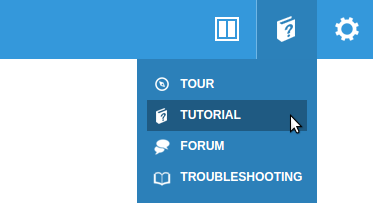

<!--- Copyright (c) 2018 Gordon Williams, Pur3 Ltd. See the file LICENSE for copying permission. -->
Quick Start (Writing Code)
==========================

<span style="color:red">:warning: **Please view the correctly rendered version of this page at https://www.espruino.com/Quick+Start+Code. Links, lists, videos, search, and other features will not work correctly when viewed on GitHub** :warning:</span>

* KEYWORDS: Quick Start,Getting Started
* USES: Only Espruino Board,Pico,EspruinoWiFi,nRF52832DK,WioLTE,STM32L496GDISCOVERY,Puck.js,Pixl.js,MDBT42Q,Ruuvitag,Thingy52

Getting connected
------------------

If you haven't already, see the getting started guides for:

* [USB-based boards](/Quick+Start+USB)
* [Bluetooth-based boards](/Quick+Start+BLE)

for information on how to get the Web IDE connected to your device.


How does the Espruino IDE work?
--------------------------------

Once connected in the IDE, writing on the left-hand side will communicate directly
with the device and executes commands immediately.

The right-hand side is a text editor. You can click the `</>` icon to swap
to a graphical code editor, and can click 
to send the code you wrote one the right-hand side to Espruino.

If you're using any version of the Espruino IDE, you can click on   in
the top right, then:

* **Tour** for a quick tour of the various parts of the Espruino IDE
* **Tutorial** for a step by step guide to writing your first code on Espruino




Start writing code!
-------------------

Now you can type commands and they will be executed (you can also copy and paste them in to the terminal window).

Try typing the following in the left-hand side of the Web IDE, and press 'Enter' after it:

```javascript
1+2
```

This should return ```=3```. If it doesn't, there might have been some text entered already by the terminal application. Press ```Ctrl-C``` to clear this, and try again.

Every time you type a command and press enter, it will be executed immediately. ```=``` will be displayed followed by the result. If there is no result (for instance if you were executing a function that returned no value), ```=undefined``` is displayed.

```javascript
digitalWrite(LED1,1)
```

Remember to enter capital letters where they appear above - JavaScript (and so Espruino) is case-sensitive, so for instance `digitalwrite` won't work while `digitalWrite` will.

*Is `Uncaught ReferenceError: "LED1" is not defined` displayed? If so you're probably not using an offical board (which all have `LED1` defined) - you can always attach an LED to a pin and type `var LED1 = you_pin_name` to continue.*

If all goes well, `=undefined` will be displayed, however the `LED1` light on the board will light up. This allows you to set voltages that come out of the processor (`1`=3.3 volts, `0`=0 volts). Instead of `LED1`, you can use any pin name, such as `A1` or `B5` (there's a handy diagram of your device's pins under the `Pinout` heading in your device's reference page).

Now, press the 'up' arrow. This will display the last command you ran, and will show the text `digitalWrite(LED1,1)` again. Press the left arrow until the cursor moves to the end of `1`, press backspace, then press `0`. It should now look like this:

```javascript
digitalWrite(LED1,0)
```

You can now step back to the end of the line (using the right arrow, or the 'end' key) and can press enter to execute the command (which will turn the LED off). If you press enter before the cursor is on the end of the line, it won't execute the command, but will split it on to two lines (you can press backspace again to back up).

For the next bit, we need to create a variable. Type:

```javascript
var on = false
```

Then press enter - this will create a new variable called `on` and will set its value to the boolean `false`.

You can now write a function. Type the following:

```javascript
function toggle() {
 on = !on;
 digitalWrite(LED1, on);
}
```

When you hit 'enter' after the first line, the command wasn't executed, but instead Espruino just created a new line because there was an unclosed open bracket. If you don't define functions with an open bracket on the end of the line then they will be executed immediately, which is probably not what you want (if you really want to put your brackets on a new line, press `Alt-Enter` at the end of the line `function toggle()` - but we don't recommend this).

What if you created a new line by mistake? Just hit backspace. Or if you're totally confused and just want to start again, press `Ctrl-C` and the text you typed will be deleted.

Once you've hit enter after the last line, the text `=function () { ... }` will be displayed in the terminal window. This means that your function (called `toggle`) is defined. So what does it do? The `on` variable stores a value which is either `true` or `false`. The command `on = !on;` makes the value of `on` `true` if it was `false` before, or `false` if it was `true` before. If you pronounce `=` as 'becomes', and `!` as 'not', reading the line makes more sense (`on becomes not on`).

The next line takes the changed value of `on` (either `true` of `false`) and applies it to the digital output (in this case LED number 1). Every time you use the toggle function, the value of `on` toggles between true and false, and so turns the LED on or off.

Now we can try it, type the following and hit enter:

```javascript
toggle()
```

If you want to run it again, just hit the up arrow (to find the command in history) followed by enter. Every time you run it, the LED will change state from on to off or vice versa.

Now type:

```javascript
var i = setInterval(toggle, 500)
```

This will call the `toggle` function every 500ms (eg. twice a second), so the LED will start blinking. The new variable called `i` (which was defined by `var`) is a reference to the timer we have created - this will be useful later!

But what if we want to change the `toggle` function? First let's see if what
we want to to makes sense.

Type:

```javascript
LED2
```

If `Uncaught ReferenceError: "LED2" is not defined` is displayed then your
device only has one LED. You'll have to skip using `LED2` in the next steps...

Type:

```javascript
edit('toggle')
```

You can also get a similar effect by hitting the up arrow until you get back to the command where you defined `toggle`. Now the function is displayed, press the left arrow to move the cursor backwards, and start to edit the function. Add a new line at the end so that it looks like this (to add a line after `digitalWrite`, move the cursor to the end of the line, and press 'enter'):

```javascript
function toggle() {
 on = !on;
 digitalWrite(LED1, on);
 digitalWrite(LED2, !on);
}
```

Now, move the cursor right to the end of the last line using the arrow keys (or press 'page down'), and press enter. This will execute the command, which will redefine the function - and now LED1 will light, then LED2, then LED1 - and so on.

You can now change the speed the lights flash, using this command:

```javascript
changeInterval(i, 200)
```

This is the same as if you originally called `setInterval( ... , 200)` - `toggle` is now called every 200ms (5 times a second)

And if you want your lights to stop flashing - just type this:

```javascript
clearInterval(i)
```

Note that just typing `clearInterval()` without any arguments will clear *all* active intervals.

If you want to start completely from scratch and wipe out everything you have done, just type:

```javascript
reset()
```

If you press the reset button on the board (if your board has one), Espruino will also reset. However we don't recommend this - on most boards this will reset the USB/Bluetooth connection as well, so you may need to restart your terminal application, or in some cases even unplug and re-plug the device.

If you power off or reset Espruino using the reset button, it will lose all the code that you wrote. You can save the state of Espruino so this doesn't happen using the `save()` command ([more information](/Saving)).

The `save()` command saves the current state of the pins and on-chip peripherals, as well as all your functions, variables, watches and timers. The commands that you typed in previously *won't be executed again though*. If you want to execute some code when Espruino starts (for example you may need to initialise some external bit of hardware like an LCD), you can use the `init` event on `E`. For example this bit of code lights the red, then green LEDs each time Espruino starts up:

```
E.on('init', function() {
  digitalWrite([LED1,LED2], 2);
  setTimeout("digitalWrite([LED1,LED2], 1);", 1000);
  setTimeout("digitalWrite([LED1,LED2], 0);", 2000);
});
```

**Note:** You can add a second handler to do something else when Espruino starts up, just by calling `E.on('init', ...)` again. If you write a function called `onInit`, that will automatically be executed as well.

The code above uses a few extra features in Espruino that weren't covered above:

* You can pass an array of pins into `digitalWrite` (the same applies to `digitalRead`). If you do that, the value you supply will be treated as a binary value, with the least significant bit going to the rightmost pin in the array and so on.
* If you pass a string into `setTimeout` or `setInterval`, it'll be treated in the same way as a function and will be executed after a certain time period.

If you do manage to save something to Espruino that causes it not to work, don't worry - you can easily recover it. Just see the [[Troubleshooting]] page.

Now you've got an idea how to use Espruino:

* Have a look at your board's reference page - it contains more in-depth information about your board, as well as for links to tutorials that specifically use your board:
  * Espruino [Pico](/Pico)
  * Espruino [WiFi](/WiFi)
  * [Original](/Original) Espruino
  * [Puck.js](/Puck.js)
  * [Pixl.js](/Pixl.js)
  * [MDBT42Q](/MDBT42Q)
  * Other board? It may be listed in [the Reference](/Reference#hardware)
* Have a look at the [[Tutorials]] and [[Reference]] pages
* Check out [[Modules]] to see which libraries of code are available to use
* See how to use the more advanced features of the [[Web IDE]]
* Check out other [ways of Programming Espruino](/Programming)
* Instantly [Search](/Search) all the Espruino website's documentation (using the box in the top right)
* If you've got a question, please check out our [[Forum]]
