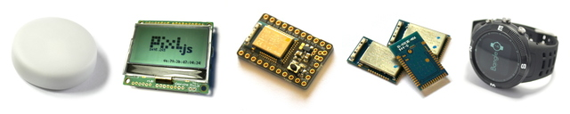
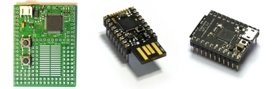

<!--- Copyright (c) 2013 Gordon Williams, Pur3 Ltd. See the file LICENSE for copying permission. -->
Quick Start
==========

:warning: **Please view the correctly rendered version of this page at https://www.espruino.com/Quick+Start. Links, lists, videos, search, and other features will not work correctly when viewed on GitHub** :warning:

* KEYWORDS: Quick Start,Getting Started

## Which board do you have?

### Bluetooth LE

### USB

For the best experience, please use one of [our official Espruino Boards](/Order).

## Already got the IDE connected?

Please [take a look here](/Quick+Start+Code) for a quick walkthrough
on how to write code for Espruino.

