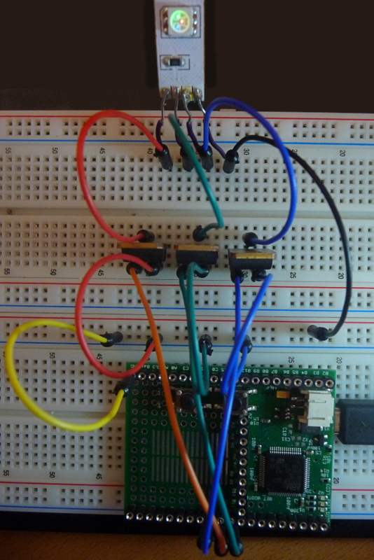

<!--- Copyright (c) 2014 Your Name. See the file LICENSE for copying permission. -->
Simple LED wiring
=======================

<span style="color:red">:warning: **Please view the correctly rendered version of this page at https://www.espruino.com/Simple+RGB+strips. Links, lists, videos, search, and other features will not work correctly when viewed on GitHub** :warning:</span>

* KEYWORDS: LED,RGB,strip,transistor,STP16NF06

Introduction
-----------

In order to power simple (analog) RGB LED strips, you need to translate between different voltage and/or want to have finer control over the output voltage to allow some dimming. Also, you may want to keep it simpler than with the WS2811 LEDs and only have one single color selectable for the entire strip. In this case a simple wiring with some transistors can be useful.

Wiring Up
--------

In order to test this, a single LED (one color) would be enough, but you probably want to use this with an LED strip (probably '5050' tri-color type LEDs, which are fairly inexpensive).

As transistor you can use any power NPN or N-Channel MOSFET. However, for this example we have chosen the STP16NF06, which is quite inexpensive but yet powerful enough to drive dozens of LEDs (up to 16A!). 

On the board you can either use the true analogue output pins A4, A5 (see [[DAC]]) or any pin supporting [[PWM]] output (which is nearly every pin). In this tutorial we are using the purely PWM pins C7, C8 & C9.



The MOSFETs can also be soldered directly onto the board as there are plenty of pins left on the prototype area.

Software
--------

To power the LEDs type 

```
analogWrite(C7, 1); // red
analogWrite(C8, 1); // green
analogWrite(C9, 1); // blue
```
