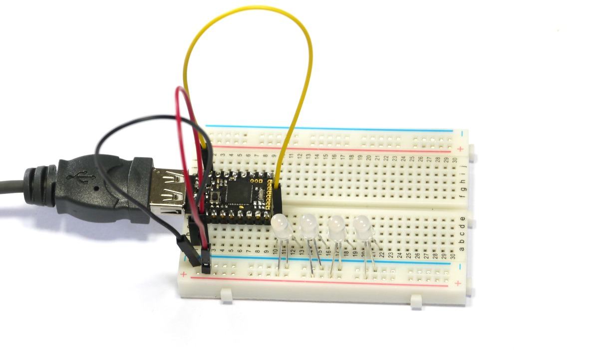
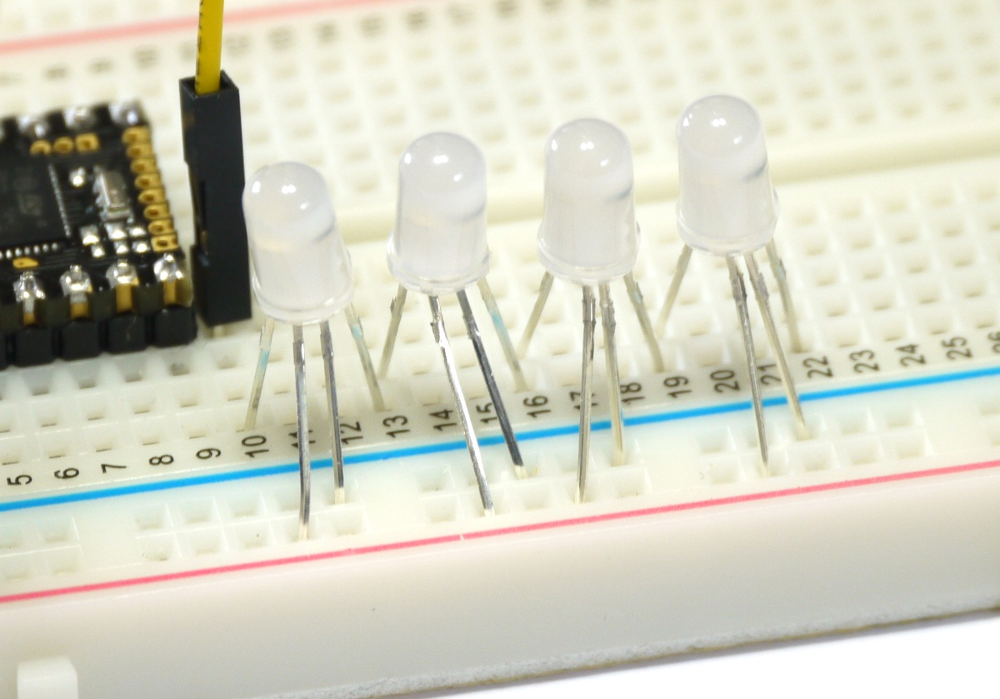

<!--- Copyright (c) 2015 Gordon Williams, Pur3 Ltd. See the file LICENSE for copying permission. -->
Slot Machine
=========

<span style="color:red">:warning: **Please view the correctly rendered version of this page at https://www.espruino.com/Slot+Machine. Links, lists, videos, search, and other features will not work correctly when viewed on GitHub** :warning:</span>

* KEYWORDS: Pico,Fruit Machine,Slot Machine
* USES: Pico,WS2811,PicoStarterKit

Introduction
-----------

We'll make a simple [Slot Machine](http://en.wikipedia.org/wiki/Slot_machine) with 4 LEDs. When the button is pressed, they'll each 'spin', changing colour until they slow down.

You'll Need
----------

* An Espruino [[Pico]]
* 4x 5mm [WS2811/APA106](/WS2811) LED lights
* [[Breadboard]]
* 3x Jumper Wires
* A 47uF (or greater) Capacitor

Wiring Up
--------



* Plug your Espruino Pico into a breadboard with the USB connector on the left-hand side. 
* With a Black Jumper wire, connect the bottom left pin (GND) to the '-' rail of the breadboard
* With a Red Jumper wire, connect the bottom pin 2nd from the left (5v) to the '+' rail of the breadboard
* With a Yellow Jumper wire, connect the the top pin 2nd from the left (B15) to a column of pins to the right of the Pico
* Connect the capacitor across the '+' and '-' rails on the bottom 2 rows. Make your you get it the right way around ('-' is marked with a stripe)

Now the tricky part... The LED lights need wiring up to GND and VCC, and also need their data pins connected together.


* Take the first LED, and figure out which pins are which using the diagram above. Hold it so the plastic part is facing up, and the two shorter pins are on the left. The slightly flat side of the plastic bit should be on the right-hand side.

* Bend the left and right pins (data in/out) towards the left and right, and bend the middle two pins towards you (beinding the shorter one on middle-left slight more).
* Then push the LED into the breadboard: 
  * The Leftmost pin (data in) should be in the same column as the yellow jumper wire
  * The Middle-left pin (5V) should be in the row right at the bottom marked with '+;
  * The Middle-right pin (GND) should be in the second from bottom row marked with '-;
  * The Rightmost pin (data out) should be 4 columns away from the leftmost pin
* Now repeat with the other 3 LEDs. The only difference should be that the leftmost pin of each new LED should be in the same column as the rightmost pin of the one before (you need to chain data out to data in)

Now check the wiring is correct and that the pins of the LEDs are not shorted out (see the picture below). *If 5v and GND are the wrong way around, you could destroy your LEDs.*




Software
-------

Ok, now we've got that sorted we can experiment with sending data to the LEDs. When you plug the board into USB the 4 lights should light up blue. If not, check that they're properly seated in the breadboard.

On the left-hand side of the Web IDE, paste the following:

```
var leds = new Uint8ClampedArray(4*3);
SPI2.setup({baud:3200000, mosi:B15});
function updateLEDs() { SPI2.send4bit(leds, 0b0001, 0b0011); }
updateLEDs();
```

This creates a blank array of data for the 4 LEDs, sets up SPI, and then sends the data to them (turning them off). There are 4 LEDs, each of which have a byte for red, green, and blue (so 12 elements in total).

Try changing what's in the array, and re-sending the data:

```
leds[0] = 255; // 1st red
leds[3+1] = 255; // 2nd green
leds[6+2] = 255; // 3rd blue
updateLEDs();
```

So now we've got the LEDs working, we'll make the slow machine. To do it, we'll create a class for each 'wheel' of the slot machine. You can either copy and paste this into the right-hand side of Espruino, and click 'Send to Espruino'.

```
var leds = new Uint8ClampedArray(4*3);
SPI2.setup({baud:3200000, mosi:B15});
function updateLEDs() { SPI2.send4bit(leds, 0b0001, 0b0011); }


function Wheel(ledOffset) {
  this.ledOffset = ledOffset;
  // velocity
  this.vel = 0;
  // position
  this.pos = Math.random();
}

// Give the wheel a random speed
Wheel.prototype.spin = function() {
  this.vel = 1+Math.random()*10;
};

/* each step of animation, decrease the wheel's
velocity and move it onwards */
Wheel.prototype.step = function() {
  this.vel *= 0.98;
  this.pos += this.vel*0.02;
  // make sure the position is always between 0 and 1
  this.pos -= Math.floor(this.pos);
  // update the colour to one of six. We don't use 255
  // here because we'd basically blind ourselves!
  var col = [
    [63,0,0],
    [47,47,0],
    [0,63,0],
    [0,47,47],
    [0,0,63],
    [47,0,47]][Math.floor(this.pos*6)];
  // set the colour in the LEDs array
  leds.set(col, this.ledOffset);
};

var wheels = [
  new Wheel(0*3),
  new Wheel(1*3),
  new Wheel(2*3),
  new Wheel(3*3),
  ];


function step() {
  // update the movement and set up the LEDs array
  for (var i in wheels)
    wheels[i].step();
  // send to the LEDs
  updateLEDs();
}

function spin() {
  for (var i in wheels)
    wheels[i].spin();
}

// update the LEDs 50 times a second
setInterval(step, 20);
// when the button is pressed, spin!
setWatch(spin, BTN, {repeat:true, edge:"rising", debounce: 100});
```

Now you can just press the button to 'spin' the Slot machine.
