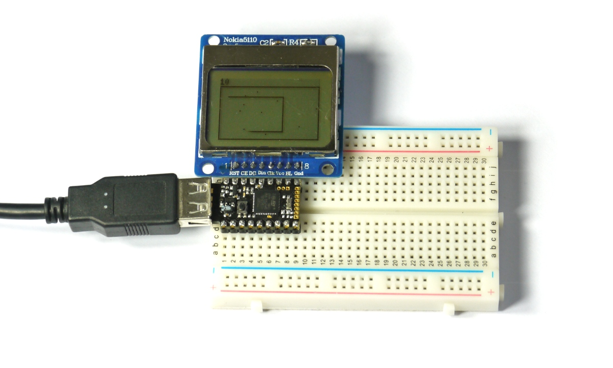

<!--- Copyright (c) 2015 Gordon Williams, Pur3 Ltd. See the file LICENSE for copying permission. -->
Snake Game
=========

<span style="color:red">:warning: **Please view the correctly rendered version of this page at https://www.espruino.com/Snake. Links, lists, videos, search, and other features will not work correctly when viewed on GitHub** :warning:</span>

* KEYWORDS: Pico,LCD,Snake,Game
* USES: Pico,PCD8544,PicoStarterKit,Graphics

Introduction
-----------

We'll make a very simple [snake game](http://en.wikipedia.org/wiki/Snake_%28video_game%29) using an Espruino [[Pico]] and a Nokia LCD display.

You'll Need
----------

* An Espruino [[Pico]]
* A [Nokia 5110 LCD](/PCD8544)
* [[Breadboard]]

Wiring Up
--------



Wiring this up is really simple, because the LCD draws so little power that we can power it from Espruino's GPIO lines... Simply place the Espruino Pico on the breadboard with the USB connector facing left, and then place the LCD directly above it, aligned to the right (so the pin on the Pico nearest the USB connector should not be connected to anything). See the picture for an example.

**Note:** If you wanted to use a normal Espruino board, just follow the instructions on the [[PCD8544]] LCD's page, and update the LCD initialisation code below accordingly.

Software
-------

We're going to start off using the code from the [Nokia 5110 LCD](/PCD8544) page, but with a few small tweaks:

* We're going to manually set up the pins for the LCD's power
* As the Pico's hardware [[SPI]] pins don't align with the LCD, we'll just use Software SPI instead (which will work on any pins).

```
A5.write(0); // GND
A7.write(1); // VCC

// Setup SPI
var spi = new SPI();
spi.setup({ sck:B1, mosi:B10 });
// Initialise the LCD
var g = require("PCD8544").connect(spi,B13,B14,B15, function() {
  // When it's initialised, clear it and write some text
  g.clear();
  g.drawString("Hello",0,0);
  // send the graphics to the display
  g.flip();
});
```

Copy and paste this code into the right-hand side of the Web IDE and click the `Send to Espruino` button. The display should now show `Hello`.

Now we're ready to make the snake game. The first step is to make a dot that moves around the screen - copy and paste the following into the right hand side over what was there already:

```
A5.write(0); // GND
A7.write(1); // VCC

// Setup SPI
var spi = new SPI();
// Graphics
var g;
// Snake position and direction
var pos, dir;

function start() {
  g.clear();
  g.drawRect(0,0,g.getWidth()-1, g.getHeight()-1);  
  // Setup snake position
  pos = {x:g.getWidth()/2,y:g.getHeight()/2}; // centre of the screen
  g.setPixel(pos.x, pos.y);
  dir = {x:1,y:0}; // the direction of the snake
  // update the screen
  g.flip();
  // start off rendering frames
  setInterval(onFrame, 100);
  // When a button is pressed, rotate the snake
  setWatch(function() { rotate(1); }, BTN, { repeat:true, edge:"rising", debounce: 50});
}

// When Espruino starts up...
function onInit() {
  clearInterval();
  clearWatch();
  spi.setup({ sck:B1, mosi:B10 });
  // Initialise the LCD
  g = require("PCD8544").connect(spi,B13,B14,B15, function() {
    // When it's initialised, clear it and write some text
    g.clear();
    g.drawString("Hello",0,0);
    // send the graphics to the display
    g.flip();
    start();
  });
}

// called every 'frame' of the game
function onFrame() {
  pos.x += dir.x;
  pos.y += dir.y;
  g.setPixel(pos.x, pos.y);
  g.flip();
}

function rotate(d) {
  if (dir.x) {
    dir = {x:0,y:d*dir.x};
  } else {
    dir = {x:-d*dir.y,y:0};
  }
}

// Start everything
onInit();
```

So now, after it's sent to Espruino you see the 'snake' moving, and you can rotate it in one direction. But what about moving the other way?
While we could wire up another [[Button]], let's just make a long press go the other way. Replace `setWatch` at the bottom of the `start` function with the following:

```
setWatch(function(e) {
  var duration = e.time - e.lastTime;
  if (duration<0.15)
    rotate(1);
  else
    rotate(-1);
}, BTN, { repeat:true, edge:"falling", debounce: 50});
```

Now, if you just 'dab' the button the snake will turn in one direction, and if you long-press it it'll turn in the other.

So the next step is to detect when the snake bumps into itself. We'll do this by looking at which pixels are set on the screen.
Replace `onFrame` with the following, and send it to Espruino again:

```
function gameOver() {
  // stop the game
  clearWatch();
  clearInterval();
  // write 'game over' on the screen
  g.clear();
  var s = "Game Over!";
  g.drawString(s, (g.getWidth()-g.stringWidth(s))/2, g.getHeight()/2-4);
  g.flip();
  // when the button is pressed, restart
  setWatch(function(e) {
    start();
  }, BTN, { edge:"rising", debounce: 50});
}

// called every 'frame' of the game
function onFrame() {
  pos.x += dir.x;
  pos.y += dir.y;
  if (g.getPixel(pos.x, pos.y)) {
    gameOver();
  } else {
    g.setPixel(pos.x, pos.y);
    g.flip();
  }
}
```

And now, we have to remember where the snake's tail was previously, so that we can remove the end of it. We'll do it by adding an array called `history` that will contain all the previous positions. This isn't a very efficient way to store the positions, so if this game were to be on a much bigger display with a longer snake then you might need to look at using something else (see the [[Performance]] page). However in this case it is good enough and makes the code much easier to understand:

Replace `onFrame` with the following:

```
// previous snake positions
var history = [];
// the length that we'll let the snake get to
var snakeLength = 20;

// called every 'frame' of the game
function onFrame() {
  pos.x += dir.x;
  pos.y += dir.y;
  // remove tail
  while (history.length>=snakeLength) {
    var p = history.shift(); // remove first item from list
    g.setPixel(p.x, p.y, 0); // clear that pixel
  }
  // add current position onto the end
  history.push({x:pos.x, y:pos.y});

  if (g.getPixel(pos.x, pos.y)) {
    gameOver();
  } else {
    g.setPixel(pos.x, pos.y);
    g.flip();
  }
}
```

And finally, we'll want to add some 'apples' that the snake can eat, some scoring, and we're good to go.

Apples are stored in an array called `apples`, and now, when the snake bumps into something we check to see if it's an apple - and if it was we add to the score rather than ending the game.


The finished game code is as follows:

```
A5.write(0); // GND
A7.write(1); // VCC

// Setup SPI
var spi = new SPI();
// Graphics
var g;
// Current score
var score = 0;
// Snake position and direction
var pos, dir;
// previous snake positions
var history = [];
// the length that we'll let the snake get to
var snakeLength = 20;
// a list of apple locations (that the snake can eat)
var apples = [];

function drawScore() {
  // remove old score...
  g.setColor(0);  
  g.fillRect(0,0,g.getWidth(),5);
  g.setColor(1);
  g.drawString(score);
}

function newApple() {
  var p;
  // keep coming up with random locations until there
  // is nothing drawn where we want to put the apple
  do {
    p = { x : Math.round(Math.random()*g.getWidth()),
          y : 6 + Math.round(Math.random()*(g.getHeight()-6)) };
  } while (g.getPixel(p.x, p.y));
  // draw the apple, and save it inthe array
  g.setPixel(p.x, p.y);
  apples.push(p);
}

function start() {
  // clear screen
  g.clear();
  g.drawRect(0,6,g.getWidth()-1, g.getHeight()-1);
  // reset score
  score = 0;
  drawScore();  
  // Setup snake position
  pos = {x:g.getWidth()/2,y:g.getHeight()/2}; // centre of the screen
  history = [[pos.x, pos.y]]; // reset the 'history' list
  g.setPixel(pos.x, pos.y);
  dir = {x:1,y:0}; // the direction of the snake
  // Now add randomly positioned apples
  apples = [];
  for (var i=0;i<10;i++)
    newApple();
  // update the screen  
  g.flip();
  // start off rendering frames
  setInterval(onFrame, 100);
  // When a button is pressed, rotate the snake
  setWatch(function(e) {
    var duration = e.time - e.lastTime;
    if (duration<0.15)
      rotate(1);
    else
      rotate(-1);
  }, BTN, { repeat:true, edge:"falling", debounce: 50});
}

// When Espruino starts up...
function onInit() {
  clearInterval();
  clearWatch();
  spi.setup({ sck:B1, mosi:B10 });
  // Initialise the LCD
  g = require("PCD8544").connect(spi,B13,B14,B15, function() {
    // When it's initialised, clear it and write some text
    g.clear();
    g.drawString("Hello",0,0);
    // send the graphics to the display
    g.flip();
    start();
  });
}

function gameOver() {
  // stop the game
  clearWatch();
  clearInterval();
  // write 'game over' on the screen
  g.clear();
  var s = "Game Over!";
  g.drawString(s, (g.getWidth()-g.stringWidth(s))/2, g.getHeight()/2-4);
  g.flip();
  // when the button is pressed, restart
  setWatch(function(e) {
    start();
  }, BTN, { edge:"rising", debounce: 50});
}

// called every 'frame' of the game
function onFrame() {
  pos.x += dir.x;
  pos.y += dir.y;
  // remove tail
  while (history.length>=snakeLength) {
    var p = history.shift(); // remove first item from list
    g.setPixel(p[0], p[1], 0); // clear that pixel
  }
  // add current position onto the end
  history.push([pos.x, pos.y]);

  if (g.getPixel(pos.x, pos.y)) {
    // check for apples
    var wasApple = false;
    for (var i in apples)
      if (apples[i].x==pos.x && apples[i].y==pos.y) {
        wasApple = true;
        // delete this apple
        apples.splice(i,1);
        // add a new apple
        newApple();
        // change score and increase snake length
        snakeLength += 5;
        score += 10;
        drawScore();
        // break out so we don't check any more apples
        break;
      }
    if (!wasApple)
      gameOver();
  } else {
    g.setPixel(pos.x, pos.y);
    g.flip();
  }
}


function rotate(d) {
  if (dir.x) {
    dir = {x:0,y:d*dir.x};
  } else {
    dir = {x:-d*dir.y,y:0};
  }
}

onInit();
```
