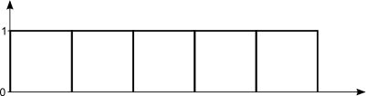
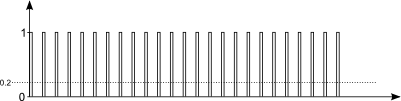

<!--- Copyright (c) 2014 Kim Bauters. See the file LICENSE for copying permission. -->
Understanding PWM and Implementing it Yourself
========================================

<span style="color:red">:warning: **Please view the correctly rendered version of this page at https://www.espruino.com/Software+PWM. Links, lists, videos, search, and other features will not work correctly when viewed on GitHub** :warning:</span>

* KEYWORDS: LED1,PWM,analogWrite
* USES: LED1,Only Espruino Board,PWM


Introduction
-----------
PWM or Pulse-Width modulation is an important concept in electronics where you mimic a lower voltage by quickly turning on and off the power to a pin. In this tutorial we'll discuss how PWM works and see how you can implement PWM yourself. This will help you to understand how the `analogWrite()` works on those pins that support PWM.


Wiring Up
--------
We will be using the LEDs on the board, so you're all set!


Software
--------
To understand PWM, we need to look at a few examples where we turn on the power to a PIN. We start with turning the power on for the entire duration of 5 seconds:



You can try this out for yourself on an Espruino, using the command:

```
LED1.set();
setTimeout( function() { LED1.reset(); }, 5000);
```

Not particularly exciting, now was it? During those 5 seconds, the light was simply on. Next, we will try to turn the power on for 1 of those 5 seconds. In total the light has been on for 1 sec in that 5 sec interval, or 20% of the time.

You can try this on your Espruino using the command:

```
LED1.set();
setTimeout( function() { LED1.reset(); }, 1000);
```

Once again, nothing exciting to see. Now let's try to turn the light on for 1/5th of a second during each second and repeat this for 5 seconds:


Notice that we still have the light on for a total of only 1 second during those 5 seconds, or 20% of the time. The difference is that we now change between on and off during each second. If we want to fool our senses, we will need to do this rapid switching even more frequently. The number of times we turn a signal on and off is called a *period*. The number of periods we have each second is measured in Hertz or *Hz*. For example:



You can see that each period we turn the LED on for 20% of the time and turn it off for 80% of the time. We have a total of 25 periods. So, if the total duration was one second, then this would have been 25 Hz.

To fool our senses, we probably need to increase the Hz even more. For example, our eyes are not able to see that the light is blinking at 50Hz. In that case the light will just appear as if it is only on with 20% of the power. **This is exactly what we want**. By quickly alternating between on and off, we have fooled our senses into thinking that the light is dimmer than normal.

As before, you can try this out on your Espruino for yourself. 

```
var interval;
function pwm(brightness, Hz) {
  if ((typeof interval) !== "undefined") {
    clearInterval(interval);
    LED1.reset();
  }
  interval = setInterval(function() {
    digitalPulse(LED1, 1, brightness * (1000/Hz));
  }, 1000/Hz);
}
```

This code accepts the parameter `brightness`, to set how bright the red LED will be, and the `Hz` or how rapidly we switch between on and off. The first `if`checks if an interval is already set. If so, it stops that interval and turns the LED off again. We can then continue with the rest of the code:

If we use the LED at full brightness and 100Hz, we will turn the LED on (using `digitalPulse`) for 10ms and we will repeat this every 10ms. If we only want 20% brightness, then we turn the LED on for 2ms and repeat this every 10ms. Now try the code for yourself to turn the LED on to only 10% brightness:

```
pwm(0.1, 50);
```

Also try varying the parameters. You'll see that increasing the Hz will not do a lot, but decreasing it to e.g. 15 will create an annoying blinking effect. At all times, you can stop the blinking of the light by typing:

```
clearInterval(interval); LED1.reset();
```

Now you understand how PWM works, and you can specify the Hz for yourself as an option when using `analogWrite`. 
