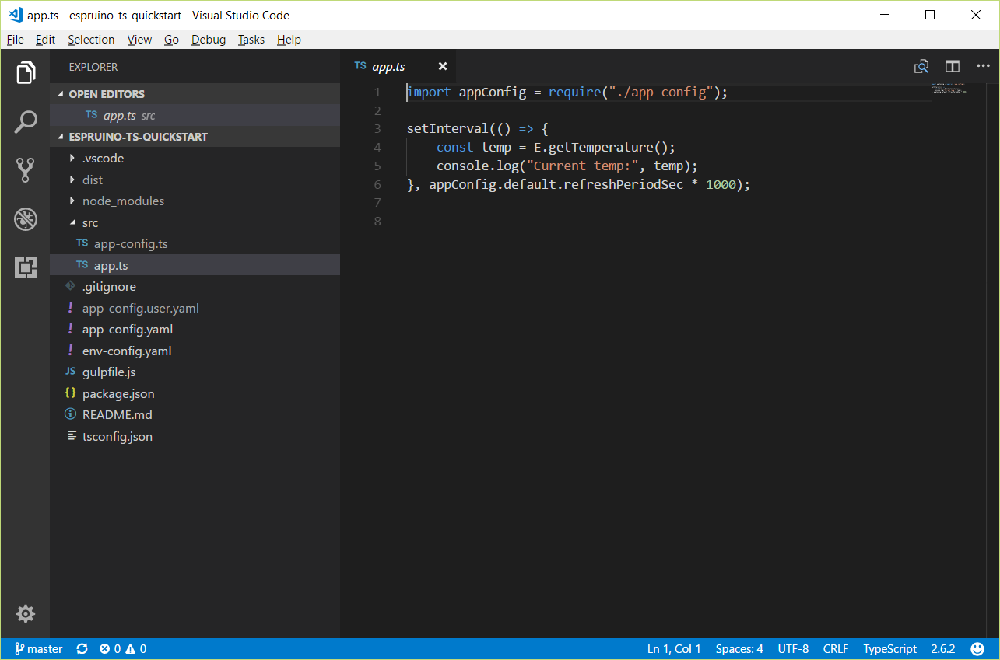
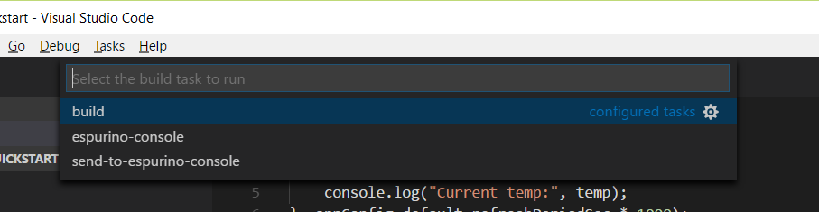
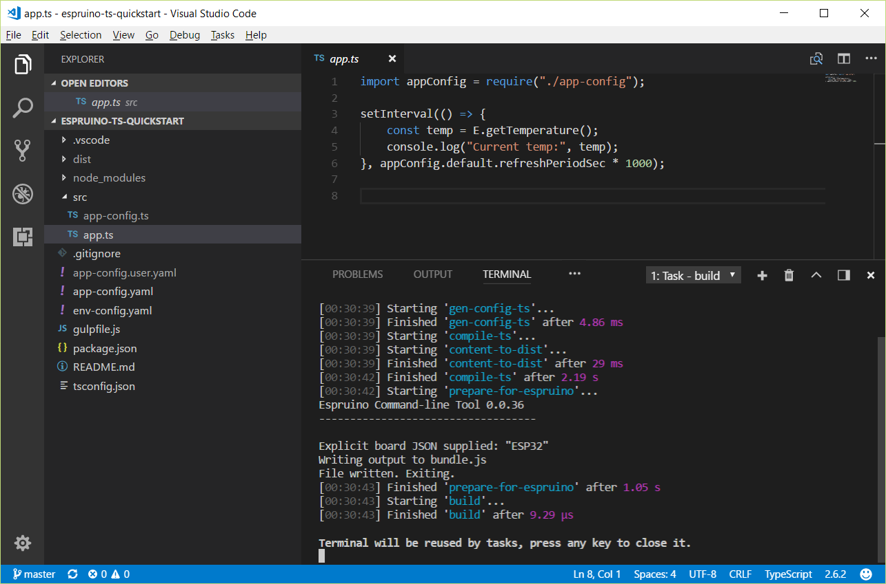
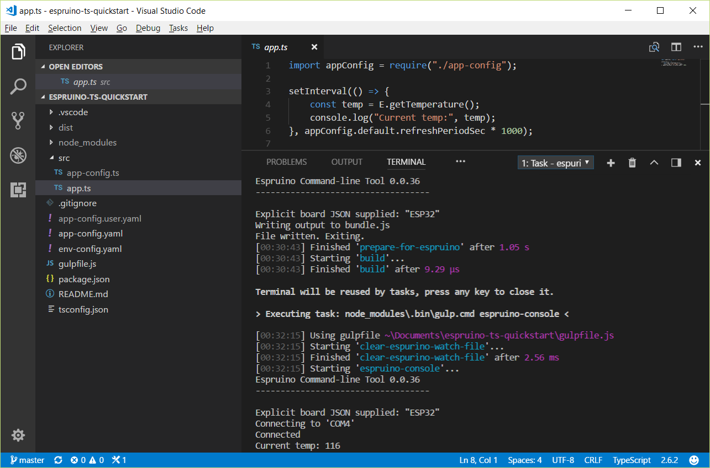

<!--- Copyright (c) 2017 Stanislav Berkov, Pur3 Ltd. See the file LICENSE for copying permission. -->
Typescript and Visual Studio Code IDE
=====================================

:warning: **Please view the correctly rendered version of this page at https://www.espruino.com/Typescript+and+Visual+Studio+Code+IDE. Links, lists, videos, search, and other features will not work correctly when viewed on GitHub** :warning:

* KEYWORDS: Typescript, Visual Studio Code, IDE, nodejs
* USES: Visual Studio Code, nodejs, espruino-cli

Introduction
------------

Typescript is a JavaScript that scales. It
supports type annotation, can deduce types.
It can compile upper versions of ECMAScript to lower versions like ES5.

Visual Studio Code is lightweight IDE that offers
intellisence, syntax highlight, refactoring tools.

This tutorial describes how to use typescript for compiling typescript to ES5 (javascript 5) using Visual Studio Code IDE.

A working example can be cloned from https://github.com/stasberkov/espruino-ts-quickstart

Project uses `gulp` to run build tasks, typescript to compile ts code to javascript, `espruino-cli` to prepare code for Espruino and uploading to board.

Typescript type information for Espruino is used from https://www.npmjs.com/package/@types/espruino package.

How to use
----------

Install Visual Studio Code, nodejs v6+.

Checkout https://github.com/stasberkov/espruino-ts-quickstart module into `espruino-ts-quickstart directory`. Inside `espruino-ts-quickstart` directory run command `npm install`. It shall install all required modules.

Then inside `espruino-ts-quickstart` directory run command `code .`

It shall run Visual Studio Code IDE and open then project.

Poject has 3 build tasks: `build`, `espruino-console`, `send-to-espruino-console`. To access it press `Ctrl-Shift-B`

`build` command compiles ts code to javascript and prepares it for espruino use.

`espruino-console` command runs Espruino console (check\adjust `env-config.yaml` config file).

`send-to-espruino-console` command uploads compiled code to board (run espruino console before using this command).
Once you run this command then switch back to espruino-console view.

Project structure
-----------------

`src/app.ts` -- sample code to compile and execute

`app-config.yaml` -- application configuration file. Used to generate `src/app-config.ts` source file
that can be used in code.

`app-config.user.yaml` -- application configuration override (not for git file) file. Values from this file
will be used instead corresponding values from `app-config.yaml` file.

`gulpfile.js` -- file with build tasks
