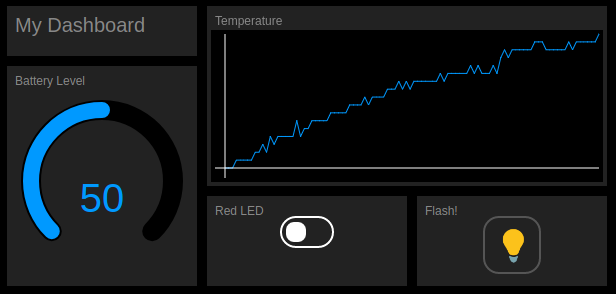

<!--- Copyright (c) 2016 Gordon Williams, Pur3 Ltd. See the file LICENSE for copying permission. -->
Web Bluetooth Dashboards
========================

<span style="color:red">:warning: **Please view the correctly rendered version of this page at https://www.espruino.com/Web+Bluetooth+Dashboard. Links, lists, videos, search, and other features will not work correctly when viewed on GitHub** :warning:</span>

* KEYWORDS: Tutorials,Puck.js,GitHub,Web Bluetooth,BLE,Dashboard
* USES: Puck.js,Web Bluetooth

Sometimes you'll want to be able to make a webpage with buttons, graphs
and gauges where you can quickly monitor or control your embedded devices.
This tutorial will show you how to make something like the page below:



First, please check out [the Web Bluetooth tutorial](Puck.js+Web+Bluetooth),
as it'll show you how to develop Web Bluetooth pages.

We're going to use [TinyDash](https://github.com/espruino/TinyDash),
a very simple HTML dashboard library that only needs a few files.

Use the instructions in the [the Web Bluetooth tutorial](Puck.js+Web+Bluetooth)
to set up your own HTTPS webpage, then put the following in it:

```HTML_demo_link
<html>
 <head>
  <title>Dashboard</title>
  <meta name="viewport" content="width=620, initial-scale=1">
 </head>
 <body style="width:620px;height:450px">
  <link href="https://espruino.github.io/TinyDash/tinydash.css" rel="stylesheet">
  <script src="https://espruino.github.io/TinyDash/tinydash.js"></script>
  <script src="https://www.puck-js.com/puck.js"></script>  
  <script>
  var elements = {
    heading : TD.label({x:10,y:10,width:190,height:50,label:"My Dashboard"})
  }
  for (var i in elements)
    document.body.appendChild(elements[i]);
  </script>
 </body>
</html>
```

This is the bare miniumum you'll need for a dashboard, so what does it all do?

* The `<meta>` tag makes sure the page renders at a 640 pixel width on devices
like phones and tablets. You can adjust this once you've figured out how wide
you want your dashboard.
* The single-line `<link>` and `<script>` tags bring in what we need for our dashboards and controlling Puck.js
* The bigger `<script>` tag contains the code for our Dashboard elements. We'll stick
all our elements in `elements` so we have an easy way to reference them - but you don't have
to do this.
* `TD.label` creates a label component, and x, y, width and height are in pixels. For
 more types of component you can have in the dashboard, [take a look in tinydash.js](https://github.com/espruino/TinyDash/blob/master/tinydash.js)

Non-realtime Dashboard
-------------------------

To start off with, we'll create a dashboard that shows historical data from
a [Puck.js](/Puck.js) when you connect to it.

First, we're going to want some data to display. Upload this to [Puck.js](/Puck.js)
via the Web IDE:

```
// our historical data
var history = new Int16Array(100);

// Get Data and store it in RAM
function logData() {
  var data = E.getTemperature();
  for (var i=0;i<history.length-1;i++)
    history[i] = history[i+1];
  history[history.length-1] = data*100;
}

// Start recording
setInterval(logData, 1000);
```

It'll log a new temperature value to the `history` variable every second.

Now, disconnect and update the Web Bluetooth page with what's below
(or you can click `Try Me!` on the code snippet below).

```HTML_demo_link
<html>
 <head>
  <title>Dashboard</title>
  <meta name="viewport" content="width=620, initial-scale=1">
 </head>
 <body style="width:620px;height:450px">
  <link href="https://espruino.github.io/TinyDash/tinydash.css" rel="stylesheet">
  <script src="https://espruino.github.io/TinyDash/tinydash.js"></script>
  <script src="https://www.puck-js.com/puck.js"></script>  
  <script>
  function connectDevice() {
    // connect, and ask for the battery percentage
    Puck.eval("{bat:Puck.getBatteryPercentage()}", function(d,err) {
      if (!d) {
        alert("Web Bluetooth connection failed!\n"+(err||""));
        return;
      }
      // remove the 'connect' window
      elements.modal.remove();
      // update the controls with the values we received
      elements.bat.setValue(d.bat);
      // now get the history - these could take a while
      // so we do it separately.
      Puck.eval("history", function(d) {
        elements.temp.setData(d);
      });
    });
  }
  // Set up the controls we see on the screen    
  var elements = {
    heading : TD.label({x:10,y:10,width:190,height:50,label:"My Dashboard"}),
    bat : TD.gauge({x:10,y:70,width:190,height:220,label:"Battery Level",value:0,min:0,max:100}),
    temp : TD.graph({x:210,y:10,width:400,height:180,label:"Temperature"}),
    redled : TD.toggle({x:210,y:200,width:200,height:90,label:"Red LED",value:0,onchange:function(el,v) {
      Puck.write("LED1.write("+v+");\n");
    }}),
    flash : TD.button({x:420,y:200,width:190,height:90,label:"Flash!",onchange:function(){
      Puck.write("digitalPulse(LED3,1,500);\n");
    }}),
    modal: TD.modal({x:10,y:10,width:600,height:430,label:"Click to connect",onchange:connectDevice})
  }
  for (var i in elements)
    document.body.appendChild(elements[i]);
  </script>
 </body>
</html>
```

So how does this work?

* First, we define all the dashboard components we want in `elements`.
* At the end, we add `TD.modal`. This covers all the components and when clicked,
calls `connectDevice` to initiate the Web Bluetooth connection (for security a
connection can't be made automatically in Web Bluetooth).
* After a connection is made, we use `Puck.eval` to request the battery
percentage, and then in a different request we get the entire contents of
the `history` array.
* Finally, clicking on the `Red LED` or `Flash` components triggers the
`onchange` callback, which calls `Puck.write` to perform the relevant action.

Realtime Dashboard
------------------

To get realtime updates from Puck.js we *could* repeatedly call `Puck.eval` to
get the information we want, but that'll be quite slow.

Instead, we'll use the [two-way communications example from the Web Bluetooth tutorial](Puck.js+Web+Bluetooth#two-way-communications).
For that, we use `Puck.connect` to create a two-way connection, use `setInterval`
on Puck.js to send data at regular intervals, and then pick it up in the
`onLine` handler function.

For the example we'll use the same `Puck.light` function to get realtime
light data, but have extended the Web Bluetooth example to output JSON
so more information can be transferred at once if needed.

```HTML_demo_link
<html>
 <head>
  <title>Dashboard</title>
  <meta name="viewport" content="width=210, initial-scale=1">
 </head>
 <body style="width:210px;height:450px">
  <link href="https://espruino.github.io/TinyDash/tinydash.css" rel="stylesheet">
  <script src="https://espruino.github.io/TinyDash/tinydash.js"></script>
  <script src="https://www.puck-js.com/puck.js"></script>  
  <script>
  // Called when we get a line of data - updates the light color
  function onLine(line) {
    try {
      var j = JSON.parse(line);
      console.log("Received JSON: ",j);
      elements.light.setValue(j.light*100);
    } catch(e) {
      console.log("Received: ",line);
    }
  }
  var connection;
  function connectDevice() {
    Puck.connect(function(c) {
      if (!c) {
        alert("Couldn't connect!");
        return;
      }
      connection = c;
      // remove modal window
      elements.modal.remove();
      // Handle the data we get back, and call 'onLine'
      // whenever we get a line
      var buf = "";
      connection.on("data", function(d) {
        buf += d;
        var i = buf.indexOf("\n");
        while (i>=0) {
          onLine(buf.substr(0,i));
          buf = buf.substr(i+1);
          i = buf.indexOf("\n");
        }
      });
      // First, reset Puck.js
      connection.write("reset();\n", function() {
        // Wait for it to reset itself
        setTimeout(function() {
          // Now tell it to write data on the current light level to Bluetooth
          // 10 times a second. Also ensure that when disconnected, Puck.js
          // resets so the setInterval doesn't keep draining battery.
          connection.write("setInterval(function(){Bluetooth.println(JSON.stringify({light:Puck.light()}));},100);NRF.on('disconnect', function() {reset()});\n",
            function() { console.log("Ready..."); });
          }, 1500);
        });
      });

  }
  // Set up the controls we see on the screen    
  var elements = {
    heading : TD.label({x:10,y:10,width:190,height:50,label:"My Dashboard"}),
    light : TD.gauge({x:10,y:70,width:190,height:220,label:"Light",value:0,min:0,max:100}),
    modal: TD.modal({x:10,y:10,width:190,height:430,label:"Click to connect",onchange:connectDevice})
  }
  for (var i in elements)
    document.body.appendChild(elements[i]);
  </script>
 </body>
</html>
```

Again you can click `Try Me` to try this out - you don't need to pre-load any
information onto your Puck for this.
