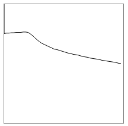

<!--- Copyright (c) 2013 Gordon Williams, Pur3 Ltd. See the file LICENSE for copying permission. -->
WiFi Enabled Thermometer
===============================

<span style="color:red">:warning: **Please view the correctly rendered version of this page at https://www.espruino.com/WiFi+Enabled+Thermometer. Links, lists, videos, search, and other features will not work correctly when viewed on GitHub** :warning:</span>

* KEYWORDS: Wifi,Thermometer,Web Server
* USES: Internet,DS18B20,CC3000,Espruino Board



Introduction
-----------

This is a simple WiFi enabled thermometer. We'll get temperature using the DS18B20 and we'll store a few samples worth of history.

There will be a WebServer on the CC3000, and when it is queried, a webpage will be displayed that shows a line graph of the temperature over time.

You'll Need
----------

* One [Espruino Board](/Original)
* A [[DS18B20]] Temperature sensor and 4.7k resistor
* A [[CC3000]] WiFi module

Wiring Up
--------

* Follow [the instructions](/CC3000) for wiring up the CC3000 module
* Connect up the [[DS18B20]] Temperature sensor as follows:

| Sensor Wire | Espruino   | 4.7k Resistor |
| --------- | ---------- | ------------- |
| Black     |  GND   |               |
| Red       |  3.3v  | 1st wire      |
| White     |  A1    | 2nd wire      |

Software
-------

Connect to the Espruino, copy and paste this into the right-hand side of the Web IDE (replacing the Access point name and password with your WiFi Access Point's name and password), and then click the `Send to Espruino` button.

```
var ow = new OneWire(A1);
var sensor = require("DS18B20").connect(ow);
var history = new Float32Array(30);

setInterval(function() {
  var temp = sensor.getTemp();
  console.log(temp);
  // move history back
  for (var i=1;i<history.length;i++)
    history[i-1]=history[i];
  // insert new history at end
  history[history.length-1] = temp;
}, 2000);


function onPageRequest(req, res) {
  res.writeHead(200, {'Content-Type': 'text/html'});
  res.write('<html><head><meta http-equiv="refresh" content="5"></head>'+
            '<body><canvas id="canvas" width="200" height="200" style="border:1px solid #888;"></canvas><script>');
  res.write('var d='+JSON.stringify(history)+';'+
'var c=document.getElementById("canvas").getContext("2d");'+
'c.moveTo(0,100 - (d[0]-d[d.length-1])*10);'+
'for (i in d) c.lineTo(i*200/(d.length-1),100 - (d[i]-d[d.length-1])*10);'+
'c.stroke()'+
'</script>');
  res.end('</body></html>');
}


var wlan;
function onInit() {
  wlan = require("CC3000").connect();
  wlan.connect( "AccessPointName", "WPA2key", function (s) { 
    if (s=="dhcp") {
      require("http").createServer(onPageRequest).listen(80);
      console.log("Server created at "+wlan.getIP().ip);
    }
  });
}

onInit();
```

And now you're done. The CC3000 takes a while to initialise so you may have to wait a minute or two. The code will print out the temperature every two seconds, and when connected it'll print its IP address. You can then connect to that with a web browser, which will draw a line graph of the last 30 temperature readings (refreshing every 5 seconds).
