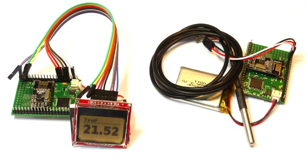

<!--- Copyright (c) 2013 Gordon Williams, Pur3 Ltd. See the file LICENSE for copying permission. -->
Wireless Temperature Sensor
===============================

<span style="color:red">:warning: **Please view the correctly rendered version of this page at https://www.espruino.com/Wireless+Temperature+Sensor. Links, lists, videos, search, and other features will not work correctly when viewed on GitHub** :warning:</span>

* KEYWORDS: Wireless,Temperature,NRF24L01+,DS18B20
* USES: DS18B20,NRF24L01+,PCD8544,Espruino Board,Graphics



Introduction
-----------

This is a quick and easy Wireless Temperature Sensor. One Espruino reads the temperature from a DS18B20 temperature sensor and transmits it over the NRF wireless module every 10 seconds, and another Espruino receives it and draws it on an LCD display.

You'll Need
----------

* Two [Espruino Boards](/Original) wired up with an [NRF24L01+](/NRF24L01P) module
* A [[DS18B20]] Temperature sensor and 4.7k resistor
* A [Nokia 5110 LCD](/PCD8544)

Wiring Up
--------

### Board 1 (transmitter)

* Follow the wiring instructions for wiring up the [NRF24L01+](/NRF24L01P) wireless module
* Connect up the [[DS18B20]] Temperature sensor as follows:

| Sensor Wire | Espruino   | 4.7k Resistor |
| --------- | ---------- | ------------- |
| Black     |  GND   |               |
| Red       |  3.3v  | 1st wire      |
| White     |  A1    | 2nd wire      |

### Board 2 (receiver)

* Follow the wiring instructions for wiring up the [NRF24L01+](/NRF24L01P) wireless module
* Connect the [Nokia 5110 LCD](/PCD8544) up as suggested [here](/PCD8544)

Software
-------

Connect to the transmitting Espruino, copy and paste this into the right-hand window, then click the ```Send to Espruino``` button.

```
SPI1.setup({sck:A5, miso:A6, mosi:A7});
var nrf = require("NRF24L01P").connect( SPI1, B0, B1 );
var ow = new OneWire(A1);
var sensor = require("DS18B20").connect(ow);
function onInit() {
  nrf.init([0,0,0,0,2], [0,0,0,0,1]);
}
onInit();
setInterval(function() {
  var temperature = sensor.getTemp();
  nrf.sendString(""+temperature);
}, 10000);
```

Now, connect to the second (receiving) Espruino, and copy and paste this in:

```
SPI1.setup({sck:A5, miso:A6, mosi:A7});
var nrf = require("NRF24L01P").connect( SPI1, B0, B1 );
SPI3.setup({ baud: 1000000, sck:B3, mosi:B5 });
var g;
function onInit() {
  nrf.init([0,0,0,0,1], [0,0,0,0,2]);
  // We set up the LCD here because it needs to initialise at power on
  g = require("PCD8544").connect(SPI3,B6,B7,B8);
}

// Draw temperature onto the LCD
function showTemperature(temp) {
  g.clear();
  g.setFontBitmap();
  g.drawString("Temp",1,0);
  g.drawLine(0,10,84,10);
  g.setFontVector(20);
  g.drawString(temp,1,15);
  g.flip();
}

// Keep checking to see if we have any new data...
dataLine = "";
setInterval(function() {
  while (nrf.getDataPipe() !== undefined) {
    var data = nrf.getData();
    for (var i in data) {
      var ch = data[i];
      if (ch===0 && dataLine!=="") {
        // if we got a 0 (end of string), show what we got
        showTemperature(dataLine);
        dataLine = "";
      } else if (ch!==0) {
        dataLine += String.fromCharCode(ch);
      }
    }
  }
}, 50);

onInit();
```

About 10 seconds later the display should update with the temperature received from the sender...

And that's it! A wireless temperature sensor. This could be extended with the code from the [[Heater Controller]] to make a wireless themostat, a history graph could be drawn, more than one wireless temperature sensor could be used or data could be logged onto an SD card...
