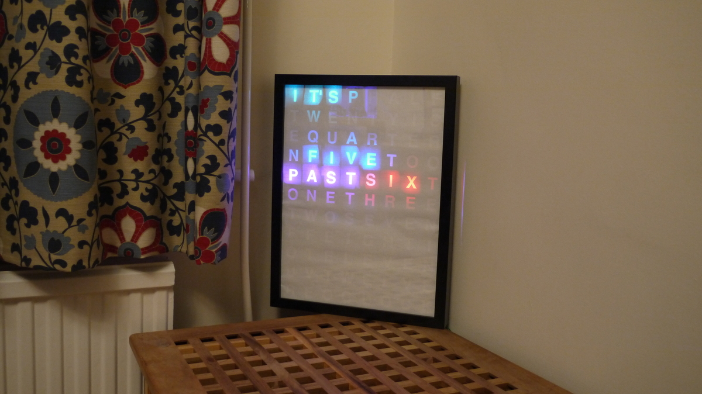
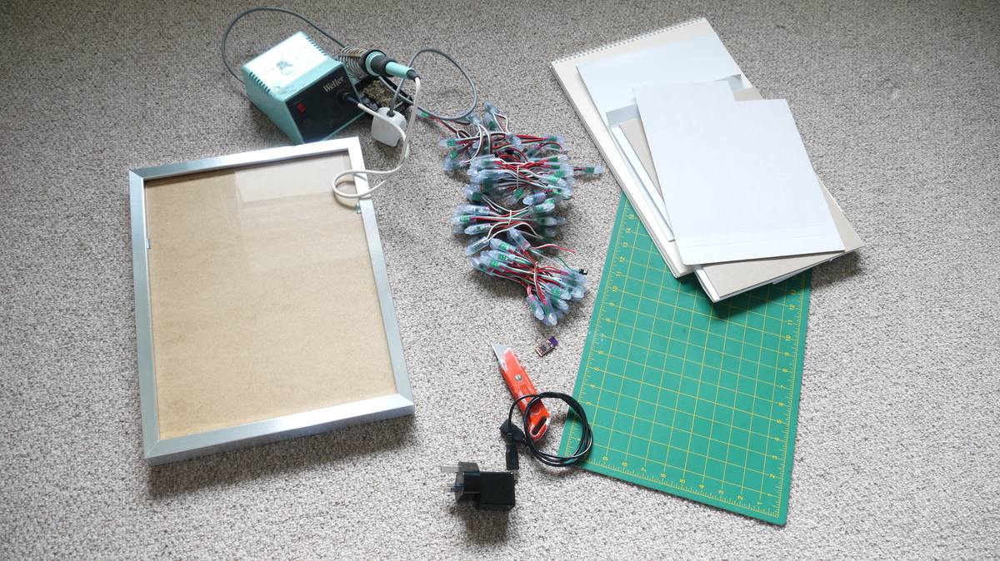
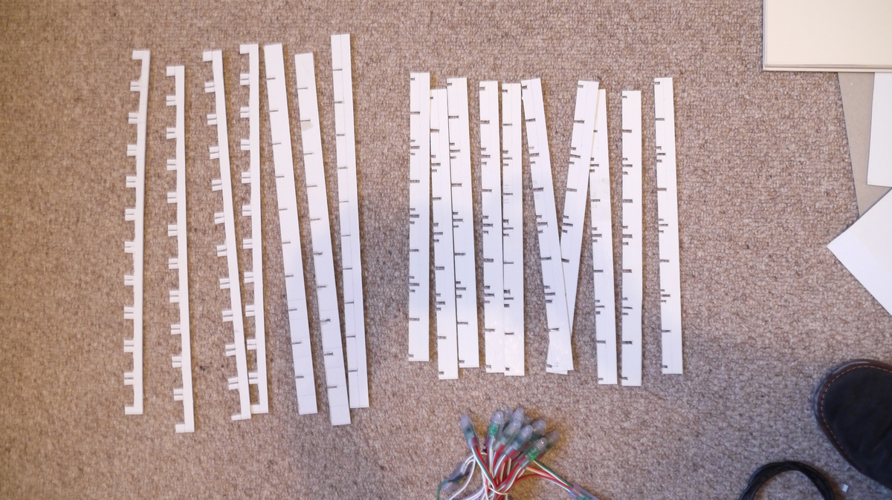
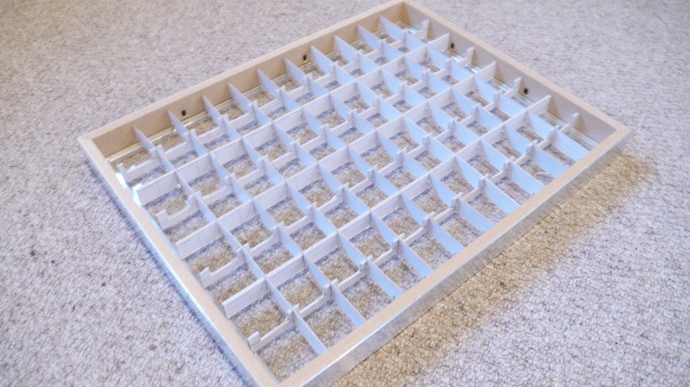
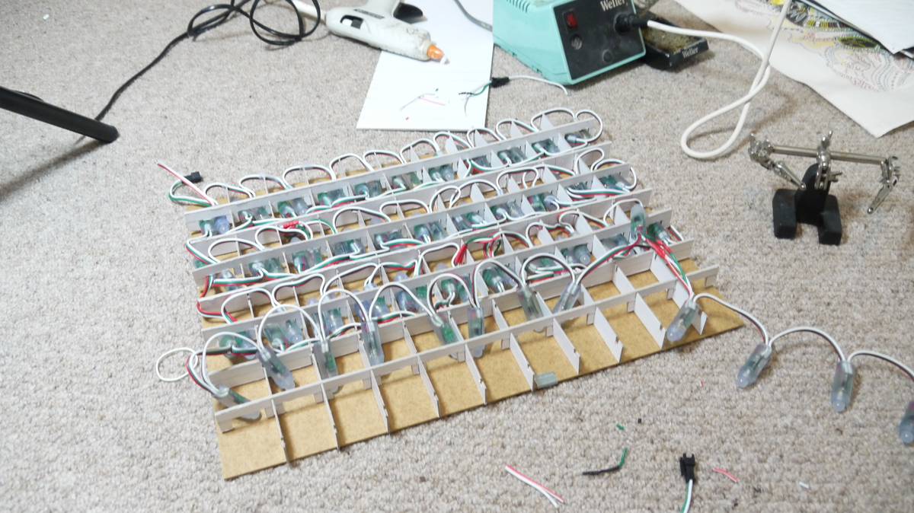
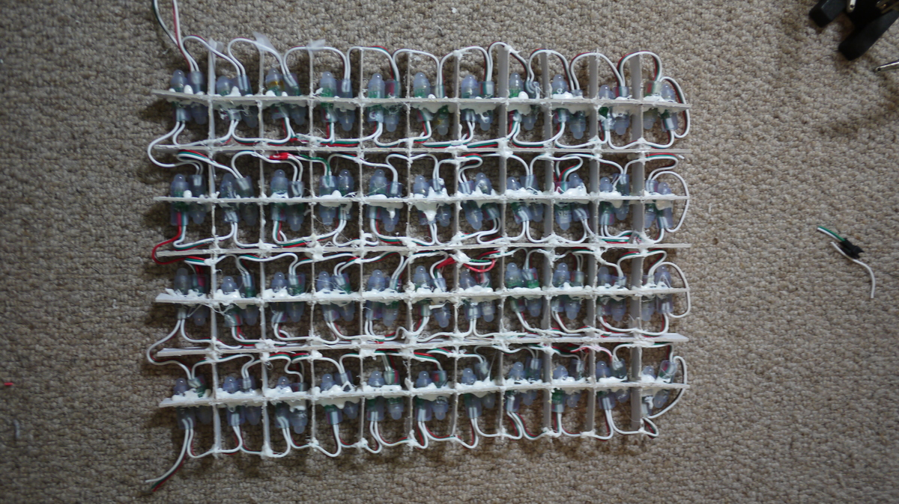
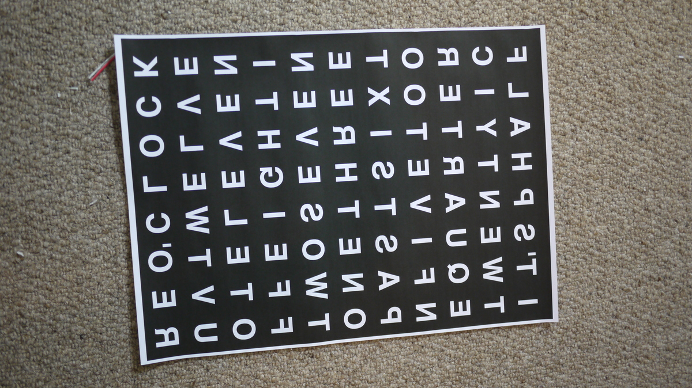
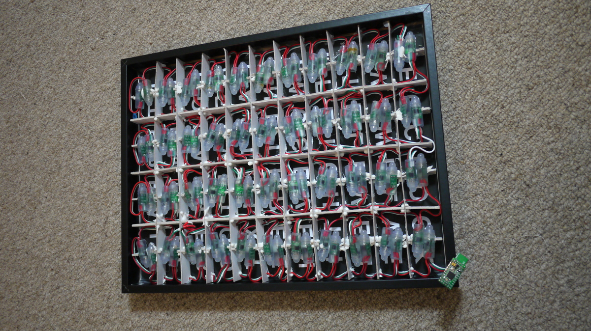

<!--- Copyright (c) 2014 Gordon Williams, Pur3 Ltd. See the file LICENSE for copying permission. --> 
Word Clock
=========

<span style="color:red">:warning: **Please view the correctly rendered version of this page at https://www.espruino.com/Word+Clock. Links, lists, videos, search, and other features will not work correctly when viewed on GitHub** :warning:</span>

* KEYWORDS: Clock,Time
* USES: WS2811



This is an LED word clock. It light up letters in a grid to spell out the time.

In order to use a sensible number of LEDs and keep the cost down, the clock will only tell the time to the nearest 5 minutes...

You'll Need
----------



* A deep picture frame (we used an Ikea one)
* 88 [[WS2811]] LED lights - for an 8 x 11 grid
* Thick card and tools to cut it
* An Espruino board. Either a Pico, revision 1v4, or a 1v3 with a [Clock](/Clocks) crystal
* A USB power supply
* Tools for soldering

Assembly
-------





Measure and cut the card into 10 x 7 strips as above (measure them to fit the picture frame that you have), and assemble them. 

We've left gaps for the WS2811 LEDs and their wires- however we used a string of LEDs. If you buy your LEDs in flat strip you won't need to cut out any large gaps.



Fit in the LEDs in an 'S' shape, and glue them securely with hot glue. Make sure know which end of the LED chain is the input and which is the output! Consult the [[WS2811]] page if you're not sure.





Print out a pattern of letters that matches your grid. We did this on plan paper and mirrored it, so that the white paper faces the viewer. However you could do it the other way, or could use acetate and a diffuser.

If you print out the text as we've done, try and do it on a laser printer or photocopier. Printing lots of black on thin paper with a normal inkjet printer will cause it to warp slightly and look ugly.



Now assemble everything, and wire up to the Espruino board as follows:

| Wire   | Function  | Espruino |
|--------|-----------|----------|
| Red    | LED + | Bat               |
| White  | LED - | GND               |
| Green  | LED data | B15            |

And you're done! On to the software...


Software
--------

Load the code below into Espruino, type `save()`, and you're sorted! 

To set the time, you'll have to modify the 'h', 'm' and 's' variables (hour, minute, and second).

```
// The indices of each word
var words = {
  "its":[76,77,54],
  "_five":[80,51,58,29],
  "_ten":[75,74,73],
  "_quarter":[79,52,57,30,35,8,13],
  "_twenty":[75,78,53,56,31,34],
  "_half":[32,33,10,11],

  "past":[72,81,50,59],
  "to":[36,7],

  "one":[71,82,49],
  "two":[70,83,48],
  "three":[60,27,38,5,16],
  "four":[69,68,67,66],
  "five":[84,85,86,87],
  "six":[28,37,6],
  "seven":[61,26,39,4,17],
  "eight":[47,62,25,40,3],
  "nine":[17,18,19,20],
  "ten":[15,16,17],
  "eleven":[46,63,24,41,2,19],
  "twelve":[45,64,23,42,1,20],
  "oclock":[44,65,22,43,0,21],
  
  "pico" : [55,9,12,14]
};
// set up SPI
SPI2.setup({baud:3200000, mosi:B15});
var arr = new Uint8Array(8*11*3);
var pos = 0;

// Hue to RGB - we use this to work out what colour to set each word
function HSVtoRGB(h, s, v) {
    var r, g, b, i, f, p, q, t;
    if (h && s === undefined && v === undefined) {
        s = h.s, v = h.v, h = h.h;
    }
    i = Math.floor(h * 6);
    f = h * 6 - i;
    p = v * (1 - s);
    q = v * (1 - f * s);
    t = v * (1 - (1 - f) * s);
    switch (i % 6) {
        case 0: r = v, g = t, b = p; break;
        case 1: r = q, g = v, b = p; break;
        case 2: r = p, g = v, b = t; break;
        case 3: r = p, g = q, b = v; break;
        case 4: r = t, g = p, b = v; break;
        case 5: r = v, g = p, b = q; break;
    }
    return [Math.floor(r * 255),Math.floor(g * 255),Math.floor(b * 255)];
}

// Given an array of words, set the relevant LEDs to light up
// in rainbow colours
function getPattern(wordList) {
  arr.fill(0);
  var i = 0;
  pos+=0.05;
  wordList.forEach(function(word) {
    words[word].forEach(function(led) {
      arr.set(HSVtoRGB(i+pos,1,1,1),led*3);
    });
    i+=0.2;
  });
}


// Convert hours and minutes (seconds are ignored) into a string such as '_five minutes past six'
// We prefix the first part with an underscore so we don't accidentally light the wrong 'five' up
function timeToWords(h,m,s) {
  var mins = ["","_five","_ten","_quarter","_twenty","_twenty _five","_half"];
  var hours = ["", "one","two","three","four","five","six","seven","eight","nine","ten","eleven","twelve"];
    
  var str = "its ";
  // the nearest 5 minutes
  var midx = Math.round(m/5);
  var hidx = h;
  // work out if we're 'past' or 'to' and adjust hour accordingly
  if (midx>6) {
    if (midx==12) midx=0;
    hidx++;
    if (hidx>12) hidx -= 12;
  }
  // finally output minutes and hours
  if (midx!=0) {
    if (midx<=6)
      str += mins[midx]+" past ";
    else {
      str += mins[12-midx]+" to ";
    }
    str += hours[hidx];
  } else {
    str += hours[hidx];
    str += " oclock";
  }
  // print it out for debugging
  console.log(h+":"+m+":"+s+"    "+str);
  return str;
} 

// Very simplistic timekeeping...
var h=5,m=59,s=0;
setInterval(function() {
  // increment seconds
  s++;
  if (s>=60) {
    // if seconds goes to 60, inc minutes, and so on...
    s=0;
    m+=1;
    if (m>=60) {
      m=0;
      h++;
      if (h>12)
        h=1;
    }
  }
  // Get the time as a string
  var timeWords = timeToWords(h,m,s);
  // convert it to an array of words and light up the LEDs
  getPattern(timeWords.split(" "));
  SPI2.send4bit(arr, 0b0001, 0b0011);
}, 1000);
```

You could also add a way to use buttons to set the time, or you could even use some [[Internet]] connectivity to get the time off the net, or [[GPS]] to get it from the Global Positioning System.
